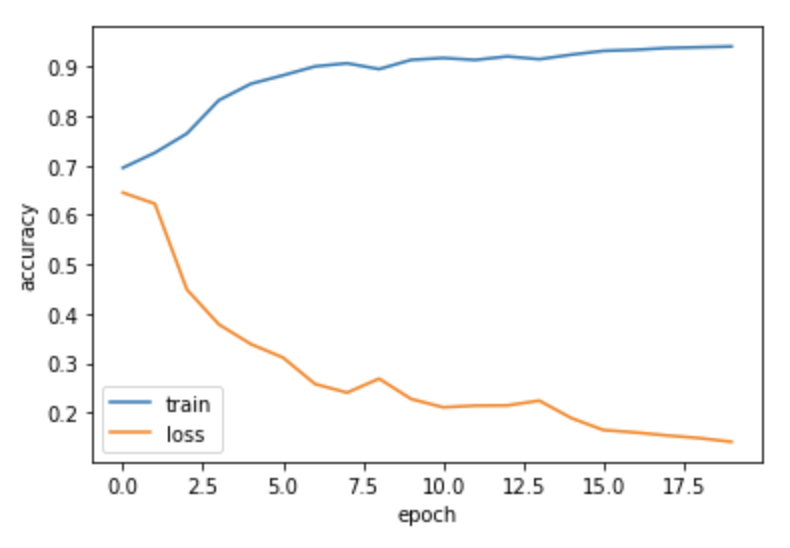

<h2>
Segment the ISICs data set with the Improved UNet 
</h2>
<b>Created by Anqi Yan, S4413599</b>

This project used Improved Unet to segment the ISICs data set. The ISICs data
set contains actual images and its segmentation images.

<p2>
Running result shows below
</p2>

 
	
	

