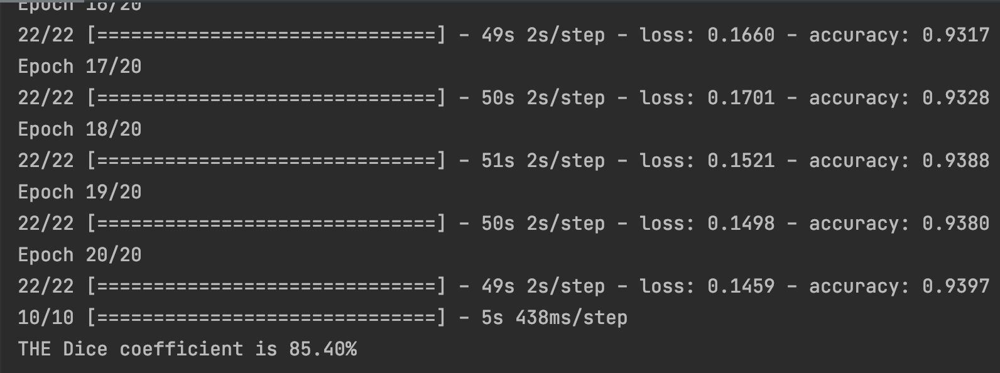

<h2>
Segment the ISICs data set with the Improved UNet 
</h2>
<b>Created by Anqi Yan, S4413599</b>

This project used Improved Unet to segment the ISICs dataset into foreground and
background segmentations. Aim to achieve above 80% of Dice Similarity Coefficient.  

The ISICs data contains dermatology images and its segmentation images. The Improved UNet takes dermatology images as input, takes its segmentation images as output to train the Improved UNet Model.

<h3>Improved UNet</h3>
The project used Improved UNet model which is derived from the U-Net to do the segmentation.

    

The Improved UNet diagram shows above.  
The CONTEXT module is a pre-activation residual block
which contains 3*3*3 convolutional layers and a dropout layer with 
0.3 drop rate 
The upsampling module contains a upsampling2D layer and a 3*3*3 convolution
layer 
The Localization module contains a 3*3*3 convolutional and a 1*1*1
convolution layer 

<p2>
Running result shows below
</p2>

 
	
	
	

