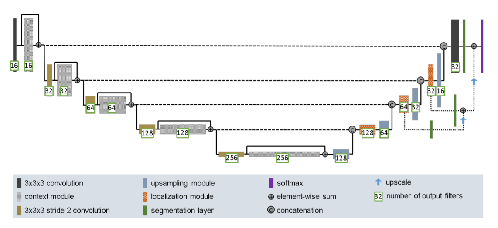
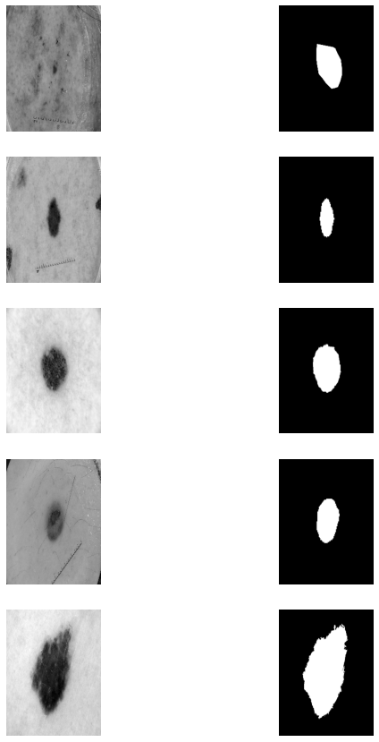
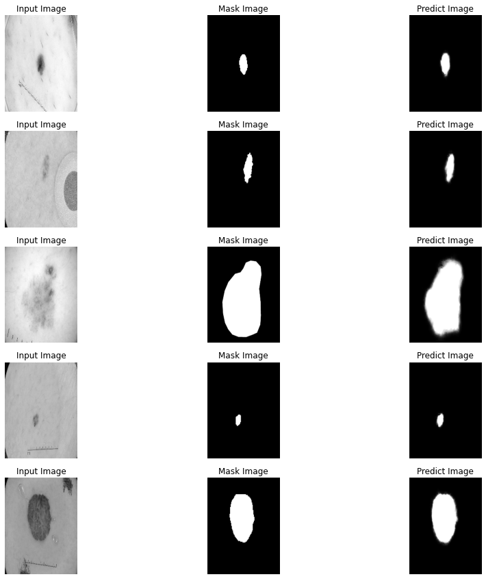
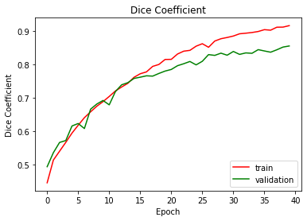

# Task 1: Segment the ISICs data set with the Improved UNet
Student: Yin Peng
</BR>
Student ID: 44148009
## Introduction
This program is to solve the problem of image segmentation. The training data is the ISICs dataset and the model is Improved Unet. This file will introduce the implementation of the model and the results of prediction, also the performance on the test set.
## Improved Unet
The structure of the model

>image reference: https://arxiv.org/pdf/1802.10508v1.pdf
</BR>
Improved Unet has a similar structure to the original Unet. The difference is that in the encoder phase, Context Module is added. Each context module is a pre-activation residual block[1] with two convolutional layers and a dropout layer (Pdrop = 0.3) in between. In addition, the context modules are connected by a convolutional layer with a stride = 2, so in the model I define a function that returns context modules:

```
def context_module(input,size):
    """
    context module is pre-activation residual block with two
      3x3x3 convolutional layers and a dropout layer (pdrop = 0.3) in between.
    """
    out = tfa.layers.InstanceNormalization()(input)
    out = Conv2D(size,3 , activation = LeakyReLU(alpha=0.01), padding = 'same')(out)
    out = Dropout(0.3)(out)
    out = tfa.layers.InstanceNormalization()(out)
    out = Conv2D(size, 3, activation = LeakyReLU(alpha=0.01), padding = 'same')(out)
    return out
```

In addition, the output of each layer of the encoder is the sum of the convolution layer and the context modules, which is mainly implemented by the add layer

    Add()([conv layers,context module])

In the decoder stage, Improved Unet sums cross-layer outputs and realizes the segmentation layer. In addition, the leaky ReLU used by Improved Unet in the network is more friendly when dealing with negative numbers (negative slope = 1e-2)

## Data preparation and training
The original image size is 511 X 384. In order to reduce the amount of calculation, the image is resized to (258,192,1) grayscale images and normalized. Original picture display



I split the data into training, validation and test dataset by the ratio of 4:1:1. In the training process of the model, I set the dice coefficient to judge the similarity between the predicted value and the true value, and the loss function is set to binary_crossentropy or 1-DCS, which have the similar result. After 40 epoch training, 

```
  model.compile(optimizer = 'adam', loss = 'binary_crossentropy', metrics = [dice_coef])
  # model.compile(optimizer = 'adam', loss = dice_coef_loss, metrics = ["accuracy",dice_coef])
  history = model.fit(train_data.batch(10), epochs = 40, validation_data = val_data.batch(10))
```

The prediction:



### Training DCS and validation DCS:



Dice coefficient is a numerical value that expresses the similarity of pictures. The value is between 0 and 1. The closer to 1, the higher the similarity between the two pictures. In addition, calculating all test data sets, the average DCS is 0.817

```
  print(f"Average DSC on the test set is:{avg_DSC}")
  Average DSC on the test set is:0.8174641226808518
```

## Dependencies
1. Python: 3.7.12
2. Tensorflow: 2.6.0
3. Tensorflow_addons: 0.14.0
4. Numpy: 1.19.5
5. keras

## Reference
> 1.K. He, X. Zhang, S. Ren, and J. Sun, “Identity mappings in deep residual networks,” in European Conference on Computer Vision. Springer, 2016, pp. 630–

> Paper reference: https://arxiv.org/pdf/1802.10508v1.pdf
