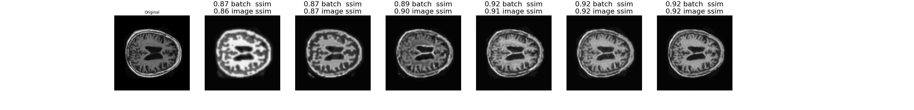
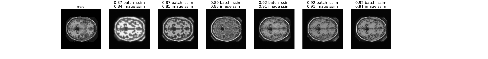

# Generative Model of OASIS Brain Data using a VQVAE

This project uses a VQVAE to generate new images from the OASIS Brain dataset.

## Vector Quantised-Variational AutoEncoder (VQVAE)
The VQVAE is a modification on VAEs where the latent space is made discrete.

 There are three main components in a VQVAE:
1. The Encoder  
   In the experiments in paper as well as in this project the encoder consists of:
   * 2 convolutional layers, with 4x4 kernels and a stride of 2
   * 2 residual blocks, consisting of a ReLu, a 3x3 convolution layer with relu activation, and finally a 1x1 convolution layer. 

2. The Vector Quantiser (VQ)  
   This is the first novel part of this model, which creates discrete latent variables. The VQ holds an embedding table (see diagram). After encoding, the outputs of the encoder are mapped to the nearest entry in the embedding table. Nearness is calualting using the typical euclidean distance between the encoded vector and the vectors in the embedding table. The indices which represent this mapping are saved. The nearest embedding is what is passed to the decoder. In this way the distributions of the model index the table instead of being continuous variables, making the latent space descrete.
 
3. The Decoder
   The decoder is almost directly the opposite of the encoder with:
    * 2 residual blocks, consisting of a ReLu, a 3x3 convolution layer with relu activation, and finally a 1x1 convolution layer. 
    * 2 transposed convolutional layers, with 4x4 kernels and a stride of 2

During training as well as the loss from the encoder and decoder, the embedding is learned by the embedding loss. There is also a third loss component, the commitment loss, which panalises the encoder for training faster than the embeddings to make sure the embedding space does not become too large. 

The VQVAE is trained on the OASIS brain dataset and can reconstruct the images. 

## Generating Images and PixelCNN
Once the VQVAE is trained we want to generate new iamges by sample the embedding space randomly instead of using the dencoder output. In order ot do this we learn the distribution of the priors outputted by the VQVAE, and sample from this distribution. To learn this distribution a PixelCNN model is used. 

The pixelCNN models the distribution of images pixel by pixel, capturing also the relationshop between pixels [2]. The key is masked convoltuion layers. In masked ocnvolution layers, the convolutional kernel is masekd so that only pixels above and to the left of the current pixel are used when generating the current pixel, if we generate pixels one by one from the top left corner. That is only the pixels that have already been generated are used in generating subsequent pixels.

*The maked kernel in PixelCNN zeros all values except those above and to the left of the current pixel.*  [2]  
<!--  -->

There are two mask types. Type A only allows connections to already generated pixels and channels and is used for the first layer. Type B  allows connections to already generated pixels and channels, but also from the current channel to itself, and is used for subsequent layers.

The PixelCNN consists of [2]:
1. A masked convolution layer. In the paper and in this project this is a 7x7 convlution with mask A
2. Residual blocks (2 in this project) consisting of a 3x3 masked convlution layer with mask B (as well asn input and output layers)
3. A relu
4. A 1x1 convolution iwht mask B
5. An output layer

This model is used to learn the prior destribution from the VQVAE by learning the distribution of the embedding indices. Then by sampling this distribution we can generate new embedding indices, and pass the results into the decoder from the VQVAE to generate new images. 

## Application to OASIS brain dataset
### The data
The oasis brain dataset consists of images of brain MRI scans. This project used the preprocessed data, which is already split into three sets for training, vaidation and testing.  For this project the iamges themselves (and not the y labels which label the area of the brain) were used. 

These are a serious of images from this datset.

### Training VQVAE
The VQVAE was trained on all 9664 images from the training set in batches of 64 images for 215 epochs. The figure below shows the total loss of the model as it trained and the ssim.

<!-- These were saved to a file every 60 iterations, so the curve is very smooth.

 -->

</p?>

<!--  -->

### Results of VQVAE
*A set of images from the test set, reconstructed by the VQVAE*

*Figure showing how the reconstructions changed with epochs*

The quality of the reconstructions was measured using the structured similarity index (SSIM)[3]. The final results on the test set of 544 images showed a SSIM of 0.963.

### Training PixelCNN
Data for training the PixelCNN was generated by using the VQVAE encoder and some parts of the VQ to generate the embedding indices. These were then split 80/10 for training and validation of the PixelCNN.
 <!-- The figure below shows the training and validation loss of the model as it trained. 
{}figure -->

The test set was used ot generate embedding indices to test with, this gave an accuracy of 0.682 for the PixelCNN after 1 day of training.

### Generated Images - Results of PixelCNN 
Starting from a zero matrix, the prior distribution was generated pixel by pixel by sampling a catagorical distribution wiht the PixelCNN model as its distribution probabilties. The resulting generated indices were converted to a quantised sample and passed to the decoder to generate new images.

*A set of images generated*
  

<!--  -->

## Code Description
model.py
    contains the VQVAE and PixelCNN models and their layers  
data_loaders.py
    contains helper functions and sequence classes for generating and loading the required data.  
driver.py
    uses data_loaders to load data, trains the models, and plots and saves some of the figures shown here. 
test_driver.ipynb 
    was used to test the code for models and training, and generate the images in this readme. 

## Dependencies
This project requires the following external packages. The anaconda environment file is available upon request.

* tesorflow 2.5
* tesnerflow-probability 0.12 for catagorical distribution, using in generaint images from PixelCNN output
* numpy for wrangling data
* matplotlib for plotting

## References

