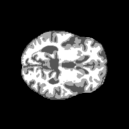
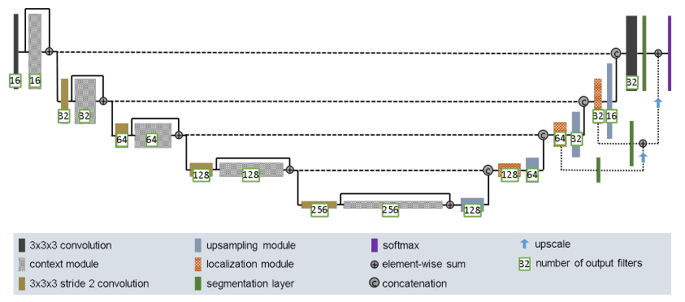
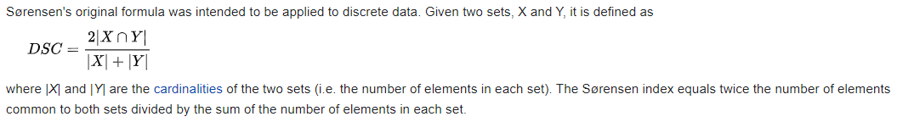
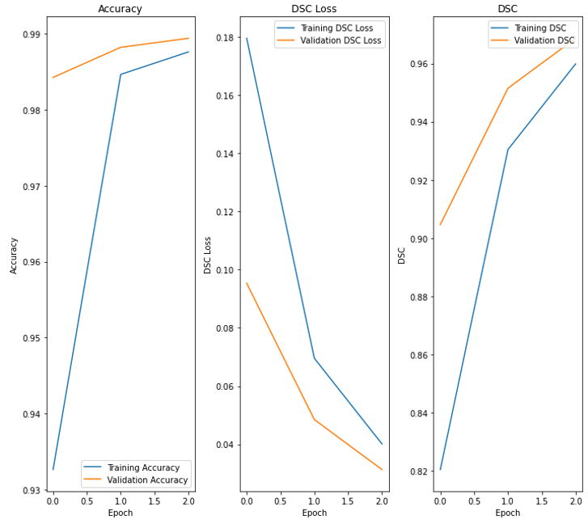
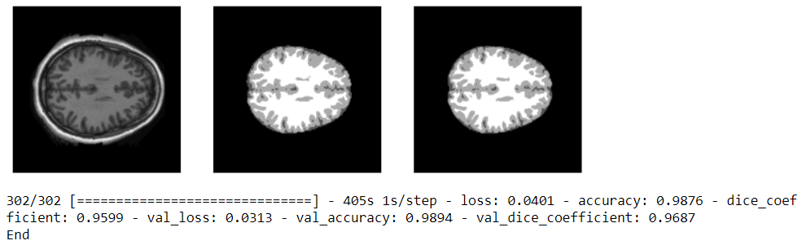
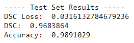
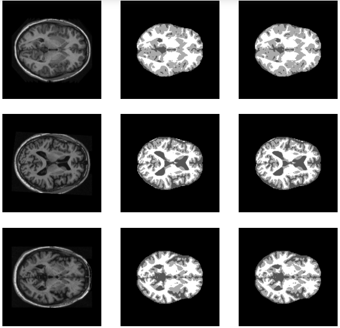

# OASIS Brain Dataset Segmentation With An Improved UNet

## Summary
OASIS Brain Dataset Segmentation with Improved UNet, with all labels having a minimum Dice Similarity Coefficient of 0.9 on the test set.

## Student Details
University of Queensland  
COMP3710 PatternFlow Contribution, Semester 2 2020  
Name: Dhilan Singh  
Student Number: 44348724  
Email: d.singh@uq.net.au  

## Problem Description
### Dataset
The OASIS brain dataset is a labelled collection of human brain MRI images and segmentation masks, as part of the [OASIS brain study](https://www.oasis-brains.org/). It contains ~9000 preprocessed images, seperated into training, validation and testing splits. Each split contains two types of images. A 2D MRI slice image and its corresponding 2D segmentation mask.
#### MRI Slice Images
- Grayscale png with shape [256, 256, 1].  

 
	

 
	Figure 1. Example MRI Slice (case_001_slice_0)

#### MRI Slice Segmentation Masks
- Grayscale png with shape [256, 256, 1] consiting of four unique classes.

    - 0 = Background
    - 1 = CSF
    - 2 = Gray Matter
    - 3 = White Matter 

- These images can then be appropriately one-hot encoded pixel wise to have shape [256, 256, 4], where each pixel belongs to one of these four classes. For example if a pixel were to belong to class 0 it would have values in axis 3 of [1, 0, 0, 0].   

 
	

 
	Figure 2. Corresponding Segmentation (seg_001_slice_0)

 
 ### Semantic Segmentation  
 The objective of this problem is to train a network to perform semantic segmentation. Semantic segmentation involves the pixel-wise classification of these input MRI slice images into the four classes of segmentation (see above).
 #### Objectives
 -  Segmentation with all labels having a minimum Dice Similarity Coefficient of 0.9 on the test set.
 - Using an improved version of the UNet.

 ## Network Architecture  
 ### Improved UNet
 The model used to solve this problem is that of an improved UNet from [[1]](#References). Based on the original UNet, this network has been carefully modified to maximize brain tumor segmentation performance. Presented in the paper as a 3D version, in this project it has been converted to work with 2D images.

 - Input image shape: [256, 256, 1]  
 - Output image shape: [256, 256, 4]  

 
	

  

 
	Figure 3. Improved UNet Network Architecture

  

Similar to the UNet, the architecture described in Fig. 3 comprises of:  
- A Context Aggregation Pathway
    - Encodes increasingly abstract representations of the input as we progress deeper into the network.
    - Activations computed by Context modules.
    - Context modules are connected by 3x3 convolutions with input stride 2 to reduce the resolution of the feature maps and allow for more features while descending down.
the aggregation pathway 
- Followed by a Localization Pathway: 
    - Recombines these representations with shallower features to precisely localize the structures of interest.
    - I.e. takes features from lower levels of the network that encode contextual information at low spatial resolution and transfer that information to a higher spatial resolution.
    - Consists of upsampling modules.
    - Then skip connections via contenation as seen in original UNet.
    - Then a Localization module.
    - Employs deep supervision by integrating segmentation layers at different levels of the network and combining them via elementwise summation to form the final network output. Increases convergence.

#### Context Module
-   A pre-activation residual block with two 3x3 convolutional layers and a dropout layer (pdrop = 0.3) in between. 

#### Upsampling Module
-   Upscale2D (2,2), followed by a 3x3 convolution that halves the number of feature maps.

#### Localization Module  
-   Consists of a 3x3 convolution followed by a 1x1 convolution that halves the number of feature maps.

#### Other Parameters  
-   Use leaky ReLU nonlinearities with a negative slope of 10−2 for all convolutions.
- Also use instance normalization after all convolutions.
- Adam optimizer.

### Metrics  
#### Dice Similarity Coefficient (DSC)  
To handle class imbalance that is notably present in medical imaging data, implement the Dice Similarity Coefficient as a loss function and metric.  
The Dice Similarity Coefficient (DSC) is a statistical tool used to measure the similarities between two sets of data. Most broadly used tool in the validation of image segmentation algorithms.    

 
	

  

 
	Figure 4. DSC Equation Used

  

## Results
### Training and Validation  

Using the default training and validation splits given in the OASIS preprocessed dataset. Upon running the driver script, get the following output.

 
	

  

 
	Figure 5. Training Performance Plot

  

 
	

  

 
	Figure 6. Training Visualisation

  

Thus, it is clear to see that after only 3 epochs with a batch size of 32, we achieve > 90% DSC.

### Testing  

Again using the default testing split given in the OASIS preprocessed dataset. Upon running the driver script, get the following output.  

 
	

  

 
	Figure 7. Test Set Evaluation Results (Average)

  

 
	

  

 
	Figure 8. Test Set Predictions

  

Thus, it is clear to see that we acheive an average DSC > 90% and the visualisations of the predictions are crisp and clear. Very close to the original. It is expected that as the number of epochs increases, should approach 100% accuracy.

## Files and Folders
### [model.py](./model.py)
- Module that implements the improved UNet model. Contains all model related code.  

### [unet_improved_oasis_brain.py](./unet_improved_oasis_brain.py)
- Driver script that that shows example usage of model and runs to solve the OASIS Brain recognition problem, showing appropriate plots and visualisations.  

### [preprocess.py](./preprocess.py)
- Dataset preprocessing module for OASIS Brain Dataset.

### [metrics.py](./metrics.py)
- Contains Dice Similarity Coefficient loss function related code. 

### [visualisation.py](./visualisation.py)
- Contains Plotting and Visualisation module code.

### [unet_im_test.ipynb](./unet_im_test.ipynb)
- Jupyter notebook version of code.

### train_output folder
- Created upon running training in driver. Contains saved images of plots and visualisations.

### testing_output folder
- Created upon running testing in driver. Contains saved images of plots and visualisations.

## Dependencies
 - python 3.7.9
 - tensorflow-gpu 2.1.0
 - tensorflow addons 0.9.1
 - matplotlib 3.3.1
 - jupyter 1.0.0

 ## Conclusion  
 The improved UNet with Dice Similarity Coefficient Loss, performes exceptionally well in the segmentation of the OASIS dataset.

## References

[1] F. Isensee, P. Kickingereder, W. Wick, M. Bendszus, and K. H. Maier-Hein, “Brain Tumor Segmentation and
Radiomics Survival Prediction: Contribution to the BRATS 2017 Challenge,” Feb. 2018. [Online]. Available:
https://arxiv.org/abs/1802.10508v1

