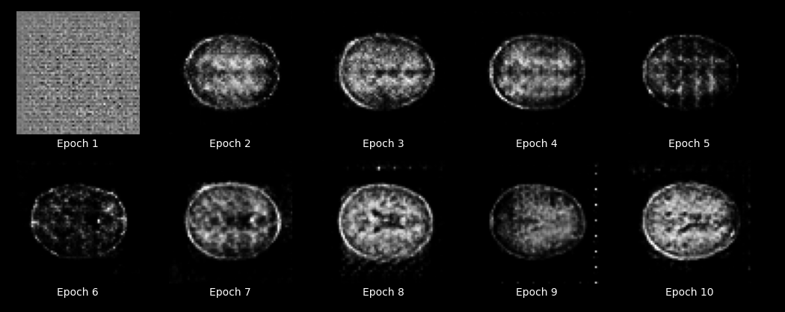
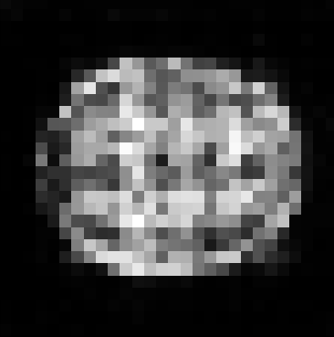
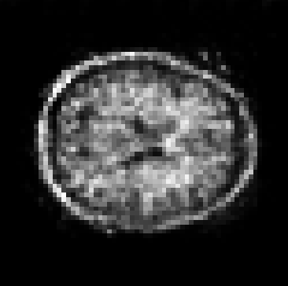
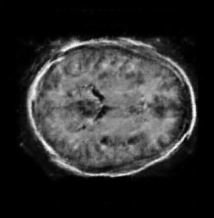

# Nic Thompson (s4436194) COMP3710 PatternFlow Project

This project seeks to implement a Deep Convolutional Generative Adversarial Network (DCGAN), for the OASIS brain 
dataset. This project specifically builds from scratch the generator and discriminator models required, 
and trains them on the corresponding data. Different resolutions have been implemented under this project, each varying
with the different model required for each. Namely, this project implements DCGAN models for,

* 28 by 28 images
* 64 by 64 images
* 128 by 128 images
* 256 by 256 images

The subsequent sections outline how to operate these scripts, and an explanation to the logic behind the implementation.

## Requirements

This project relies on various packages native to Python. Namely, this project requires at least,

* tensorflow 2.1.0 +
* matplotlib
* tqdm
* PIL (i.e. the Pillow package)
* numpy (only for driver tests)

Furthermore, this module relies on the following built in Python packages,

* glob
* itertools
* os
* time
* datetime
* typing
* unittest

In particular, this project is dependent on having at least TensorFlow 2. This project worked with version 2.1.0, and 
has not been tested on prior versions, so this is not guaranteed. Furthermore, many of these dependencies are for 
convenience, and so on request some of these can be removed. Please contact me if you wish to do so.

## Deep Convolutional Adversarial Networks (DCGAN's)

The DCGAN forms the foundation of what this project aims to implement. Their architecture builds on the idea of 
combining a U-Net style, convolutional neural network, with the generative adversarial framework that many GAN's 
are built on today. They were originally introduced by Radford & Metz in 2016, in their paper concerned with combining
CNN architectures with GANS. The paper can be found [here](https://arxiv.org/pdf/1511.06434.pdf).

The DCGAN architecture requires two core models to be built, both relying heavily on convolutions. The original paper
outlines a range of criteria to help in stability of these models, which this project aims to adhere to. These 
specifications include,

* Using strided convolutions in the discriminator, over pooling layers
* Using fractional strided convolutions in the generator
* Using batchnorm between layers in the generator and discriminator
* Removing all fully connected layers from both models
* Using RelU activation between all layers in the generator, except the output which uses Tanh
* Using LeakyRelU activation between all layers in the discriminator

Building on this, the paper also specifies important qualities in the models implementation that were considered here,

* Normalising image inputs between -1 and 1
* In the LeakyRelU, use a leak with slope 0.2
* Use the Adam optimiser for both generator and discriminator, with a learning rate of 0.0002 and a momentum value of 0.5

Note that when looking through models_helper.py, only the 256 x 256 models obey these guidelines. An illustration of
the generator image is shown below,

Example generator architecture given in the original [paper](https://arxiv.org/pdf/1511.06434.pdf)

For the generator, randomly sampled data from a normal distribution is passed in, and iteratively up-sampled using
2D transposed convolutions until the desired dimensions are achieved. This is why a new model was used for each
image resolution. The discriminator works conversely, instead taking a full image, and down-sampling to a binary output
using convolutions. Binary Cross-Entropy is used for both the generator and discriminator losses, noting that the 
discriminator loss is given by comparing a binary output to a binary classification, and the generator loss is computed
based on whether generated images were classed correctly by the discriminator, again with binary classifications.

It's encouraged to read the full paper to fully understand the nature of how DCGAN models work. Much more details 
on this implementation can be explained there.

## Running the algorithm

There are four core python scripts used in this project,

### `driver.py`

This file is used to run the code used in this project. Namely, this includes training a model, and testing a trained 
model. Note that to test a trained model the model must exist prior to running this script. This runs the code found
in `oasis_dcgan.py`, and is the main driving script used for this project. This file uses code from 
the `models_helper.py` file to generate models, which is then passed to classes from `oasis_dcgan.py`.

### `driver_tests.py`

This file uses the Python built-in `unittest` package to test individual parts of the code. This means generating
mock data and testing outputs have the correct dimensions, data types, and expected outputs. This code is not
fundamental to running this project, but useful for testing purposes.

### `oasis_dcgan.py`

This is the main implementation for this problem. This file contains two core classes, `Dataset` and 
`DCGANModelFramework`. The `Dataset` class is responsible for importing data and creating a generator to release images
in batches, while the `DCGANModelFramework` contains the main training code for the models. 

### `models_helper.py`

This file creates a range of generator and discriminator model classes, that are then bundles together in functions 
designed to return the classes based on the size required. This is where the main model development was conducted,
and where to look regarding each model implementation.

In line with this, there are several features that the scripts have to aid in the model developement cycle,
* Building on this, the driver script is used to train and test the main models used for this project. Models are saved
automatically, and if training is stopped, it can be resumed where last left off, as long as the same model name
is used. Model name's are determined by the current date, and size of the model output, so in practice this needs
to be done on the same day. This is facilitated through TensorFlows checkpoint construct.
* SSIM is calculated regularly through a training epoch. This is particulary to help woith developing large models,
to infer early on whether a model is converging on a solution, and whether to continue training (can take large periods
of time in the larger models).

Notably, since a GAN was developed for this project, there was no need to rely on train/test/validation splits, or
the labelled-segmented data. For this project, each epoch was only trained on the provided OASIS training image data.

To run this project, in `driver.py`, set the resolution to 28, and run the script. This will run the training process 
for a new model, which should train each epoch in roughly a minute each. One each epoch completion, a set of images will 
be generated in the `output/` folder, and SSIM values will be printed periodically throughout the training process.
If you stop the process, simply re-running the script (granted it is on the same day) will pick training back up
where you left off.

## Project Results

The code used in this project was designed to display images on each epoch of training. The benefit of this is that we 
can illustrate model development over time as it is trained against the data over and over. The following set of charts
illustrate the development of a 64 x 64 generator model over time as it progresses through training epochs,

Clearly, initially, the model poorly reflects what a brain looks like, whilst over time we can see these generated 
images progressively improving. For this particular model, epochs take roughly five minutes each, so this model would 
take roughly an hour to fully train. It's also worth noting that after the first epoch, each generated image is scoring 
a [Structure Similarity](https://en.wikipedia.org/wiki/Structural_similarity) of over 0.75 each time. This is slightly
due to the low resolution of the image, which makes it slightly easier for the SSIM to perform well. This is less so 
the case with higher resolutions.

We can furthermore investigate the final outputs at each level of resolution. For a **28 x 28** model, a set of 
generated images looks like the following,

Which has a SSIM value of 0.7. Furthermore, for a **64 x 64** model, a set of generated images looks like the following,

Which similarly has a result around 0.7. Finally, a **256 x 256** model generated image looks like the following,

Which has a SSIM value just below 0.8. Clearly, as models grow in size their resolution becomes better and better,
but at a cost of model training times and the weights checkpoint size. For each of the models in this project, we found,

* 28 x 28, training time less than one and a half minutes, model checkpoint size was 30mb
* 64 x 64, training time around five minutes, model checkpoint size was 60mb
* 256 x 256, training time was around four hours, model checkpoint size was roughly 2.5Gb

Clearly, in the interest of memory constraints, those models that generated the images seen here aren't included in this 
project repository. Contact me if interested in running the models yourself. Otherwise, training the model specified in 
`models_helper.py` under the 256 x 256 classes of generator and discriminator, and using the right loss and optimiser
with specific hyperparameters should yield a similar result. 

Note that the 256 x 256 model was significantly larger than the others. This is because initially a simple model could
perform quite well, but scaling up the model proved incapable of generating successful results. The 256 x 256 is 
slightly different in structure, and instead based more off the papers specified models than the smaller models were.
Out of interest, the output at the final epoch in the 256 x 256 model produced the following images,

Note that in these images, a different colormap is used to better represent the generated images.
