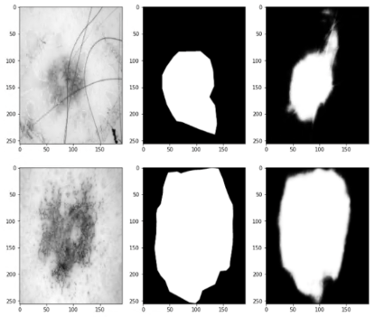
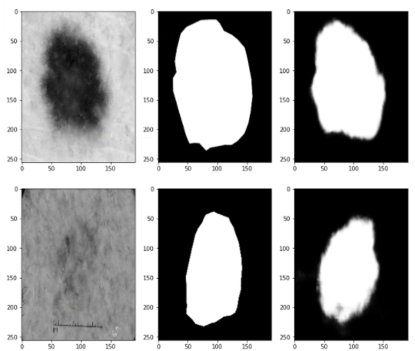

# Segement the ISICs data set with the Improved UNet

This project is aimed to train a improved UNet model for detecting the melanoma shape from its photo. After properly trained, the model achieves the accuracy over 0.92 and dice similarity coefficient (DSC) over 0.8.

## BACKGROUND
The International Skin Imaging Collaboration is an internationa effrort to improve melanoma disgnosis. The project target is to develop image analysis tools to enable the auto mate disgnosis of melanoma from dermoscopic images [1]. The challenge is divided into three sub tasks which are:
Task 1: Lesion Segmentation 
Task 2: Lesion Attribute Detection 
Task 3: Disease Classification 

In our project, only task one is focused and addressed. Our model use Imporved UNet to segement the lesion area from background with a high accuracy and DSC. 

## DATASET DESCRIPTION

The datasets used in this project from training, validating and testing are all from ISICs 2018 Challenge Data set. The datasets contains two matched groups with each group has 2594 images. The first group of images is the raw melanoma images and the second groups of image (mask image) is the segmentation of the lesion area which will serve as labels in following model training.  mask images are binary images with only pixel value of 0 and 255. Pixel value = 255 means the lesion area while 0 means background area. Figure 1 is an example of melanoma raw image (group 1 image) and Figure 2 is the responding mask image.

Figure 1, An example of melanoma raw image

Figure 2, Mask image (segmentation image) of Figure 1 

## DATA PREPROCESSING

Data preprocessing of this project including three steps:

### 1. Load Rwa Data

In this project, the grayscale version of images are loaded for training in the model because the task of this project is to segment the lesion area without analysising the attribute of lesion area. Load the grayscale only can be helpful in reducing the unnecessary computing resources. 

### 2. Split Raw Data

There are 2594 pairs of image & mask supplied. In this project, 60% of them will be used for model training and 20% of them for model calidation and the rest 20% for testing the trained model. That is, training set has 1556 pairs of images, both validating and testing sets have 519 pairs of images. To make sure the credibility of the model, all datasets will be shuffled before training. 

### 3. Map and Decode Raw Images

Before datasets are ready to be trained in the model, all images and masks will be rescaled into the same size with matching mask. In this model, the predefined image size is 512 * 384 because the balance between image actual size and computing resources. The raw image size distribution is as following. Since the number of large image accounts for over 2/3, it is not suitable to rescale image to a very small size, but large size will cause slow training process. 512 * 384 is the chosen predefined image size . 

Figure 3, width distribution of all images

## MODEL TRAINING 

### Model Description
U-Net is a convolutional neural network that is originally developed for biomedical image segmentation. It has two stage. The first stage is VGG stage to encode the image and the second stage is CONCAT stage by combining the symmetric VGG with previous step out put for further convolution. Figure 4 is a sampled structure of UNet. 

Figure 4, Sample Unet Structure

Each VGG stage contains a seriers of convolution layer with a max pooling layer to encode raw image. CONCAT stage requires up sampling (upsampling with convolution) at first and concat output of symmetric VGG concolution output. then perform a seriers of convolution action and also perform a max pooling action. Final convolution layer will be used to segment the image based on the predefined settings (num of classes, activation functions and so on). 

### Model Structure

Model straucture of this project is as following with four VGG block, one bottom block and four CONCAT block. The output layer use 'Sigmoid' as the activation function.

Input size for each image: (512， 384， 1)

Encode output size for each image: (32, 24, 1024)

Figure 5 shows the structure of applied UNet.

Figure 5, UNet structure in this project

## First Epochs Result

## 100TH Epochs Result

## 200TH Epochs Result

## Training History

### Training Accuracy vs Validation Accuracy
Figure 6, shows the accuracy change of training dataset and validating dataset

### Training Dice Coefficient vs Validation Dice Coefficient

# RESULTS
### Four sets images with the first image being raw image, the second one being raw mask and the third one being predicted mask

