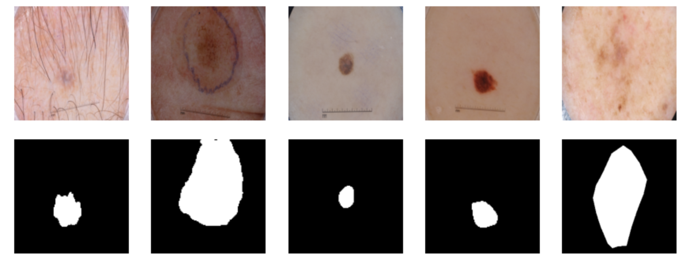
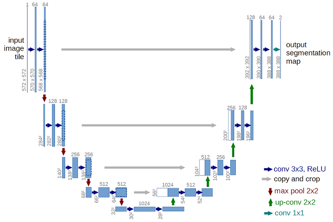
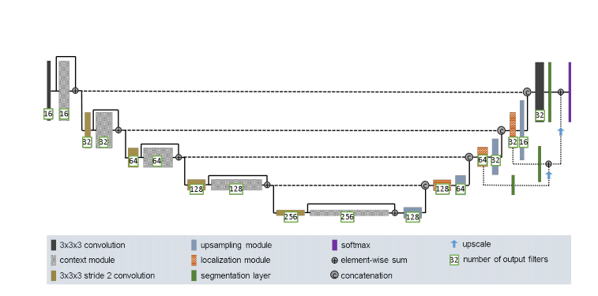
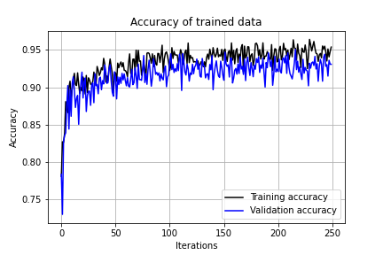
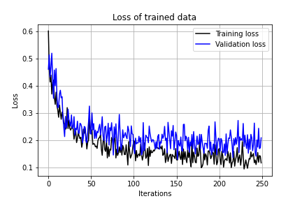
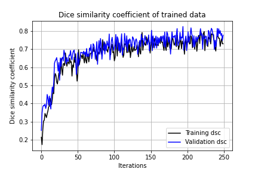
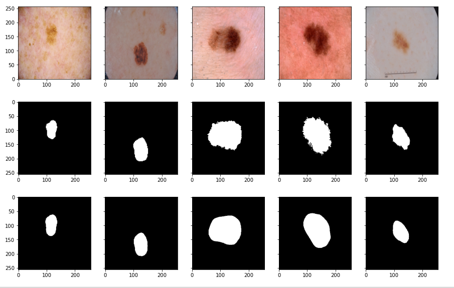
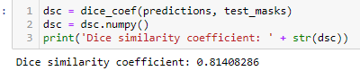

# Image Segmentation on ISICs dataset using Improved Unet

## Backgournd
### Problem Statement
ISICs dataset contains images of Melanoma, a serious form of skin cancer. The aim of this project is to conduct image segmentation, creating pixel-wise binary mask for Melanoma. The dataset contains 2594 photos of Melanoma and 2594 masks.   Improved unet model is used to map raw images to binary masks. For the binary mask, places with Melanoma infections are mapped to 1 and those uninfected area are mapped to 0. Some examples of the original images and their corresponding masks are shown below.  
  
More information about the ISICS Dataset can be found at https://challenge2018.isic-archive.com/.

### Algorithm
U-Net is a convolutional network architecture, designed for biomedical image segmentation. It consists of one contraction part, bottleneck and expansion part. Any contraction block and expansion block at the same level will be concatenated. (Ronneberger, Fischer, Brox, 2015)
    
We are using the improved U-Net, developed based on U-Net in 2017. The following features are added to normal U-Net:
1. Context modules for activations
2. Localization pathway to transfer features from lower level to higher spatial resolution
3. Segmentation layers integration at different levels for deep supervision
4. Leaky ReLU is used to add nonlinearities to the model.
    

### How It Works
As the unet goes deep, more abstract information of the input is encoded. With the help of localization pathway, we can recombine the information with shallower features to localize the infected area. Information before and after context module are recombined, before and after the encoding, latend space, decoding as a whole are recombined. Segmentation layers at different levels are also integrated and combined with elementwise summation to form results, so connections among different localization layer are kept. 

## Implementations
### Data Split
Since the data set is sufficiently large with 2594 pairs of images, we can conduct train, validation, test split on the dataset. Since the model has large amount of parameters, it's necessary to have a validation set to prevent overfitting. Data was split as 70% for training, 15% for validation, 15% for testing. 

### Model Training Parameters
* Activation function: Sigmoid
* Optimizer: Adam (learning rate at 0.0001)
* Loss function: BinaryCrossEntrypy
* Checkpoint Callback: Maximum validation accuracy
* Training Epoch: 250
* Batch size: 10

### Result
1. Training plots 

2. Prediction plots 
 
(First row: row images; Second row: ground truth; Third row: predictions)  
3. Dice Similarity on testing data: 0.814  
 

## Dependencies
* Python=3.7
* Tensorflow-gpu(2.1)
* Opencv
* Matplotlib
* PIL

## Author
Name: Wenjun Zhang 
Student Number: s4469251

## Reference
* Fabian Isensee and Philipp Kickingereder and Wolfgang Wick and Martin Bendszus and Klaus H. Maier-Hein, Brain Tumor Segmentation and Radiomics Survival Prediction: Contribution to the BRATS 2017 Challenge, 2017, arXiv:1802.10508 
* Olaf Ronneberger and Philipp Fischer and Thomas Brox, U-Net: Convolutional Networks for Biomedical Image Segmentation, 2015, arXiv: 1505.04597
