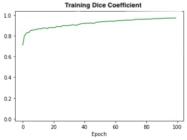

# Tensorflow Implementation of  Improved UNET

## Description of Algorithm & The ISIC Dataset

The Improved UNet is a CNN originally developed for biomedical image segmentation in order to produce masks for skin lesion images. This algorithm ultimately contributes to medical research by improving the diagnosis of melonoma in patients. 

The ISIC dataset is a open source dataset seeking to advance melonoma research. Each year they run the ISIC Challenge which aims to improve diagnosis accuracy using AI. The dataset used in this project is taken from the 2018 challenge.

## Architecture
The Improved UNet Architecture is displayed below. The model works by continously encoding the data in higher abstract forms through convolution, before recombining the representations to identify features used to form a segmentation mask. Like the standard UNET, the Improved UNet model can thought of as containing two separate parts - encoding and decoding. The encoding section of the network is broken into a series of blocks with increasing filter size, whilst the decoding section essentially performs the inverse. Inside each context module is 2 layers of Batch Normalization, ReLU, and Convolution with a dropout layer between. Additional layers of Batch Normalization have been added to avoid overfitting. 

The model was trained with a 80:10:10 train/test/validation split for 100 epochs to achieve a >0.8 dice similarity. The data was preprocessed through normalization and resizing to 256x256 with 3 channels for input data, and 1 channel for the mask data. The model is trained with a dice coefficient loss function.

## Running the Model

### Google Colab

This model has been developed using Google Colab. Henceforth, all of the logic (such as mounting drives) assumes that setup. There are some preliminary steps if you would like to run it within that environment.

1. You will need to upload the 2018 ISIC dataset to your Google Drive. This could take a couple of hours depending on your internet speeds.
2. You will also need to update the directory strings to be the relative location of your dataset
3. Finally, you can either chose to upload model.py to Google drive and then import it within main.ipynb, or alternatively copy paste the code into the relevent cell. 

### Running on Personal Computer

If you would like to run this on your computer then please do not run the first cell of main.ipynb. Instead you will need to update the dataset path to where you have saved it locally. Furthermore, you will need to import the model from model.py.

## Results

This model is able to achieve >0.8 dice similarity on the test dataset in 50 epochs.

### Loss Function and Accuracy Plot

A Dice Similarity Loss function is used as we are aiming for a Dice similarity of over 0.8. The Dice Coefficient was chosen as the metric to evaluate the model as it is a straightforward mechanism used to evaluate the similarity of two images. A higher value represents higher similarity. The below image plots the training set results.

### Data Visualisation

The below image demonstrates the model predicting the mask of 3 different skin lesion images.

## Dependencies 

### Model Dependencies
- Python 3.7
- tensorflow

### Driver Dependencies 
- Python 3.7
- sklearn
- glob
- tensorflow
- matplotlib
- google.colab 