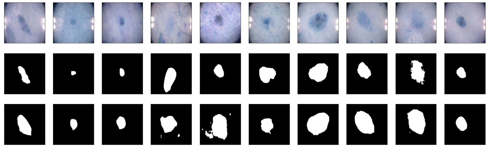

# Improved UNet for ISIC2018 Segmentation

Improved UNet model of image segmentation implemented for TensorFlow

# Description

Image segmentation technology can be widely used in various fields. For example, we can detect abnormal lesions by processing medical images. Therefore, we need to perform feature extraction on the picture. The traditional UNet forms a U-shaped structure through a contraction network and an expansion network, which extracts features from images. However, its depth is insufficient and cannot be applied to more complex image segmentation. In this project, an improved Unet model proposed by Fabian et al. will be constructed in TensorFlow, which is used for segmenting the skin cancer data set provided by the ISIC2018 Challenge with all labels having a minimum Dice similarity coefficient of 0.8 on the test set. Namely, this model will classify the original images into two labels to generate black-and-white images, which can help observe skin cells' size and shape directly. This model deepens the UNet structure's depth by adding designed pathways, like context and localization modules. So that the input data is processed more deeply, and the features are extracted more accurately. Simultaneously, this model's most significant improvement is adding a segmentation layer in the decoder part, and the corresponding features are combined through upsampling to optimize the number of feature maps. Besides, according to the data set characteristics, we modified the input and output layers of the improved UNet, using the 2D convolutional layer. Also, the activation function of the last layer is sigmoid for binary classification.


# How it Works


# Dependencies

__Requirement:__

* Python 3.6
* Pytorch 1.2.0

[Download]() to use the algorithm

or via Github clone

```shell
git clone https://github.com/1tanwang/PatternFlow.git
```


# Example Usage

Import the algorithm and use in Python script.


__Note: The input image to algorithm should be converted into pytorch tensor__


```Python

import torch


from PatternFlow.denoise.denoise_tv_bregman.denoise_tv_bregman import denoise_tv_bregman


# noisy_img is the noised input image

# convert to torch tensor

input_img = torch.FloatTensor(noisy_img)

# pass the input image to algorithm

# convert the return image to numpy array for later plotting

denoised_img = denoise_tv_bregman(input_img, weight=0.1).numpy()

```

# Example Result




# Reference

* [1] [Fabian Isensee et al. - Brain Tumor Segmentation and Radiomics Survival Prediction: Contribution to the BRATS 2017 Challenge](https://arxiv.org/pdf/1802.10508v1.pdf)

* [2] [Wikipedia - Sørensen Dice coefficient](https://en.wikipedia.org/wiki/Sørensen–Dice_coefficient)

* [3] [Dataset - SICI2018 Challenge](https://challenge2018.isic-archive.com)


