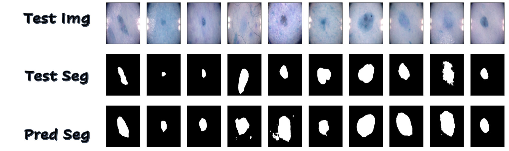

# Improved UNet for ISIC2018 Segmentation

Improved UNet model of image segmentation implemented for TensorFlow

# Description

Image segmentation technology can be widely used in various fields. For example, we can detect abnormal lesions by processing medical images. Therefore, we need to perform feature extraction on the picture. The traditional UNet forms a U-shaped structure through a contraction network and an expansion network, which extracts features from images. However, its depth is insufficient and cannot be applied to more complex image segmentation. In this project, an improved Unet model proposed by Fabian et al. will be constructed in TensorFlow, which is used for segmenting the skin cancer data set provided by the ISIC2018 Challenge with all labels having a minimum Dice similarity coefficient of 0.8 on the test set. Namely, this model will classify the original images into two labels to generate black-and-white images, which can help observe skin cells' size and shape directly. This model deepens the UNet structure's depth by adding designed pathways, like context and localization modules. So that the input data is processed more deeply, and the features are extracted more accurately. Simultaneously, this model's most significant improvement is adding a segmentation layer in the decoder part, and the corresponding features are combined through upsampling to optimize the number of feature maps. Besides, according to the data set characteristics, we modified the input and output layers of the improved UNet, using the 2D convolutional layer. Also, the activation function of the last layer is sigmoid for binary classification.


# How it Works

- __Input:__

Normalized image data with resized height, weight and channels as `(None, 256, 256, 3)`

- __Encoder:__

The encoder is the left part in the architecture, which encodes the input image into feature representations at multiple different levels.

    - context module: 
    
    A pre-activation residual block, which deepens the UNet's depth and allows for more features while descending down the aggregation pathway.
    
- __Bridge:__

The bridge is the middle part in the architecture, which connects the encoder and decoder.

    - upsampling module:
    
    Consists of one upscale and one convolutional layer, which upsamples the low resolution feature maps and reduces the number of feature maps.
    
- __Decoder:__

The decoder is the right part in the architecture, which semantically projects the discriminative features (lower resolution) learnt by the encoder onto the pixel space (higher resolution) to get a dense classification.

    - localization module:
    
    Consists of two convolutional layers, which takes features from lower levels of the network that encode contextual information at low spa- tial resolution and transfer that information to a higher spatial resolution.
    
- __Output:__

Two lables image data with resized height, weight and channels as `(None, 256, 256, 1)`


__Fig1: Architecture: Improved UNet__


__Fig2: Modules__

Context Module | Upsampling Module | Localization Module
------------ | ------------- | -------------
 |  | 


# Dependencies

__Requirement:__

* Python 3.7
* TensorFlow 2.0
* GPU

or via Jupyter Notebook `COMP3710_Project_Final.ipynb`


# Example Usage

Import the model and use in Python script.


__Note:__

__1. The input image to model should be normalized and resized.__

__2. The dataset will be split to train:val:test with the ratio `6:2:2`.__

__3. The value of ground truth and output should be converted to `0 or 1`.__


```Python

import tensorflow as tf
from model import build_model

# prepocessing image data

width = 256
height = 256
channels = 3

X = np.zeros([2594, height, width, channels])
y = np.zeros([2594, height, width])

# process image
for i in range(len(images)):
    images[i] = cv2.resize(images[i],(height,width))
    images[i] = images[i]/255
    X[i] = images[i]

# process mask
for i in range(len(masks)):
    masks[i] = cv2.resize(masks[i],(height,width))
    masks[i] = masks[i]/255
    masks[i][masks[i] > 0.5] = 1
    masks[i][masks[i] <= 0.5] = 0
    y[i] = masks[i]      
y = y[:, :, :, np.newaxis]

# predict mask
predictions = model.predict(X_test)
for i in range(len(predictions)):
    predictions[i][predictions[i] > 0.5] = 1
    predictions[i][predictions[i] <= 0.5] = 0
    
    
# plot original image, ground truth, segmentation
n = 10 
plt.figure(figsize=(30, 10))
for i in range(1, n+1):
    ax = plt.subplot(1, n, i)
    plt.imshow(X_test[i])
    plt.gray()
    ax.get_xaxis().set_visible(False)
    ax.get_yaxis().set_visible(False)

plt.figure(figsize=(30, 10))
for i in range(1, n+1):
    ax = plt.subplot(1, n, i)
    plt.imshow(y_test[i])
    plt.gray()
    ax.get_xaxis().set_visible(False)
    ax.get_yaxis().set_visible(False)

plt.figure(figsize=(30, 10))
for i in range(1, n+1):
    ax = plt.subplot(1, n, i)
    plt.imshow(predictions[i])
    plt.gray()
    ax.get_xaxis().set_visible(False)
    ax.get_yaxis().set_visible(False)
```

# Example Result



__Note: Test Dice Coefficient:  0.8451062__

# Reference

* [1] [Fabian Isensee et al. - Brain Tumor Segmentation and Radiomics Survival Prediction: Contribution to the BRATS 2017 Challenge](https://arxiv.org/pdf/1802.10508v1.pdf)

* [2] [Wikipedia - Sørensen Dice coefficient](https://en.wikipedia.org/wiki/Sørensen–Dice_coefficient)

* [3] [Dataset - SICI2018 Challenge](https://challenge2018.isic-archive.com)

# Author

Name: Jiamin Li

Student ID: 45115286


