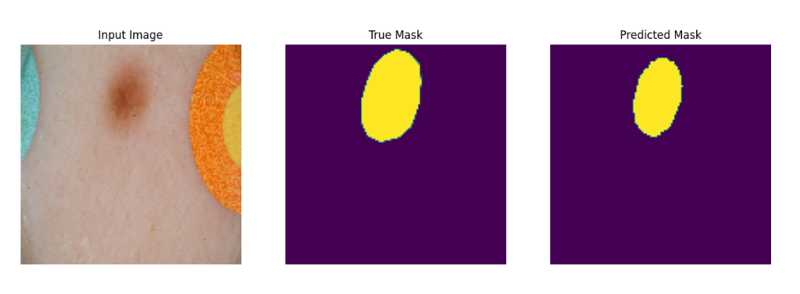

# Image segmentation using UNet on the ISICs skin cancer dataset.

#### Created by Yash Talekar, s4524723

The ISIC 2018 challenge data for skin cancer includes over 2500 images of 
skin lesions as well as masks for these lesions. 

On this dataset, a UNet model was trained and evaluated to perform image segmentation.
The segmentation splits the image into parts which belong to the lesion and the rest of 
the image.

## Dataset
These images are provided as 3-channel coloured pictures whereas the masks are
single channel or grey-scale. The dataset is available at 
https://challenge2018.isic-archive.com/.

Example of image and mask:

 

*fig1. example image*

*fig2. example mask*

## Dataset Pre-processing
The images provided were not of uniform size, so they were first all resized to 128x128
pixels.

The given image and mask files were converted to tensors, and their pixel 
values were rescaled from [0, 255] to [0, 1].

The data was split into training, validation and test sets with a standard split ratio
of 60:20:20.

## Model
An Improved UNet model was created following the paper 
https://arxiv.org/abs/1802.10508v1 which was used for 3D brain data from MRIs.
This model is similar but for 2D skin lesion images. The network architecture is roughly as follows, 
but 3 layers deep instead of 5 and it has been adjusted to deal with 2D images instead of 
3D images.:

*fig3. Improved UNet model*

The model consists of two parts, the encoder and the decoder.
The encoder is the part of the model as we go down the 'U' shape of the model, 
where it tries to learn features using convolution layers 
at each level of abstraction and transmit them to the 
lower layer and across skip connections.

The decoder is the part which reconstructs the mask from the image using these learnt 
features using convolutions, upsampling and the data passed from skip connections.

## Training
The model was run for 100 epochs. The loss function used was binary cross-entropy.
The following are example accuracy and loss curves obtained
from training the model. 

*fig4. Accuracy curve in training run.*

*fig5. Loss curve in training run.*

## How to Run 
First make sure the following dependencies are installed. They are
also found in the file 'requirements.txt'.

### Dependencies
 * numpy~=1.19.4
 * tensorflow~=2.6.0
 * Pillow~=8.0.1
 * matplotlib~=3.3.3
 * keras~=2.6.0

### Data files
Put the image files in the project directory under data/images.
Put the mask files in the project directory under data/masks.

Then, just run driver.py, and the model will run.

## Results
The [dice coefficient](https://en.wikipedia.org/wiki/S%C3%B8rensen%E2%80%93Dice_coefficient) 
metric was used to evaluate the model. 

The model achieved a dice score greater than 0.8 on the test set.

The following are some examples of the masks predicted by the model:

*fig6. Example Predictions on test set.*

## References/Resources used in order of importance.
Improved UNet Paper: https://arxiv.org/abs/1802.10508v1

TensorFlow Image Segmentation Example: https://www.tensorflow.org/tutorials/images/segmentation

Image Segmentation Example on Medium: https://medium.com/geekculture/u-net-implementation-from-scratch-using-tensorflow-b4342266e406

