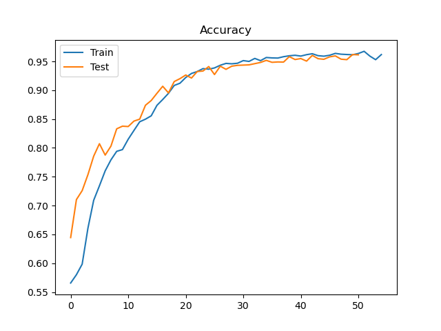

# s4524825 Perceiver

This folder contains an implementation of a [Perceiver][^1].

The perceiver combines the previous works on transformers 
with a new iterative attention mechanism that allows it to discern a latent array iteratively by consecutively applying cross-attention and a transformer (for images, similar to ViT[^2]). 

The model iteratively sees the summary latent array from the previous block, and sees the original data array, basing the attention on the data array on the latent array and the queries, keys, and values generated from the previous iteration. This allows it to fine tune the attention on the original image as it goes on. At the end a basic MLP classification head decides on the output based on the latent array after global average pooling.

This architecture allows any data 
format to be input into the model, rather than just images (e.g. ViT). 
As attention based methods tend to iteratively focus on key features, they often provide better classification results than previous convolutional methods. 

The model inputs the data array as a vector, and as the model doesn't care about the position of the data relative to other datapoints, the model requires that a positional encoding is supplied.

These attention based methods offer more accuracy with supposed less resources to train.

## AKOA dataset 

The AKOA dataset provides MRIs of knees. In this project we aim to classify the laterality of a knee using the Perceiver model.

Some examples (resized to 64x64x3):

A left and right knee:

 

Laterality appears to be a simple task as it is a binary classification problem, and the knees are generally a flipped variant of the other laterality.

## Usage

driver.py shows example using AKOA knee data to classify the 
laterality of the knee scan given to the model.  

To train, place images in folders `data/AKOA_Analysis/left/` and `data/AKOA_Analysis/right/` and then run `generate_labels.py` to do splits, 
and finally run `train.py`. 

A classification can be done by running `driver.py`.

## Training

Training can be done by running train.py to build weights.h5, although some pre-trained weights and training and test output is provided in 
`goliath/`. The images were resized to 64x64x3 to save space, and as the laterality should be easily determined, the dimension reduction 
should not pose any risk to the classification rate. Although, perhaps if the image resolution was lowered too much the model would overfit, 
embedding outputs to the inputs would be much simpler for smaller image sizes. This does not appear to happen as seen in the figures below.  

As seen in the above figures, the model achieves great accuracy within 20 or so epochs. After the first epoch the accuracy is 55% and this is just better than what we might expect for random coin toss, as this is a two class classification problem. 

There may be an error in the test loss code as it doesn't seem to change much, I believe it is being scaled by the number of training examples rather than test examples and the bug was fixed but there was not time to retrain.

## Splits 
The data was split as 60%, 20%, 20% (train, test, validation). As the images are MRI scans there can be a lot of differences in examples and so it should be useful to provide a larger test and validation split so the model doesn't overfit. 

Splits must be done before training by runing generate_labels.py

## References

[^1]: Jaegle, A., Gimeno, F., Brock, A., Zisserman, A., Vinyals, O., & Carreira, J. (2021). Perceiver: General perception with iterative attention. arXiv preprint arXiv:2103.03206. 

[^2]: Vaswani, A., Shazeer, N., Parmar, N., Uszkoreit, J., Jones, L., Gomez, A. N., ... & Polosukhin, I. (2017). Attention is all you need. In Advances in neural information processing systems (pp. 5998-6008).