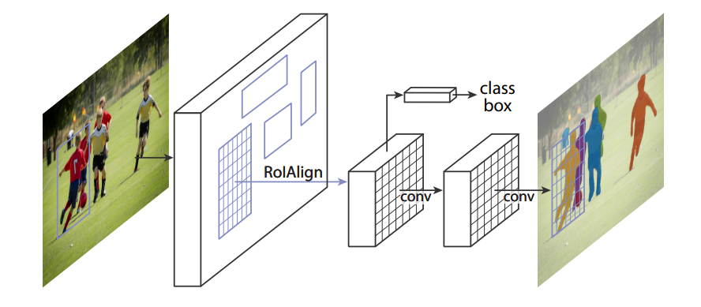
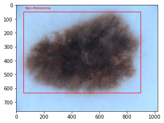
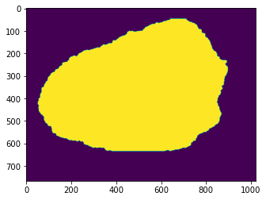
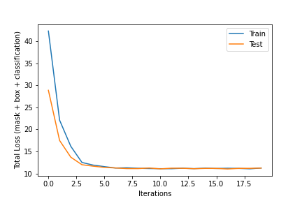
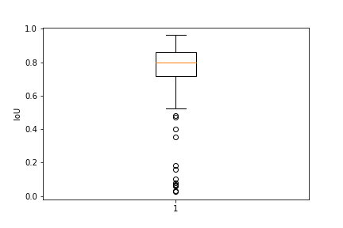
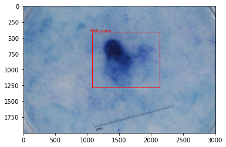
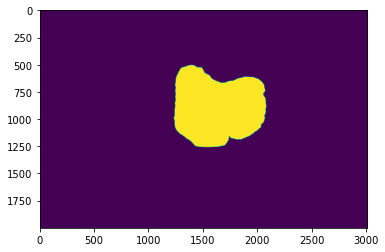

# Detect and classify lesions in the ISIC 2017 dataset using Mask R-CNN
We train a [Mask R-CNN model](https://arxiv.org/abs/1703.06870) on the [ISIC 2017 dataset](https://challenge.isic-archive.com/data/#2017) to detect skin lesions in an image and classify them as cancerous or benign. We start with a model pretrained on the COCO dataset provided by PyTorch (see [here](https://pytorch.org/vision/main/models/mask_rcnn.html)) and train it on the ISIC 2017 dataset. The model is a Mask R-CNN with a ResNet-50-FPN backbone, which is known to be capable of efficiently detecting and classifiying objects in images.

## Mask R-CNN

The Mask R-CNN architecture extends the Faster R-CNN, which outputs a class label and bounding box for an input image. Faster R-CNN first proposes candidate bounding boxes using a Region Proposal Network (RPN) then performs bounding box regression and classification using RoIPool. The Mask R-CNN model follows the same architecture as Faster R-CNN, and further generates a mask in parallel with classification and bounding box regression.

Figure 1: Picture of the Mask R-CNN from the original paper [1]

Therefore, the loss of Mask R-CNN is the sum of the classification loss, the box regression loss, and the mask loss.

## ISIC 2017 Challenge Data

The ISIC 2017 Challenge Data provides images of skin lesions and ground truth segmentation masks and classifications as melanoma. We use the training, test, and validation split provided by the challenge and compute a bounding box bases on the ground truth masks.

We aim to use Mask R-CNN to predict masks, bounding boxes and classifications of skin lesions in the ISIC data. In Figure 2 we show an example of an input image and the ground truth bounding box and classification.

Figure 2: Example of input image with bounding box and classification

In Figure 3 we show an example of the ground truth mask from which the bounding box has been computed.

Figure 3: Example of target mask

## Training

We use the train, test, validation split provided by the ISIC challenge. We are training our model on a subset of 2000 images of skin lesions, and train for 20 epochs. Due to memory constraints, we train on a random subset of 100 images of the training data. We plot both the training and test loss on each epoch which can be seen in Figure 4. The optimizer was chosen to match that from the original paper, namely we use stochastic gradient descent with a learning rate of 0.0025 (the original paper trains with 0.02 and a batch size of 16, our batch size is 2 so we take 1/8 of the learning rate).

Figure 4: Plot of total training and test loss on each iteration

## Results

We achieved an average IoU of 0.75, a precision score of 0.43, and recall of 0.76. A plot of the IoU for each prediction on the validation set is given in Figure 5.

Figure 5: IoU scores on the validation set

We show in Figure 6 and example bounding box prediction and classification of a sample of the validation data.

Figure 6: Example prediction by the trained network with positive classification

The mask prediction for the same image is showed in Figure 7.

Figure 7: Example mask prediction

## Requirements

* `python==3.9.12`
* `pytorch==1.12.1`
* `torchvision==0.13.1`
* `cudatoolkit==11.3.1`
* `matplotlib==3.5.2`
* `numpy==1.23.1`
* `pandas==1.4.4`
* `pillow==9.2.0`
* `tqdm==4.63.0`

## References
[1] He, Kaiming, Georgia Gkioxari, Piotr Dollár, and Ross Girshick, “Mask R-CNN,” in 2017 IEEE International Conference on Computer Vision (ICCV), October 2017, pp. 2980–2988. [Online] Available: http://arxiv.org/abs/1703.06870.

[2] Codella N, Gutman D, Celebi ME, Helba B, Marchetti MA, Dusza S, Kalloo A, Liopyris K, Mishra N, Kittler H, Halpern A. "Skin Lesion Analysis Toward Melanoma Detection: A Challenge at the 2017 International Symposium on Biomedical Imaging (ISBI), Hosted by the International Skin Imaging Collaboration (ISIC)". arXiv: 1710.05006 [cs.CV]
