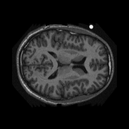
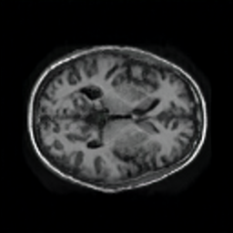
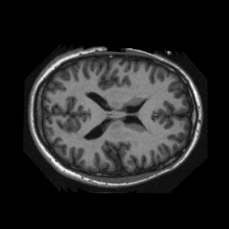
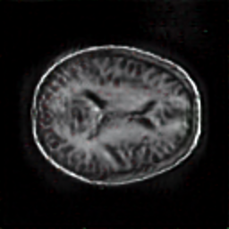

# StyleGAN Implementation

## Preview
This project is an implementtion on StyleGAN networks based on
the paper ...


"We first map the input to an intermediate latent space W,
which then controls the generator through adaptive
instance normalization (AdaIN) at each convolution layer.
Gaussian noise is added after each convolution, before
evaluating the nonlinearity. Here “A” stands for a learned
affine transform, and “B” applies learned per-channel scaling fac-
tors to the noise input. The mapping network f consists of 8 lay-
ers and the synthesis network g consists of 18 layers—two for 22
each resolution (4 − 1024). The output of the last layer is
converted to RGB using a separate 1 × 1 convolution, similar to
Karras et al. [30]. Our generator has a total of 26.2M trainable
parameters, compared to 23.1M in the traditional generator."

As an example, we will train a StyleGAN model to generate MRI image slices of 
the human brain.

## Training
Prerequisites: for the purpose of training StyleGAN model on our
example images of the MRI slices of the brain, images must be provided 
in the images/brain directory in the root of the project.
Images need to be in the RGB format to be ready for training,
and formatted into a square resolution, ie 256 x 256.

To run training, first make sure that all dependencies 
from "Dependencies" below are installed. Then, run Python script `run_stylegan.py`. The script accepts
the following command line arguments (the default value is in brackets []):

`device: Optional[str]`
- The device training is executed on.
- Acceptable values: ["cuda:0"] and "cpu"

`continue_from_previous_checkpoint: Optional[str]`
- Load existing model from the checkpoint and continue training from there.
- Acceptable values: [False] and True

`start_point: Optional[str]`
- If continue_from_previous_checkpoint is set to True, continue training 
  from the checkpoint designated by start_point
- Acceptable values: ints greater or equal to 0 [0]

`start_progressive_level: Optional[int]`
- Start level for progressive training.
- Acceptable values: ints greater or equal to 0 [1]

`max_progressive_level: Optional[int]`
- Maximum progressive level for progressive training.
- Acceptable values: ints greater or equal to 0 [7]

### Checkpoints
During training, checkpoints are saved to the trained_models/checkpoints directory.
If training is stopped, or exited with an error, training can 
be continued from the one of the saved checkpoints. To
continue training, provide `continue_from_previous_checkpoint` and `start_point`
as command line arguments.

### Image samples during training process
During training, samples of generated images are saved to previews foler.

### Some samples from training
After ~10 or a bit more hours of training, the following samples are generated:




For comparison, this is an original image:



It takes a long time and a lot of samples and progressive levels to reach 
these generated images. In the process, images similar to these
were generated:



### Dependencies
Training uses the following dependencies:
```
cycler==0.10.0
kiwisolver==1.3.2
matplotlib==3.4.3
mypy-extensions==0.4.3
numpy==1.21.2
Pillow==8.4.0
pyparsing==2.4.7
python-dateutil==2.8.2
simple-parsing==0.0.16.post2
six==1.16.0
torch==1.9.1
torchvision==0.10.1
tqdm==4.62.3
typing-extensions==3.10.0.2
typing-inspect==0.7.1
```

