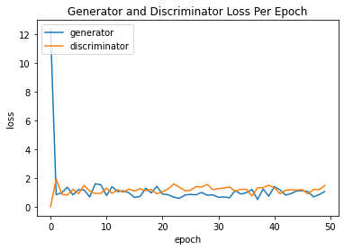
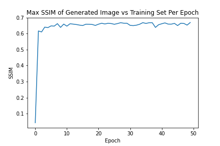
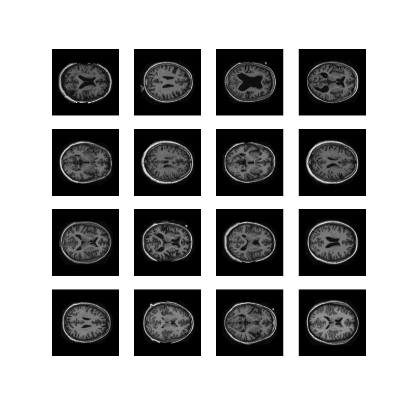

# OASIS Brain Dataset Generative DCGAN Model 
This model aims to generate accurate brain scans through the utilisation of a DCGAN trained on the OASIS Brain dataset. The completed model  results in a "reasonably clear image" and a Structured Similarity (SSIM) of approximately 0.65 when comparing a batch of iamges produced by the generator with 50 different batches of images from the training set.

## OASIS Dataset Processing
The OASIS brain dataset is preprocessed, consisting of 9,664 brain scans for training purposes and 544 for testing. 

The images in the dataset were converted to gray-scale, clipped to a resolution of 256x256, and normalised to (-1,1) for the purposes of training. A batch size of 16 was used to train the model, and 50 batches were randomly chosen from the training set in order to generate an SSIM value for every epoch the model was ran.

## DCGAN Model Explanation
GANs are an approach to generative modelling which achieve their goal by utilising two sub-models. The generator, and the discriminator. The generator's job is to generate new images, which in this context means brain scans. The discriminator's job is to decide whether the generated images are real (in this case, from the OASIS dataset) or fake (generated). The two models are trained simultaneously, with the goal that the generator eventually gets good enough to successfully trick the discriminator most of the time.

The DCGAN model is a direct application of the GAN, using convolutional layers in both the disriminator and generator. The DCGAN model utilised in this model is based on the one outlined by Radford et. al. in the paper "Unsupervised Representation Learning With Deep Convolutional Generative Adversarial Networks".

### Model

#### The Discriminator
The discriminator model consists of three convolution layers, all consisting of a LeakyReLU activation. Each layer uses a strided convolution to downsample the input image by a factor of 2 until the final dense layer is reached. The dense layer outputs a single value representing the probability of whether the input image is real or fake. The model summary as generated by TensorFlow is as follows:

#### The Generator
The generator on the other hand, begins with a Dense layer which is fed a single vector to be upsampled into the output space, which in this case is one 256x256 image. The upsampling is done through strided transpose convolution layers, each followed by a batch normalisation layer. The final convolution layer which doesn't contain a LeakyReLU activation, instead utilising a tanh function to ensure that the output pixel values are normalised to (-1,1) as per the preprocessing of the dataset. The model summary of the generator can be seen below:

### Training
Initially, the discriminator is fed a batch of brain scans from OASIS labelled by an array of ones to indicate that they are all real images. Meanwhile, the generator takes a batch of randomly generated arrays of noise as input. The generator's output is then fed into the discriminator. 

The loss function used for both models is BinaryCrossentropy. The discriminator's loss is calculated as the sum of its loss on an array of ones with a batch of real images, and an array of zeros with the generator's output. The generator's loss is purely the BinaryCrossentropy of array of ones with it's generated output.

The generator gets trained over time through the discriminator model's weights being held constant and having it be fed a batch of fake images accompanied by an array of ones, making the discriminator think the images are real. The resulting loss from this is back-propogated through the generator.

This process continues for 50 epochs for this model.

## Model Evaluation

The loss values for both the generator and the discriminator were stored every epoch, and plotted as seen below:

It can be clearly seen that the generator's loss upon instantiation is extremely high as it is originally generating an output based on noise. Equilibrium is reached very quickly with both models oscillating as they both improve.

The maximum SSIM value of the output batch from the generator and 50 batches of training images was also calculated. SSIM is used as a measure of similarity between images, which is why it was decided to take the maximum SSIM value of the generated batch and a large batch of training images. There is a magnitude of variety in the training brain scans, and comparing the generated output with a single random batch would result in a low SSIM value purely due to the discrepancy in the brains scanned, and would be a poor indicator of model quality. The SSIM values over the epochs can be seen below and shows an upward trend in the generator's similarity with the OASIS dataset over time:

## Results
The batch of images generated by the generator over the 50 epochs is seen animated below:

The model's improvement over time can be more accurately outlined by looking at some noteable epochs:

<table>
<tr>
<td> Epoch 1</td><td> Epoch 2</td><td> Epoch 3</td>
</tr>
<tr>
<td></td>
<td></td>
<td></td>
</tr>
<tr>
<td> Epoch 10</td><td> Epoch 25</td><td> Epoch 50</td>
</tr>
<tr>
<td></td>
<td></td>
<td></td>
</tr>
</table>

Comparing epoch 50 directly with a batch of real images side by side:
<table>
<tr>
<td> Epoch 50</td><td> Real Batch</td>
</tr>
<tr>
<td></td>
<td></td>
</tr>
</table>

## Running The Model

### Dependencies
- Python (v3.7)
- TensorFlow-GPU (v2.1)
- Matplotlib
- imageio
- IPython
- OASIS Dataset (https://cloudstor.aarnet.edu.au/plus/s/n5aZ4XX1WBKp6HZ)

