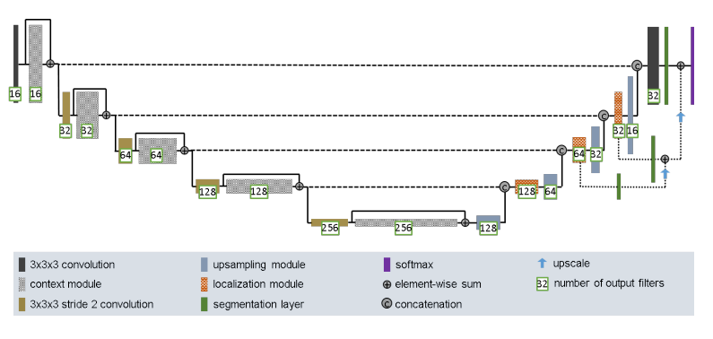
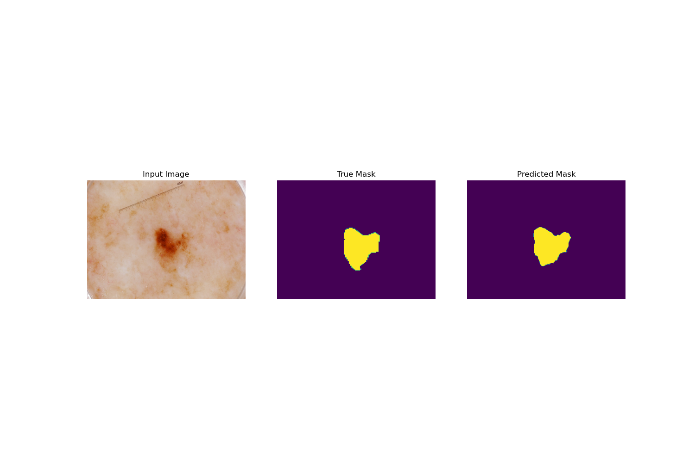
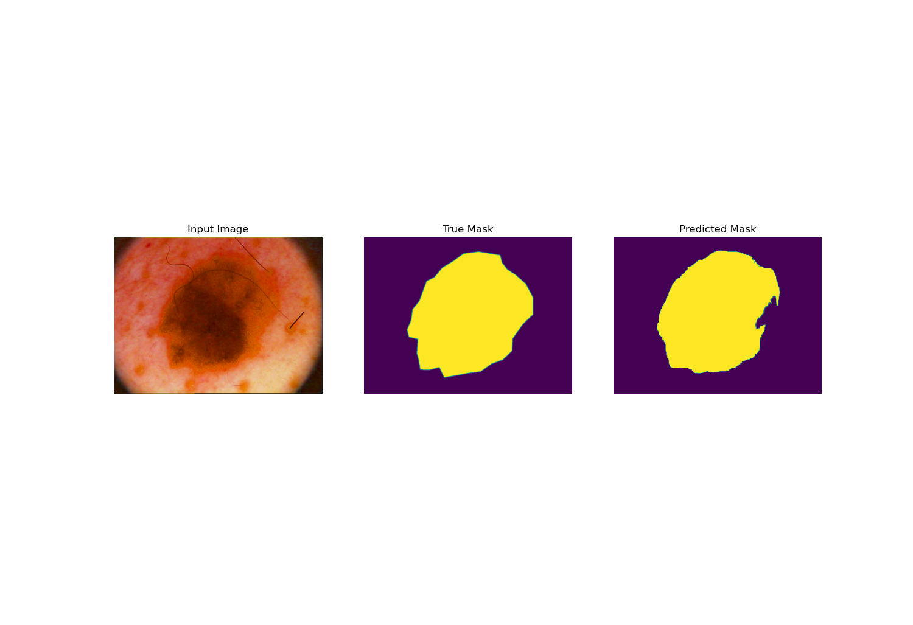
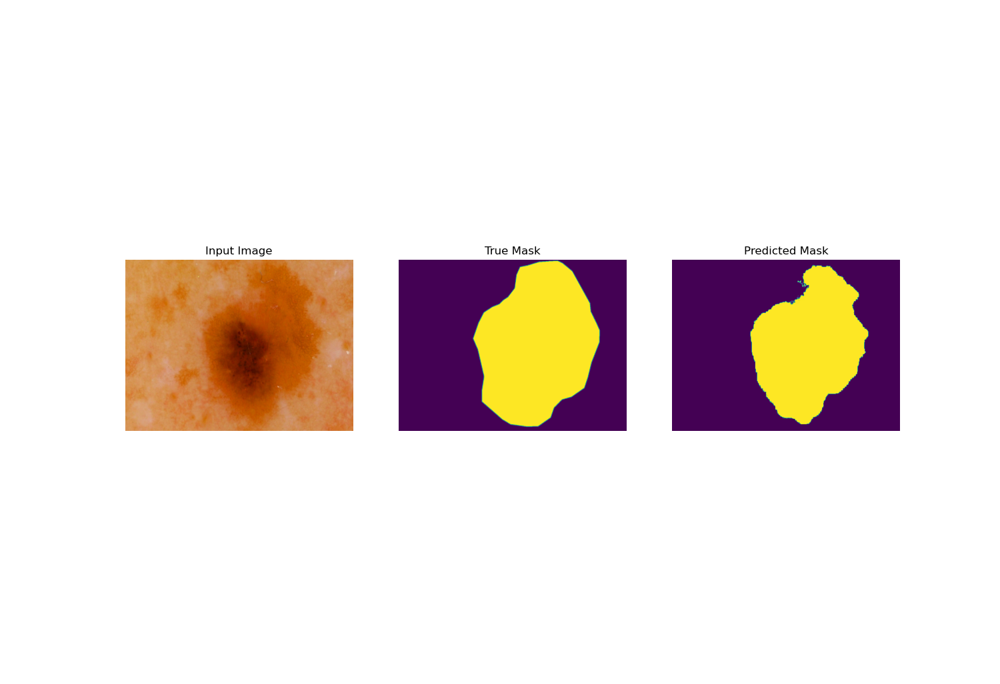
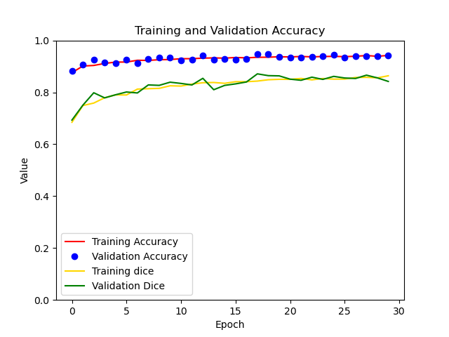

# Improved Unet model for Melanoma segmentation

This algorithm is a modified version of Unet created by Isensee and colleagues, provided in this report: https://arxiv.org/pdf/1802.10508v1.pdf.
The file driver.py gives and example of how to use the algorithm. First we create the model through improved_unet.py and its
build_model function. The model is inspired by the Unet architecture and implements many improvements to enhance the performace [1].

It consists of the following parts:
- Context module
  - Usually initialised by a convolution layer of stride 2 (except for the first level), this works to reduce
    the resolution of the feature maps. The context module is described by 2 convolution layers with a
    dropout layer in between. These are residual blocks, a type of skip connection that learns the residual
    function with reference to an input [2].
- Upsampling module
  - This module works to upscale the resolution to encode it up high resolutions. It consists of
  an upsample layer followed by a convolution layer [1].
- Localisation module
  - This module takes the upsampled features that have been concatenated with a skip connections
    and encodes its lower level features at low spatial resolutions and transer it to a
    higher spatial resolution. This is done by 2 convolution layers, where the last one halves the 
    filter siz [1]. 
- Deep supervision
  - Segmentation maps are taken following localisation modules, to inform the final layer of the model by element-wise summation [1].
  
Throughout the architecture Instance Normalisation and Leaky reLU is used. The final output is a sigmoid activation
so that the output is mask of one channel. Additionally, in trainer.py, the model is compiled
with a dice coefficient loss function. 

## ISICs 2018 Challenge Dataset
To showcase the effectiveness of the modified Unet model, the ISIC 2018 Melanoma Dermoscopy
Dataset was used. The file data_loader.py implements the loading of the data. It contains training, validation and test
datasets as tf.data.Dataset objects, by default split by 0.2 validation and 0.1 test. Additionally, 
to increase the amount of trainable data, augmentation is applied randomly to the training set; from a 
combination of vertical and horizontal flips and saturation amplifications.

### Results
Run for 30 epochs with a starting filter size of 64 in batches of 1 with default dataset split.

Evaluating the model through the test dataset, it was able to obtains values of: 
- loss: 0.15029695630073547
- accuracy: 0.9389772415161133
- dice: 0.8497030138969421

## Dependencies
- Python 3.9.6
- tensorflow 2.5
- tensorflow addons 0.14
- matplotlib 3.4.2

## References
[1] F. Isensee, P. Kickingereder, W. Wick, M. Bendszus and K. H. Maier-Hein, "Brain Tumor Segmentation and Radiomics Survival Prediction: Contribution to the BRATS 2017 Challenge," 28 February 2018. [Online]. Available: https://arxiv.org/pdf/1802.10508v1.pdf.

[2] K. He, X. Zhang, S. Ren and J. Sun, "Deep Residual Learning for Image Recognition," 10 December 2015. [Online]. Available: https://arxiv.org/pdf/1512.03385v1.pdf.

