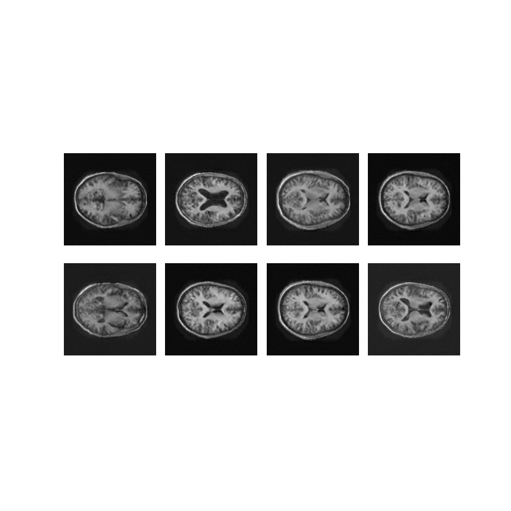
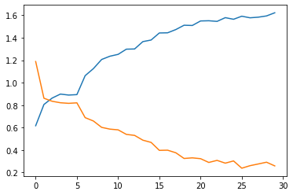

# Modelling the OASIS Brain Dataset with StyleGAN2

## The algorithm
The base StyleGAN aimed to improve over the traditional GAN architecture by enabling the user to have more control over the input of the GAN. It achieved this by instead of having just noise input into the generator, it instead input a "style" into each layer of the network. The user chosen "style" vector (which represents some part of the dataset distribution) was put through a Style Generator which learned how to turn that given style vector into something the Generator could more easily turn into the output image.

Antoher thing that the StyleGAN introduced was some added noise into every layer, to control the finer details of the image. "stochastic variation" is random variation that doesnt change the overall structure of the image. Examples of this are things like hair and freckle distribution, with respect to generated faces. 

StyleGAN2, released in March of 2020, was made to solve image quality issues with the original StyleGAN. The biggest change is the use of modulating the convolution weights to input style instead of the AdaIN used in the original StyleGAN. This fixed some blob artifacts that were present in the original.

Another major change over the original was the use of residual and skip connections to replace the progressive growing used in the original. This not only made the training more simple, it also helped with the quality of the images. 

## The problem
The OASIS brain dataset was used for this task. It contains about 10 thousand images of MRI brain scans. Every image is 256x256, grayscale, and all centred.

The task was to generate images of a reasonable quality using either StyleGAN or StyleGAN2. StyleGAN2 was chosen as it solves image quality issues with the original StyleGAN.

## How it works
As with the normal GAN, StyleGAN2 works by having an adversarial relationship between two networks, the generator, and the discriminator. The generator learns how to network generates images, and the discriminator network learns to to differentiate between real and fake images. During training a fake image is made by inference from the generator, that and real images from the dataset are fed into the discriminator. The losses for both networks are based on the output from the discriminator, the generator trying to minimise the output of the fake images, and the discriminator trying to minimise the real output and maximise the fake output.

StyleGAN and StyleGAN2 add in a style generator which acts as the input to the generator network, inserting a "style" into each layer of the generator. It takes a style vector from the distribution of the dataset and learns to make it more readable for generator to generate a meaningful image. 

For the code implementation, a custom convolution layer was needed to be able to modulate the weights using the input style.

The generator network consists of 8 modualted convolution layers with some LeakyReLU activation layers, and some residual connections to compensate for the lack of progressive growing. The constant input is modified by a Dense layer to achieve better results. The style generator is a fully connected nerual network with 4 Dense layers and LeakyReLU activation layers. The discriminator has 5 blocks that have residual connetions over the block, each block has 2 normal convolution layers with LeakyReLU activations, and a single Dropout layer in each block to solve the mode collapse the model was experienceing.

## Example Outputs
Here is a gif showing the output after each of the 30 epochs used for testing. As can be seen the algorithm learns both what a brain looks like and learns to output different brain shapes. It can be seen in these images the noise that defines the smaller features doesn't change throughout the entire training sequence, this is the "stochastic variation".

Here is the output from the final epoch after being trained for ~8 hours and 30 epochs

The loss functions were averaged over every epoch and graphed for the 30 epochs that were trained. In the graph blue represents the Discriminator loss and orange is the Generator loss.

## Usage
To make the model train, all that needs to be changed in the driver.py file is the parameters up the top. For the case of the OASIS Brain dataset, all that should be changed is batch_size, depth, and epochs. For other datasets, the datapath should be changed to where the data images are stored. For datsets that have different sized images, the actual models need to be changed (an example of this can be found in the MNIST folder of this repository), in models.py the synthesis netowork, and discriminator need to have the appropriate amount of blocks so that up/down sampling doesnt go beyond the dataset. 

## Dependencies
The code requires these python libraries to run:
* Tensorflow (2.x)
* Matplotlib
* Numpy
* tqdm
* imageio   (for making the gif)
* glob      (for making the gif)

## References
* https://www.tensorflow.org/api_docs
* https://arxiv.org/abs/1812.04948 (paper for StyleGAN)
* https://arxiv.org/abs/1912.04958 (paper for StyleGAN2)
* https://github.com/manicman1999/StyleGAN2-Tensorflow-2.0 (a tf 2.x implementation of StyleGAN2)
* https://keras.io/guides/making_new_layers_and_models_via_subclassing/ (making a custom layer)