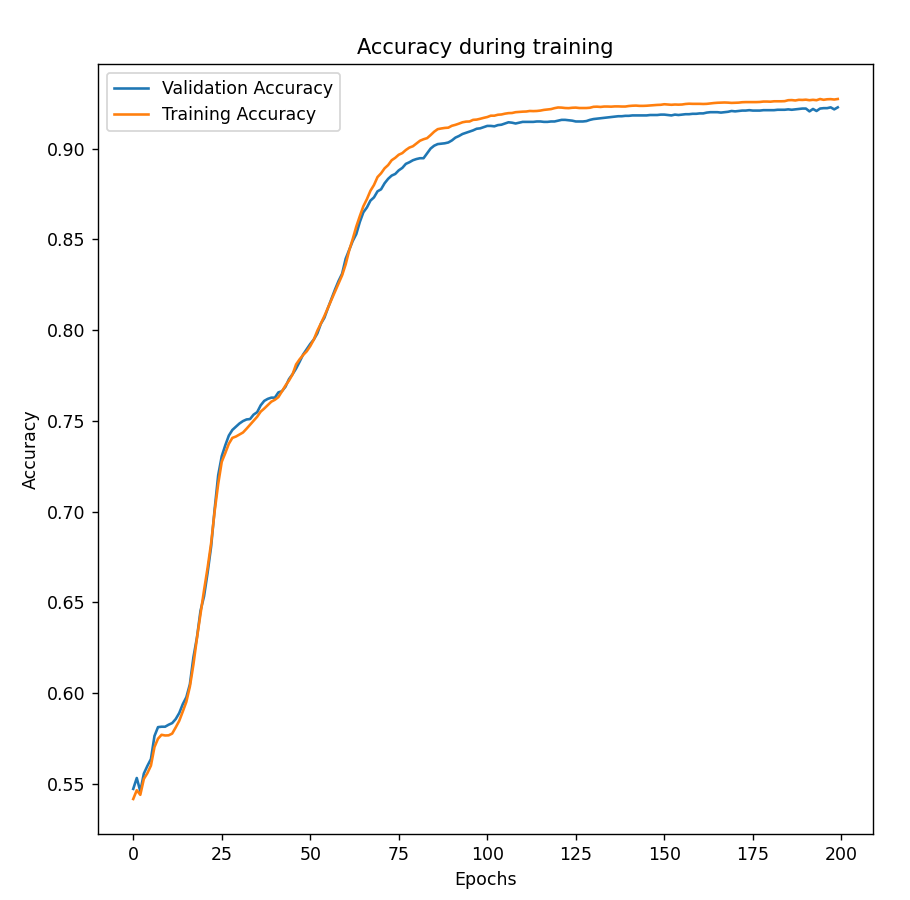
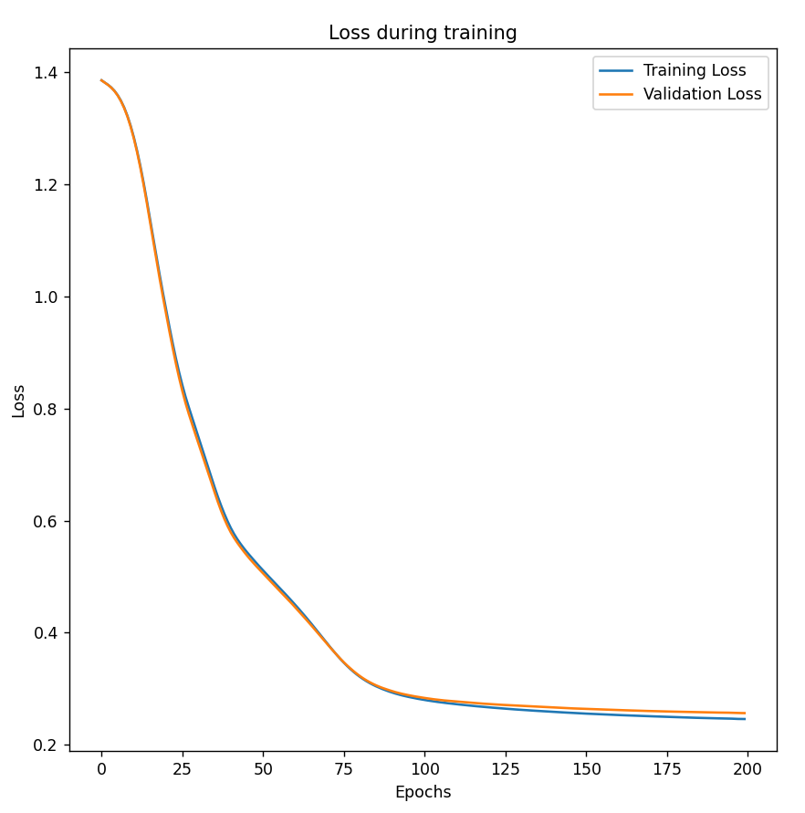
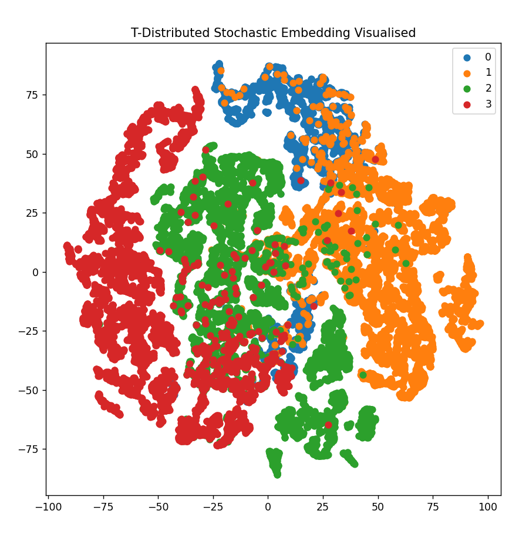

# Facebook Page GCN Modelling

## Algorithm
The algorithm being used for this project is a multi-layer graph convolutional network as well as a T-Distributed Stochastic Embedding
in order to visualise the data in a human-readable form. This is done against the facebook.npz dataset which contains a graph of 
22470 individual facebook pages from four categories - politicians, governmental organizations, television shows and companies.

## Aim
The aim of the project is to be able to effectively classify each page into one of these four categories with high accuracy. This has real-world applications as being able to use machine learning algorithms to identify types of social media accounts is a high priority for social media companies, data mining and news/data collection companies. This is because this data could be used to identify the accuracy of certain pages, which may be useful for identifying fradulent pages, false information or improving advertisements.

## How it works
Graph convolutional networks are very similar to regular convolutional networks, the primary difference being that they are designed to work on non-euclidean graph data, instead of structured matrix data that regular convolutional networks generally use. This is done by inserting the adjacency matrix into the forward pass equation that usually just multiplies features and the weight. By adding the adjacency matrix into the calculation GCNs are able to learn information/features from nodes that they have an edge with on the graph - similar to how regular convolutional networks work with neighbours in a matrix. Multiple GCN layers increase how many edges these nodes are able to 'look', i.e. 3 layers means that a node will be impacted by any nodes that are connected to it within 3 edges. The network used in this project uses three GCN layers, the first two having a ReLU activation and a dropout layer and the final using a logarithmic softmax to get the output. Dropout layers are used to make the system more robust by adding a level of noise and also reducing overfitting whilst ReLU is the most common choice of activation function for all convolutional networks as it prevents exponential growth of parameters and its simplicity reduces calculation times.

The embedding visualisation was done using T-Distributed Stochastic Embedding (TSNE). TSNE is a statistical method used for reducing high-dimension data down into two or three dimensions so humans can understand it better. It works by construction a gaussian probability distribution over a pairs of high dimension objects so similar objects have a higher likelihood to be near each other, whilst dissimilar points are further separated - for our algorithm the higher dimension data is the predicted likelihoods returned from the trained algorithm. These distributions can then be used to define a similar probability distribution against a lower-dimension map - reducing the data. 

A 60:20:20 train:test:validation split is used for all results shown below. This was chosen as it showed the best performance in terms of test accuracy - see testing/tuning section for the results.


### Usage

1. Ensure that `facebook.npz` is located within `s4532390/res`

2. Run `predict.py`
```
cd s4532390
python predict.py
```

## Visualisation and Results

Three visualisations will be produced after the program is ran - these are the training and validation accuracy, training and validation loss and the tsne visualisation.



Seen above is the accuracy plot produced over 200 epochs. Most notably, both accuracies increase relatively quickly until approximately 0.9, after which the rate of change slows and goes almost flat by epoch 200. Also, as expected training probability is higher than validation probability, although the difference is very slight and the test accuracy of 0.9192 shows that overfitting is minimal. There are two sections before 0.9 accuracy where the model slows in improvements before picking up again, there are numerous possible causes for these with the most likely being that it is simply a quirk of the dataset as the features are not being shuffled so certain areas may provide less information or have more complex structures to train.



The next plot shows the training and validation loss. Loss is different to accuracy in that it takes into account how far off the guesses that the machine learning model made were from the actual results, accuracy just cares about the final prediction. Due to this we see a far smoother graph than for accuracy, clearly during the sections where progress seemed to be slowing on the accuracy graph the model was infact still improving its predictions and learning at a relatively constant rate - even though the predictions took some time to catch up. Another interesting feature is that it is only past 100 epochs where training and validation begin to distinguish themselves - with training showing lower loss. This could be a warning sign for overfitting as the model has continued to improve against the training data but it does not seem to be improving its predictions for the validation data. Despite this, the difference between them is still minor at 200 epochs and the accuracy graph shows that there is still improvement in the predictive abilities against validation data.



Finally, this scatterplot is produced by the T-Distributed Stochastic Embedding being used against the test predictions given by the GCN model. TSNE has reduced the dimensions down to 2 and each of the page types (classes) has been plotted as a different colour. The plot shows generally good separation between each class, with them all having a distinct cluster in a different area of the plot. These clusters represent the connections the pages have to each other and how similar pages are more closely connected e.g. A politicians facebook page is more likely to connect with other politicians meaning they will be more closely clustered than a politician page and television show.
However, the clusters are not totally clean - with some of them having a decent amount of other pages included in the cluster. This is unlikely to be an issue with the TSNE but rather is most likely due to the inaccuracy in the model. The most has a test accuracy of 0.9194 so approximately 8% of pages have been mislabelled and will likely appear in the wrong cluster. Just from the visuals this seems to be correct as about 90% of pages seem to be clustered correctly. Improving the performance of the model should give clearer clusters in this graph although some outliers would still be expected.


## Dependencies

```
numpy:1.23.1
matplotlib:3.5.2
scikit-learn:1.1.2
torch:1.12.1+cu116
```

## Testing/Tuning

Various testing around hyperparameters and different network layouts was done, some of these results are summarised below to show the exploration process:

All completed with 200 epochs of testing.
All results shown are in testing accuracy.

### Dropout Layers
```
Dropout Layers  Test Accuracy
0               0.9174
1               0.9192
2               0.9194
```
Varying the number of dropout layers seemed to have a very small, possibly negligible impact, however 2 dropout layers did perform slightly better than 0 or 1 so it is what is used for the final model - this could be because it helped reduce overfitting although it is hard to say when the difference is so small.

### Data split
```
Data split    Test Accuracy
40:30:30      0.9187
60:20:20      0.9194
80:10:10      0.9137
```
When testing different data splits there is no optimal split percentage so testing was relyed upon to find something that worked for the facebook dataset. Overall, the best performance was seen with a 60:20:20 test split although 40:30:30 was almost identical. Surprisingly the 80:10:10 split had worse performance for test accuracy (although validation accuracy was higher) - possibly due the 10% of test data having high variation compared to the training. Overall, the differences seen from different were relatively minor as the dataset is quite large; in the future further testing should use 10-fold cross validation with shuffled data in order to remove the statistical anomalies that can occur in single runs with unshuffled data.

### GCN Layers
```
Layer format                     Test accuracy
(?, 16) -> (16, 4)               0.8291
(?, 32) -> (32, 4)               0.8551
(?, 64) -> (64, 4)               0.8643
(?, 16) -> (16, 8) -> (8, 4)     0.8896
(?, 32) -> (32, 16) -> (16, 4)   0.9157
(?, 64) -> (64, 16) -> (16, 4)   0.9177
(?, 64) -> (64, 32) -> (32, 4)   0.9201
```
This table shows some testing done with various GCN formats in order to determine the optimal choice for this project. There are 3 double GCN layer tests and 4 triple layer tests. As a whole two GCN layers performed worse than three layers by a relatively wide margin. During the 3 layer tests each increase number of weights and see a corresponding improvement in performance. Testing was stopped at the final format shown above as the improvements had began to shrink and the time taken to run each test was increasing expontentially. This final setup chosen was the first layer of (input, 64), next layer of (64, 32) and the final layer of the 32 going into the four output classes.


## Conclusion

The project was a success, with a Graph Convolutional Network providing very strong results with a test accuracy of ~92%, with a larger dataset and more time/compute power this result could improve a decent amount. There is plenty of other future work that could be done also, particularly tuning hyperparameters and formats. To do this a 10-fold cross validation setup should be used in order to improve the reliability of results and reduce the effect of outliers, although this will take more time to run than the current setup. Parameters such as learning rate, weight decay, optimiser, different activation functions and more could be tested and tuned to improve both time efficiency and the accuracy of the GCN.

