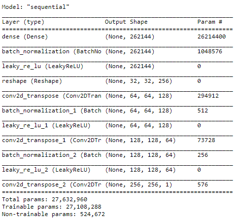
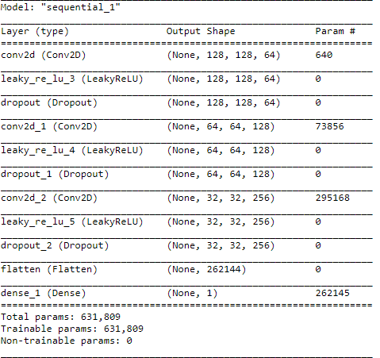
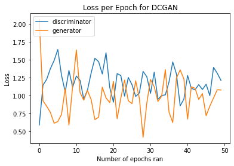
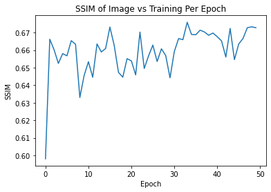

# Generative DCGAN Model for OASIS Brain Dataset using TF
This model generates brain scans using the OASIS Brain dataset through the use of a Direct Convolutional Generative Adversarial Network (DCGAN). The model is fairly successful, evident using a Structure Similarity (SSIM) comparison. The SSIM upon comparing a batch of generated images via this model to a batch of real images was approximately 0.67, where the closer the SSIM value to 1 the better. This model utilised 50 unique batches from the OASIS Brain training set. 

Please refer to the bottom of this README file for dependencies, how to run the model, and further information regarding running this own your own system.

## Preprocessing Data for the DCGAN
The OASIS brain dataset is a set of preprocessed images, of which 9664 of these images are considered for training and 544 for testing. This model utilised 50 randomly chosen batches of size 16, thus each batch having 16 images. Each image was resized to a resolution of 256x256, and then had their colour pallete changed to grayscale. They were then normalised to (-1, 1) for training within the DCGAN.

## An Overview of GANs and DCGANs

### What is a GAN?
Generative Adversarial Networks (GANs) are an approach for generative modelling using deep learning methods. It is an unsupervised learning task that discovers and learns regularities and patterns in data such that it can generate new examples of those learnt patterns. GANs are a revolutionary approach to training a generative model. GANs consist of two parts, a generator model; which generates new examples via training data, and a discriminator model; which tries to classify the generator's outputted examples as real or fake. The pair are trained together, at the same time, resulting in an adversarial sort of training where the generator is trying to trick the discriminator. The final goal of the model is that the discriminator has to randomly check the generator's output as it cannot distignuish between real and fake, at which it can be said the generator is creating realistic and feasible examples.

### What is a DCGAN?
The DCGAN created by Radford et. al. in the article, "Unsupervised Representation Learning With Deep Convolutional Generative Adversarial Networks is an adaptation of the original GAN, using convolutional layers in both the discriminator and generator models.

## Model Summary and Explanation
Below is an explanation an of the DCGAN used in this repository to train the OASIS Brain Dataset. It explains each sub-model and the layers used to create them. A summary of the execution of training can also be found below.

### Generator
The generator starts off with a Dense layer that is fed a vector of random noise. This is then upsampled to a single 256 by 256 image. This upsampling is achieved via Conv2DTranspose layers which is a strided convolution transpose layer, followed by a batch normalisation layer to create stability via rescaling and recentering. For each upsample stage we use LeakyReLU activation. Although being another strided convolution tranpose layer, the final layer of the generator uses a tanh activation to guarantee the output to be normalised. Strides of (2,2) and kernel sizes of (3,3) were consistently used in the generator. Below is a screenshot of the model.summary() which outlines the order of the layers used in the generator and has some other minor details.

### Discriminator
The discriminator downsamples the provided input (image) until a single scalar value is reached and then outputted. This is achieved via Conv2D layers, also known as convolution layers. This discriminator uses three convolution layers, each with LeakyReLU activation and dropout layers. A strided convolution is executed downsampling the image until the last layer. This last layer is a dense layer which outputs the single sclar value aforementioned. This value correlates to the probability of the input being real or fake. Below is a screenshot of the model.summary() which outlines the order of the layers used in the discriminator and has some other minor details.

### Execution of Training
Training this DCGAN was executed by firstly feeding the discriminator one batch of images from the dataset labelled as 1s, meaning they are real images. Simultaneously, the generator receives random noise correlating to the batch size. The output of the generator is then provided as input the discriminator thus starting the training cycle.

#### Loss Functions
Both models utilise BinaryCrossentropy. The generator's loss function is the BinaryCrossentropy of 1s and the generator's output. The discriminator's loss function is the sum of two losses, one being the loss between an array of 1s and real images, and the other being an array of 0s with the generated images created by the generator.

## Evaluation of The Model
This model was evaluated through the application of Maximum SSIM and the analysis of its loss on a graph over time. The time measurement here being the amount of epochs the model was ran for. The loss graph over epochs can be seen below for both sub models.

Analysis of this graph shows that the loss upon the early epochs starts off high due to the random input but then lowers. It of course fluctuates as the two sub models are learning and competing against each other, evident through their almost inverse relationship. In moments where the inverse relationship is not evident, it is likely that new patterns were learnt by either of the models. 

The max SSIM was another form of evaluation used. SSIM measures the similarity between images and is easily applied as a TF function. Initially, a single batch was compared to the training data, however it was quickly realised that this is a poor use of SSIM due to the amount of fluctuations in patterns within the brain images. Thus, many batches were used and the maximum value of this was used as a means of evaluation. The final SSIM was apparoximately 0.67, evident in the graph below. In general the trend of the SSIM was that as the more epochs passed, the higher it got. It did of course fluctuate too given the variety in features of each image.

)

## Final Results
A GIF of the model over all 50 epochs is below. It can be seen that the model significantly increased in the early epochs, with some almost redundant looking changes and loops in the last few epochs. It did have some significant turning points which can be explored in the folder of images called "Images at Each Epoch".

## Running the Model Locally
To run the model locally, a file named driver.py should be executed via the command line. It takes the path to the OASIS dataset and the number of epochs you would like to run the model for as input.

The model does require for a folder within the same directory to exist that is named, 'Images at Each Epoch'. It will output each epoch's batch to this folder for reference. It will also output a gif of the model, as well as printing SSIM, Generator Loss and Discriminator Loss per epoch on the command line.

### Examples
python driver.py path epochs

python driver.py D:/User/Documents/ ... 25

(where ... refers to further extension down the path)

### Dependencies
For this to run you must have the following installed.
- TensorFlow-GPU (v2.1)
- Python (v3.7)
- IPython
- imageio
- Matplotlib

and have the Oasis Brain Dataset downloaded (https://cloudstor.aarnet.edu.au/plus/s/n5aZ4XX1WBKp6HZ).
