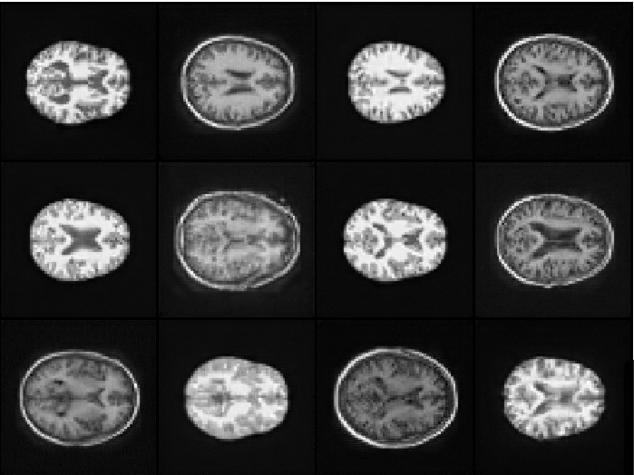
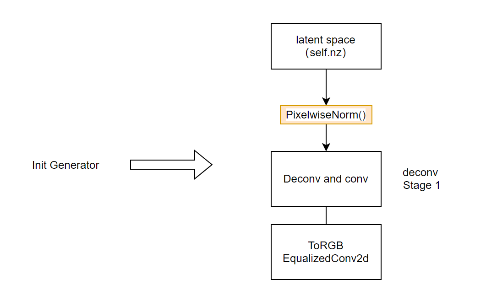
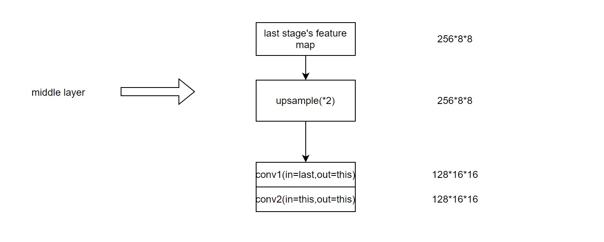
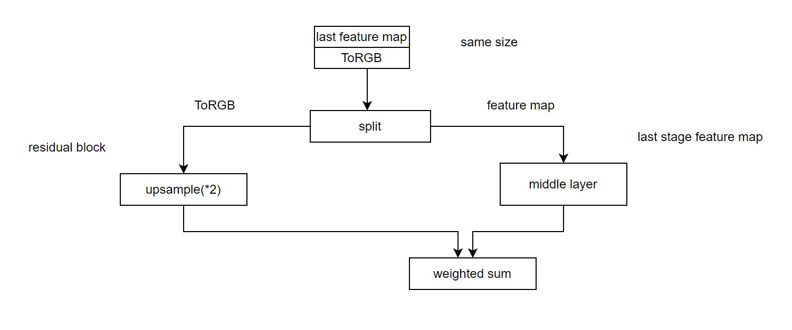
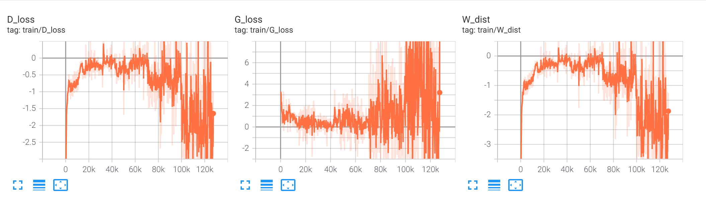
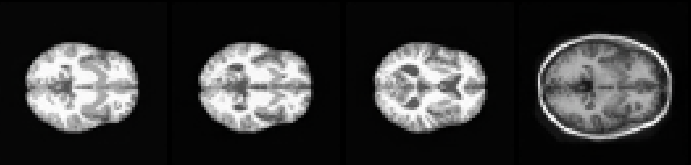
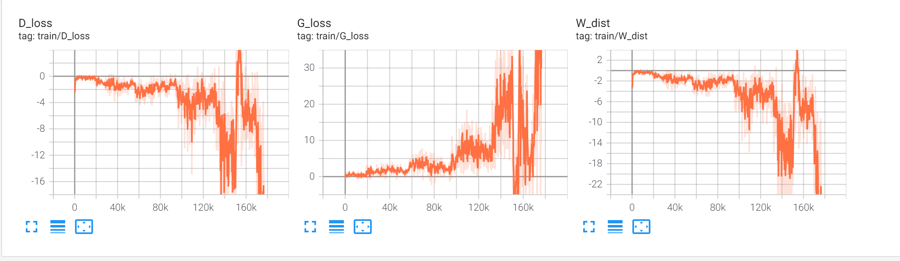

# StyleGAN Pytorch implementation


  


  

**Picture:** *These MRI images are not real images but are generated by StyleGAN random generation.*

This repository was created for the COMP3710 project report. Since I chose GAN as my topic in DEMO2 and found it very interesting and challenging, for this project report I decided to use the OASIS brain MRI dataset to train StyleGAN to generate clear images.This repository contains the  Pytorch implementation reference to following papers:

> **A Style-Based Generator Architecture for Generative Adversarial Networks**<br>
> Tero Karras (NVIDIA), Samuli Laine (NVIDIA), Timo Aila (NVIDIA)<br>
> https://arxiv.org/abs/1812.04948
>
> **Progressive Growing of GANs for Improved Quality, Stability, and Variation**<br>
>
> Tero Karras, Timo Aila, Samuli Laine, Jaakko Lehtinen<br>
>
> https://arxiv.org/abs/1710.10196


## System requirements

* Linux Windows are supported.

* Python 3.8 should be installed.

* Pytorch 11.3 or newer with GPU support.

* high-end NVIDIA GPU. In this experiment, I choose to use RTX 3090 24GB.

* CUDA toolkit 11.0 or newer

## WorkFlow and model's introduction

This section will introduce the workflow of my project, I started with DCGAN in Demo2 to transform my network based on multiple papers.

### 1.DCGAN

In demo 2 , I choose to use DCGAN to generate faces.Despite generating a relatively clear image, I found that there was a non-negligible problem in that a few pixels of the generated image did not generate the right content. The reason for this is that the generator has found a way to trick the discriminator.

> **Unsupervised Representation Learning with Deep Convolutional Generative Adversarial Networks**<br>
> Alec Radford, Luke Metz, Soumith Chintala<br>
> https://arxiv.org/pdf/1511.06434.pdf


### 2.WGAN and WGAN-GP

WGAN will make the training more stable compared to the native GAN.Because the loss of the discriminator of the native GAN in the optimal case, generator can be equated to minimize the Jensen-Shannon divergence of the true and generated distributions.Due to the feature of the JS divergence, if the two distributions do not overlap or the overlap is small, the value of divergence is always equal to $log {2}$.There is a high probability that this will happen.
For example,  the dimension of latent space is 512, the size of the image we need to generate is 128 * 128. This is equivalent to forming a 512-dimension manifold in a space of 16384 dimensions and this manifold can not fill all space.
Wasserstein distance solves this problem very well and can be used as a metric to measure the similarity of two distributions.

Since WGAN needs to satisfy the Lipschitz constraint，We need weight clipping to satisfy this condition.  However, this method makes the weights progressively binarized, so a gradient penalty is proposed to replace this method.

In this project, I used the WGAN-GP

> ** Wasserstein GAN**<br>
> Martin Arjovsky, Soumith Chintala, Léon Bottou<br>
> https://arxiv.org/pdf/1701.07875v3.pdf
>
> **Improved Training of Wasserstein GANs**<br>
>
> Ishaan Gulrajani, Faruk Ahmed, Martin Arjovsky, Vincent Dumoulin, Aaron Courville<br>
>
> https://arxiv.org/pdf/1704.00028v3.pdf


### 2. Progressive GAN

By reading the literature, I found a way to significantly improve the resolution of the generated images called Progressive Growth, which improves the quality of the generated images by training the network and the residual module on a resolution-by-resolution basis. The additional benefit is that it can prevent the network collapse to some extent.Since the PGGAN paper doesn't mention specific design details, I drew up a draft.
 
<table>
    <tr>
        <td ><center></td>
        <td ><center></td>
        <td ><center></td>
    </tr>
</table>

**Picture:** *Drafts of this repository's Progressive growth.*

###  3. StyleGAN

StyleGAN uses ProgressiveGAN as the baseline and adds the style module, AdaIn module for normalization and random noise to control the training model.

## Model Usage

GAN can generate similar images based on real data distribution.StyleGAN allows for style migration and increases the diversity of generated images.Since the dataset I chose([OASIS Brain MRI]:https://www.oasis-brains.org/) is medical images, in this report I would rather discuss the usefulness of StyleGAN in medical images.I purposely went to ask a Chinese doctor in a tertiary care hospital what can be wrong with medical images, especially MRI images.Based on his answer and my personal opinion, I think StyleGAN has the following usefulness:  
1. Medical picture rebuild:Many patients lose some information in MRI images due to involuntary movements. The style migration feature of StyleGAN can be used to refine the details by using the style of the incomplete image at the low-resolution stage and the style of the complete image at the high-resolution.
2. Conversion of different kinds of medical pictures
3. Data augumentation


## How to use this code

1. put dataset images under root dirctory named "BrainMRI"  
 
3.run mainToRun.py script

```shell
python run mainToRun.py
```
 
## Experimental analysis

This experiment used PGGAN as baseline and add Mapping network and AdaIn moudle.

| Dataset                           | Network                                       | Time                      |
| :-------------------------------- | :-------------------------------------------: | :-----------------------: |
| OSAIA brain MRI                   | PGGAN                                         | 14 hours(64 * 64)         |
| Multi-GPU support                 | StyleGAN                                      | 36 hours(128 * 128)       |


### baseline (PGGAN) result:
<table>
    <tr>
        <td ><center></td>
        <td ><center></td>
    </tr>
</table>

### StyleGAN result:
<table>
    <tr>
        <td ><center></td>
        <td ><center></td>
    </tr>
</table>


## Useful Tricks:

1. Equalized learning rate :As mentioned in the paper, using this method to initialize the convolution kernel and the coefficients of the fully connected layer makes the training more stable.
2. MiniBatchStd deviation: In training, GANs are often prone to learn only a few patterns, and adding this method to the last layer of the discriminator makes it possible to share statistical information between training and validation
3. Progressive growth: use average pooling to resize is better than dataset's resize.
4. Exponential Moving Average: This trick can help model become more stable.

## Future work:

1. Multiple graphics cards trained in parallel to increase resolution.
2. Conditional GAN can be added

## References:

https://github.com/facebookresearch/pytorch_GAN_zoo/blob/b75dee40918caabb4fe7ec561522717bf096a8cb/models/networks/custom_layers.py#L29  

https://github.com/tkarras/progressive_growing_of_gans  

https://github.com/SaoYan/GenerativeSkinLesion  


