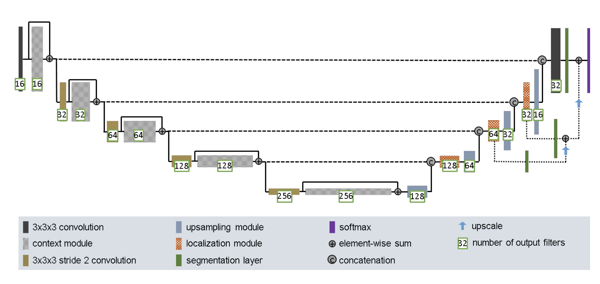

# Segment the ISICs data set with the Improved UNet

**COMP3710 TASK1**
**HAN ZHANG (45463718)**

## Introduction

In this project, I completed the IMPROVED U-NET model and automatically predicted the segmentation boundary of skin lesion. This documentation contains the network architecture of IMPROVED U-NET and the evalutaion of tarining model through loss and dice cofficient. Also, it contains some images of prediction and the ground truth.

## Network Architecture of IMPROVED U-NET

Compared with u-net, the improved u-net architecture comprises a context module and localisation module, and more details are available in the paper[1].

## Dependencies

* python3
* numpy
* scikit-image
* opencv-python
* tensorflow2.0 or higher
* matplotlib
* io

## Data Processing

#### Data Split
There are almost 2700 pictures in ISICs dataset.
The ratio of training data : validation data : testing data : 0.6 : 0.2 : 0.2 

#### Input data
All images are resized, and the size of input is (256,256). 

#### Output data (label)
The output have 2 classes.

## File Description

* model.py （U-NET Improved architecture built using TensorFlow Keras Layers）
* data_cleaning.py (Importing data, creating masks, and partitioning training, validation and testing sets.
* dice_cofficient (Function of dice_coefficient)
* test.ipynb

## Reference

[1]F. Isensee, P. Kickingereder, W. Wick, M. Bendszus, and K. H. Maier-Hein, “Brain Tumor Segmentation andRadiomics Survival Prediction: Contribution to the BRATS 2017 Challenge,” Feb. 2018. [Online].Available: https://arxiv.org/abs/1802.10508v1

