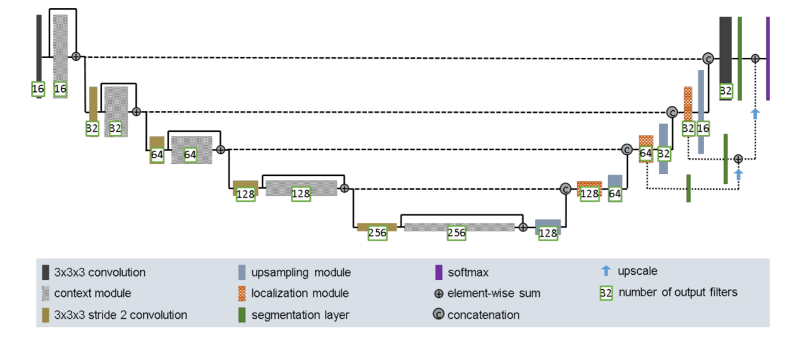
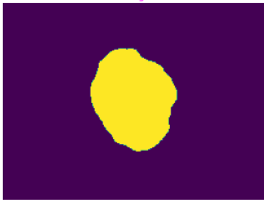
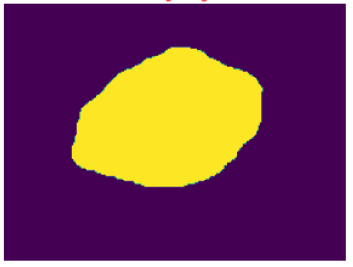
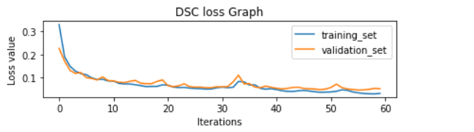

# Segment the ISICs data set with the Improved UNet
This repository contains the tensorflow implementation of the Improved UNet.

## Instructions:
Modules:
- matplotlib.pyplot: pip install matplotlib
- tensorflow: pip install tensorflow
- cv2: pip install opencv-python

## Guides:
1. Before running the codes, please check whether you are using the GPU for this task.
Here is a simple way to check it:
- Open the anaconda terminal shell
- Type "python"
- Type "import tensorflow as tf"
- Type "tf.ones((2,2))"
- Check the outcoming message
In the last step, if the message mentions the GPU usage, then the running environment is proper.
Otherwise:
- Create a new virtual environment
- Type "conda install jupyter"
- Type "pip install tensorflow"
- Type "pip install xxx" to install other necessary patches
Note: Please use "pip" command only after using "conda install jupyter", because "conda" command will have conflicts.

2. After setting the proper environment, please follow the steps below:
- Download the images sets from the given download link 
- Download the main.py and the model.py
- Change the paths to the image sets in the main.py
- Run the main.py

Alternative approach:
- Create a new file via jupyter notebook
- Copy the codes from main.py and model.py
- Run the file

## Information about ISICs:
The International Skin Imaging Collaboration (ISIC) aims to improve melanoma diagnosis. The ISIC Archive contains the largest publicly available collection of quality-controlled dermoscopic images of skin lesions.

## Resources: 
The origin image sets can be downloaded via: https://challenge.isic-archive.com/data

The images contain the training images and the ground truth images

## Basic UNET structure:
There is a python file called "basic_unet_model.py", you can have a look at this before using the improved UNET model if you want.

 
*Figure 1: U-Net architecture. Each blue box corresponds to a multi-channel feature map. The number of channels is denoted on top of the box. The x-y size is provided at the lower left edge of the box. White boxes represent copied feature maps. The arrows denote the different operations (Ronneberger, O., Fischer, P., Brox, T., 2015).*

## Improved UNET structure:

 
*Figure 2: Improved U-Net architecture. 

Note: This picture is taken from the document: Brain Tumor Segmentation and Radiomics Survival Prediction: Contribution to the BRATS 2017 Challenge.
In this document, this structure is used to process three dimensional inputs. (3 * 3 * 3) But in my project, two dimensional inputs are required. (3 * 3)

Difference: The improved UNET has many short cut connections and summation. 

## Results Demonstration:

### 1. Here are two examples from the results:

First example's similarity:

 
*Figure 3: The Dice similarity of the first example

 
*Figure 4: The origin image for the first example.

 
*Figure 5: The ground truth image for the first example.

 
*Figure 6: The predication image for the first example.

Second example's Dice similarity:

 
*Figure 7: The Dice similarity of the second example

 
*Figure 8: The origin image for the secondexample.

 
*Figure 9: The ground truth image for the second example.

 
*Figure 10: The predication image for the second example.

### 2.  The average value of the Dice similarity coefficient:

 
*Figure 11: The average value for the Dice similarity coefficient.

### 3. The value graph and the value loss graph of the Dice similarity coefficient:

 
*Figure 12: The loss graph for the Dice similarity coefficient.

 
*Figure 13: The value graph for the Dice similarity coefficient.

## Dependencies:
- Python 3.9.7
- TensorFlow 2.5.0
- matplotlib 3.4.3
- ISICs 2018 Challenge dataset (The download link is provided in [here](https://challenge.isic-archive.com/data))

## References
[1] F. Isensee, P. Kickingereder, W. Wick, M. Bendszus, and K. H. Maier-Hein, “Brain Tumor Segmentation and
Radiomics Survival Prediction: Contribution to the BRATS 2017 Challenge,” Feb. 2018. [Online]. Available:
https://arxiv.org/abs/1802.10508v1

[2] Ronneberger, O., Fischer, P., Brox, T. (2015). *U-Net: Convolutional Networks for Biomedical Image Segmentation.* Retrieved from: https://arxiv.org/pdf/1505.04597.pdf.