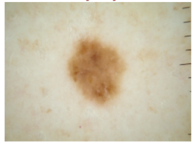
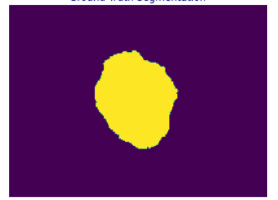
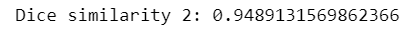
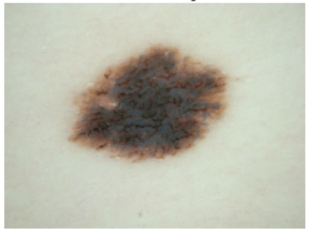
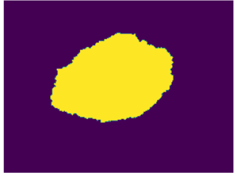

# Segment the ISICs data set with the Improved UNet
This repository contains the tensorflow implementation of the Improved UNet.

## Instructions:
*Modules*:

- tensorflow: pip install tensorflow
- cv2: pip install opencv-python
- matplotlib.pyplot: pip install matplotlib

## Guides:
*1. Before running the codes, please make sure your current virtual environment uses GPU.*

Here is a simple way to check it:

- Open the anaconda terminal shell
- Type "python"
- Type "import tensorflow as tf"
- Type "tf.ones((2,2))"
- Check out the outcoming message

In the last step, if the message mentions the GPU usage, then the running environment is proper.

Here is an example of the output message:

*Otherwise:*
- Create a new virtual environment
- Type "conda install jupyter"
- Type "pip install tensorflow"
- Type "pip install xxx" to install other necessary patches

Note: Please use "pip" command only after using "conda install jupyter", because "conda" command will have conflicts.

*2. After setting the proper environment, please follow the steps below:*
- Download the images sets from this download [link](https://challenge.isic-archive.com/data)
- Download the main.py and the model.py
- Change the paths to the image sets in the main.py
- Run the main.py

**Alternative approach:**

Note: This is **recommended** because the original version of these codes is written with the jupyter notebook.

- Download the images sets from this download [link](https://challenge.isic-archive.com/data)
- Create a new file via jupyter notebook
- Copy the codes from model.py and paste it into the first block
- Copy the codes from the main.py and paste it into the second block
- Important: Please use "#" to ignore the line "from model.py import *" 
- Change the paths of images to the paths on your local computer
- Run the file

## Information about ISIC:
The International Skin Imaging Collaboration (ISIC) aims to improve melanoma diagnosis. The ISIC Archive contains the largest publicly available collection of quality-controlled dermoscopic images of skin lesions.

While the initial focus of the ISIC collaboration is on melanoma diagnosis, the goals being pursued by ISIC are critical to advancing the broader landscape of skin imaging and artificial intelligence in Dermatology, including non-melanoma skin cancer and inflammatory dermatoses.

## Resources: 
The original image sets can be downloaded via the archive on the official site: https://challenge.isic-archive.com/data

These images contain the training images and the ground truth images

## Basic UNET structure:
There is a python file called "basic_unet_model.py", you can have a look at this before using the improved UNET model if you want.

Note: There is no driver file for the basic Unet model.

 
*Figure 1: Basic U-Net architecture. 

## Improved UNET structure:

 
*Figure 2: Improved U-Net architecture. 

Note: This picture is taken from the document: Brain Tumor Segmentation and Radiomics Survival Prediction: Contribution to the BRATS 2017 Challenge.
In this document, this structure is used to process three dimensional inputs. (3 * 3 * 3) But in my project, two dimensional inputs are required. (3 * 3)

## Brief Explanations:

The improved UNET model has the **context module**, which can encode the abstract representations of the inputs progressively as it goes deeper into the whole network.

In order to accurately localize the structures of interest, the improved UNET model also has the **localization module**, which can make the recombination of the representations only with shallower features.

In the different levels of the whole network, there are **segmentation layers**  in there. And element wise summation approach is used to combine them and form the network output.

The feature: In the **context module**, the input is upsampled, and the results are concatenated within the module. And this is followed by a **localization module**.

### Context Module:

- Convolution layer (3 * 3)
- Drop out layer (Probability of dropping is 0.3)
- Convolution layer (3 * 3)

### Localization Module:

- Convolution layer (3 * 3)
- Convolution layer (1 * 1)

Note: The activation functions are all Leaky ReLU.

Since it is a binary classification (0 or 1), the output layer's activation function is **sigmoid**.

Optimizer: **adam** optimizer.

### Metrics: 

[Dice Similarity Coefficient](https://en.wikipedia.org/wiki/S%C3%B8rensen%E2%80%93Dice_coefficient) is used as the mertics.

The Dice Similarity Coefficient in this project is following this:

## Results Demonstration:

### 1. Here are two examples from the results:

First example's similarity:

 
*Figure 3: The Dice similarity of the first example

 
*Figure 4: The origin image for the first example.

 
*Figure 5: The ground truth image for the first example.

 
*Figure 6: The predication image for the first example.

Second example's Dice similarity:

 
*Figure 7: The Dice similarity of the second example

 
*Figure 8: The origin image for the second example.

 
*Figure 9: The ground truth image for the second example.

 
*Figure 10: The predication image for the second example.

### 2.  The average value of the Dice similarity coefficient:

 
*Figure 11: The average value for the Dice similarity coefficient.

### 3. The value graph and the value loss graph of the Dice similarity coefficient:

 
*Figure 12: The loss graph for the Dice similarity coefficient.

 
*Figure 13: The value graph for the Dice similarity coefficient.

## Dependencies:
- Python 3.9.7
- TensorFlow 2.5.0
- matplotlib 3.4.3
- ISICs 2018 Challenge dataset (The download link is provided in [here](https://challenge.isic-archive.com/data))

## References
[1] F. Isensee, P. Kickingereder, W. Wick, M. Bendszus, and K. H. Maier-Hein, “Brain Tumor Segmentation and
Radiomics Survival Prediction: Contribution to the BRATS 2017 Challenge,” Feb. 2018. [Online]. Available:
https://arxiv.org/abs/1802.10508v1

[2] Ronneberger, O., Fischer, P., Brox, T. (2015). *U-Net: Convolutional Networks for Biomedical Image Segmentation.* Retrieved from: https://arxiv.org/pdf/1505.04597.pdf.