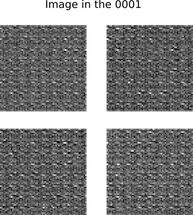

# A tensorflow implementation of  DCGAN

## Discription 

### The model

Deep Convolution GAN (DCGAN) include two models : generator and discriminator.

The generator creates new images and tries to fool the discriminator. 

The discriminator learns how to judge fake images from real images. 

The uniqueness of DCGAN (compared with GAN) :

 	1. Use batchnormlise in both the generator and the discriminator.
 	2. Remove fully connected hidden layers for deeper architectures
 	3. Use ReLU activation in generator for all layers except for the output, which uses Tanh.
 	4. Use LeakyReLU activation in the discriminator for all layers.

### Problem Solved

Use OASIS brain data set to build a DCGAN model. 

The generator model of the DCGAN will create a reasonably fake images and ensure the structured similarity is 0.6 

## How the model works

### The flowchart of the  process

### Details : The structure of generator

### Details : The structure of discriminator 

## Dependencies required

### Requirements:

  1. Python 3.7 

  2. Tensorflow-gpu 2.1.0

  3. Keras

  4. OpenCv

  5. IPython

     

## Example outputs

## Result

The model will be trained use 9664 images (shape 64*64)

The model will be tested by generating 32 images and compare it with 32 real images. (since the nmber of slice is 32)

Structural Similarity(SSIM) Index will be used to validate the generated images. Our purpose is to get the  SSIM is over 0.6

The plot below show how the  structure similariy changes 

1. The  SSIM changes up and down around 0.6 after 50 epochs.
2. During the whole training process, the max value of ssim is 0.727

