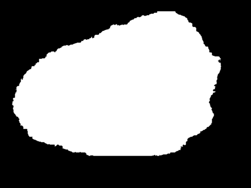
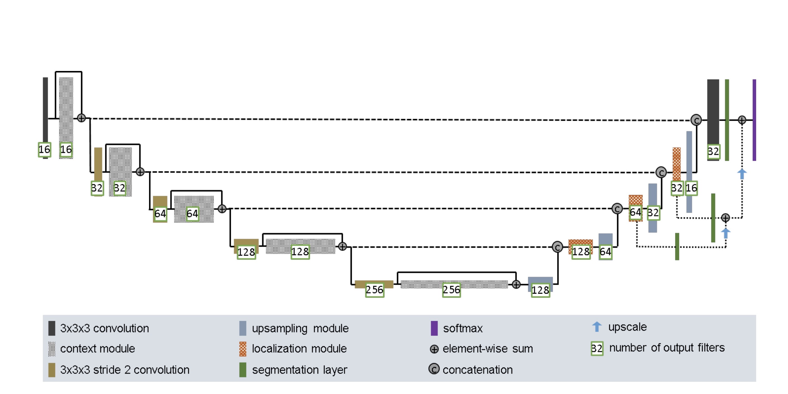
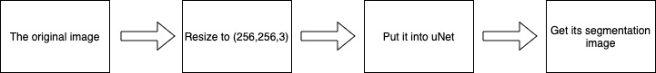
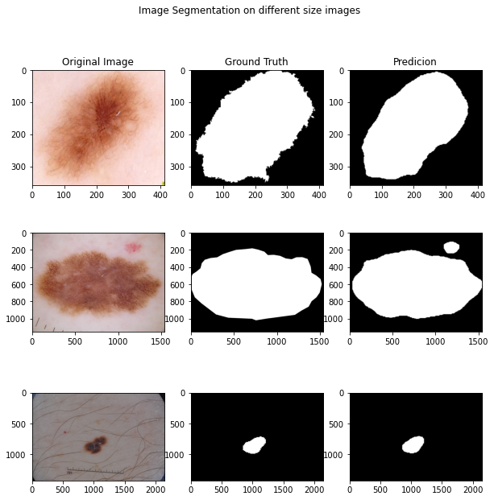
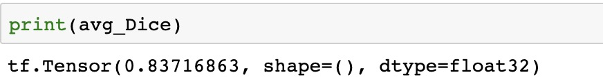
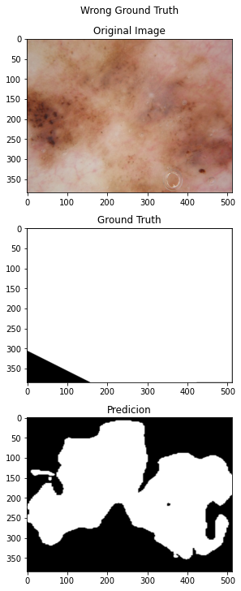

# Segment the ISICs data set with the Improved UNet
Image segmentation of ISICs data set implemented for tensorflow

## Description

ISICs data set concludes thousands of Skin Lesion images. This recognition algorithm aims to automatically do Lesion Segmentation through an improved unet model [[1]](#References). The evaluation of segmentation has a [Dice similarity coefficient](https://en.wikipedia.org/wiki/Sørensen–Dice_coefficient) of 0.84 on the test set. 

Here is a exmaple of the original Skin Lesion image and its Ground Truth segmentation image.

​                                                               

<p align="center">Figure 1. Left is original Skin Lesion image and the right is its ground truth image.</p>  


To conclusion, the aim of this project is to create the segmentation image like the above right one from an input image like the above left one by a spicified model inspired by uNet.

## Model Structure

The model structure is almostly from the structure in [[1]](#References).



<p align="center">Figure 2. The structure of the improved uNet</p>  


The difference is that images in ISICs data set are 2D dimensions, and so all 3×3×3 convolution layers have been changed to 3×3  convolution layers.

**Context module**: InstanceNormalization, leaky RELU, 3×3 convolution, 

​							     InstanceNormalization, leaky RELU, 3×3 convolution, Dropout(0.3). 

​                                 It is implemented as a method called “context_modules” in model.py.

**Upsampling module**: UpSampling2D(), 3×3 convolution

​										 It is implemented as a method called “upSampling” in model.py.

**Localization model**: 3×3 convolution, 1×1 convolution

​									   It is implemented as a method called “localization” in model.py.

**Segmentation layer**: 1×1 convolution by 1 output filters

**Upscale**: UpSampling2D() by bilinear interpolation

**Optimizer**: Adam

**Loss**: binary_crossentropy

**Metrics**: accuracy

**Activation Function**:  leaky ReLU nonlinearities with a negative slope of 10−2

Since it is a binary classification problem in this case, the final activation function is “sigmoid” instead of “softmax”.

The whole model is implemented as a method called “improvedUnet” in model.py.

##  Dependencies required

**Requirement:**

- Python 3.7
- Tensorflow 2.1.0
- Keras
- Tensorflow_addons (to use Instance Nomalization), should execute ```tf.random.Generator = None``` if the tensorflow version is not 2.3.0
- Opencv (just using to resize images)

## Workflow



```python
from model.py import improvedUnet

#Load model
model = improvedUnet()
results = model.fit(X_train, y_train, validation_data= (X_val, y_val), batch_size=16, epochs=5)
preds_test = model.predict(X_test, verbose=1)
#Nomorlization the results into [0,1]
preds_test = np.around(preds_test)

#inverse the image size
preds_test = preds_test.reshape([519,256,256])
preds_test_real = []
for i in range(len(y_test_real)):
    preds_test_real.append(cv2.resize(preds_test[i], (y_test_real[i].shape[1],y_test_real[i].shape[0])))

#Calculate the average dice similarity coefficients
sum_Dice = 0
avg_Dice = 0
for i in range(len(y_test_real)):
    dice = dice_similar_coef(y_test_real[i], preds_test_real[i])
    sum_Dice += dice
avg_Dice = sum_Dice / 519

#Plot the result
fig, axs = plt.subplots(3,3,figsize=(10,10))
fig.suptitle('Image Segmentation on different size images')
axs[0,0].imshow(X_test_real[2])
axs[0,1].imshow(y_test_real[2],cmap='gray')
axs[0,2].imshow(preds_test_real[2],cmap='gray')

axs[1,0].imshow(X_test_real[5])
axs[1,1].imshow(y_test_real[5],cmap='gray')
axs[1,2].imshow(preds_test_real[5],cmap='gray')

axs[2,0].imshow(X_test_real[12])
axs[2,1].imshow(y_test_real[12],cmap='gray')
axs[2,2].imshow(preds_test_real[12],cmap='gray')


axs[0,0].title.set_text('Original Image')
axs[0,1].title.set_text('Ground Truth')
axs[0,2].title.set_text('Predicion')
```

## Example outputs and plots



<p align="center">Figure 3. Image Segmentation on different size images</p>  

In most cases, the pridiction is almose the same as the ground truth segmentation image and can segment Skin Lesion correctly.



The final average Dice similarity coefficient on the test set is 0.84.

## Interesting finding



<p align="center">Figure 4. The condition which the ground truth image seems to be wrong</p>  

The above plots show that sometimes the prediction image is better than the ground truth image. The ground truth image may be wrong due to human negligence. Hence, for this kind of easy segmentation job, AI may be better than manual work in terms of the cost and accuracy.

## Splitting data set

I split data set into training set, validation set and testing set.

Firstly, I split the whole dataset into (training,  validation) set and testing set, which the proportions are 0.8 and 0.2 respectively.

Then I split the (training,  validation) set into training set and validation set, which the proportions are 0.75 and 0.25 respectively.

Hence, the total proportions of training set, validation set and testing set are 0.6, 0.2, 0.2.

## References

[1] F. Isensee, P. Kickingereder, W. Wick, M. Bendszus, and K. H. Maier-Hein, “Brain Tumor Segmentation and Radiomics Survival Prediction: Contribution to the BRATS 2017 Challenge,” Feb. 2018. [Online]. Available: https://arxiv.org/abs/1802.10508v1

