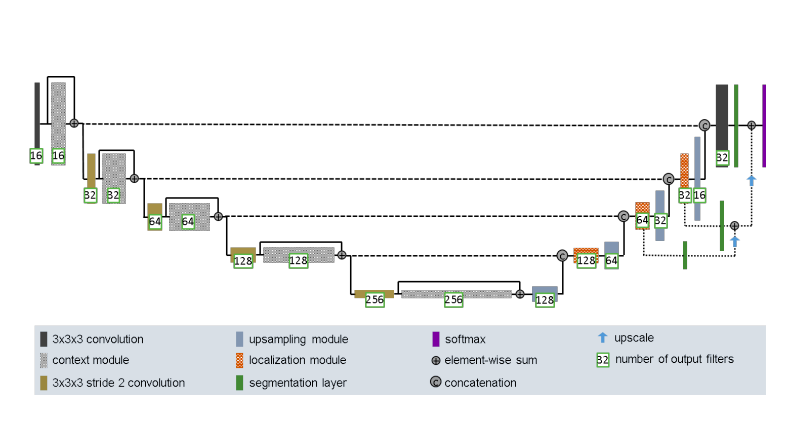
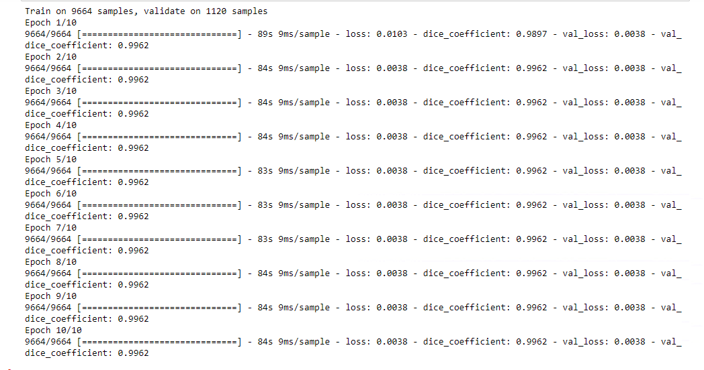
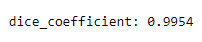

# Segment the OASIS brain data set with an Improved UNet
 
Segment the OASIS brain data set with an Improved UNet with all labels having a minimum Dice similarity coefficient of 0.9 on the test set. 
[solved in Tensorflow (TF) 
The propose of the model is to remove the noise and segment the Brain images into four parts automatic. 

  
## Contributing
  
* Our Network architecture is based on the U-Net model. Here I propose my contribution to essay 'Brain Tumor Segmentation and Radiomics Survival Prediction: Contribution to the BRATS 2017 Challenge'.

 

  

* Model validation process

 

  
* The segmentation peerformance of participating algorithms is measured based on the DICE coefficient. After perdict, the Dice similarity coefficient is up to 99.5%

 

  

### The process of my work:

1. Load image data from the given OASIS brain data set.

2. Transfer the data into the suiable model that can use in Neural network mdoel.

3. Build network architecture.

4. Train the model, and feed validation into it to check the accuracy.
Use test dataset do prediction.

5. Use model do prediction.

6. Compare the prediction outcome with groud truth value, calculate the dice similarity coefficient.

7. Make outcome visualisable, and compare the originl image, predict image, and ground truth image.

  

### DataSet
The oasis dataset I use is already preprocessed for ease of use.
The dataset contains six files, including three image data files(train, test, and validation data), and three labled image data files(train,test,and validation data)
There are 9664 train images, 1120 validation images, and 544 test images.
For the labled images, every image are segmentited four color, which means four lables. Each color represent one label. The black refers to Blackground. Dark gray refers to Cerebrospinal fluid. Light gray refers to gray matter. White area refers to white matter.

  

## Script

 

#### data_prepare.py
It includes the main function of the whloe progress. The main function which includes importing the data set, using neural network model to do prediction, and plotting the outcome images.

When run the code, it loading data from dataset, and then transfer the images into array list, which in order to be used in model training, validating, and testing process.

#### model.py
Build a model which based on u-net architecture (not the same, it is after improved u-net model)

#### predict.py
Defind the model predict function.

#### dice.py
In this document, it define the dice function to calucale dice coefficience and dice coefficience loss to calculate the accuracy of the model performance.

#### resources
Save the images that README.md used.

     

### References
[1] F. Isensee, P. Kickingereder, W. Wick, M. Bendszus, and K. H. Maier-Hein, “Brain Tumor Segmentation and
Radiomics Survival Prediction: Contribution to the BRATS 2017 Challenge,” Feb. 2018. [Online]. Available:
https://arxiv.org/abs/1802.10508v1