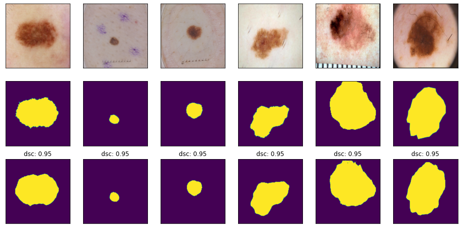

# **Segment the ISICs data set with the Improved UNet**

## Problem
The problem is to build an Improved UNet model to segment the ISICs data set with all labels having a minimum Dice similarity coefficient of 0.8 on the test set.
      
##  Algorithm
The algorithm is to implement a "U-shape" model which is composed of *Encoder*, *Bridge*, and *Decoder*. 

-The Encoder is built with context modules, which lets the UNet go deeper.

-The Bridge is built with a upsampling module, which reduces the number of feature maps.

-The Decoder is built with localization modules, which reduces the number of feature maps and let the data be the original size.

The input in this algorithm is the normalized image data which resized to (256,256,3), and split it into train, validation and test dataset. 

## How it works
 
The context module consists two convolutional layers(convolution kernel is 3 × 3 and padding is 1). And there is a dropout layer to avoid overfitting.Besides, Relu is the activation layer.

## Example 
```python
# build context module
def context_module(input, filters):
    ins_layer1 = InstanceNormalization()(input)
    conv_layer1 = Conv2D(filters, (3,3), padding='same',activation=LeakyReLU(alpha=0.01))(ins_layer1)
    dropout = Dropout(0.3)(conv_layer1)
    ins_layer2 = InstanceNormalization()(dropout)
    conv_layer2 = Conv2D(filters, (3,3), padding='same',activation=LeakyReLU(alpha=0.01))(ins_layer2)
    return conv_layer2

# build unsampling module
def upsampling_module(input, filters):
    upsample = UpSampling2D(size=(2,2))(input)
    conv_layer = Conv2D(filters, (3,3), padding='same')(upsample)
    return conv_layer

# build localization module
def localization_module(input, filters):
    conv_layer1 = Conv2D(filters*2, (3,3), padding='same')(input)
    conv_layer2 = Conv2D(filters, (1,1))(conv_layer1)
    return conv_layer2

def improved_u_net(img_size):

    # input layer
    inputs = Input((img_size, img_size, 3))
 
    # Encoder
    conv_layer1 = Conv2D(16, (3, 3), padding='same')(inputs)
    c_module1 = context_module(conv_layer1, 16)
    add1 = Add()([conv_layer1, c_module1]) 

    conv_layer2 = Conv2D(32, (3, 3), strides=2, padding='same')(add1)
    c_module1 = context_module(conv_layer2, 32)
    add2 = Add()([conv_layer2, c_module2])  

    conv_layer3 = Conv2D(64, (3, 3), strides=2, padding='same')(add2)
    c_module3 = context_module(conv_layer3, 64)
    add3 = Add()([conv_layer3, c_module3])  

    conv_layer4 = Conv2D(128, (3, 3), strides=2, padding='same')(add3)
    c_module4 = context_module(conv_layer4, 128)
    add4 = Add()([conv_layer4, c_module4]) 

    conv_layer5 = Conv2D(256, (3, 3), strides=2, padding='same')(add4)
    c_module5 = context_module(conv_layer5, 256)
    add5 = Add()([conv_layer5, c_module5])

    # Bridge
    u_module1 = upsampling_module(add5, 128)
    con1 = concatenate([u_module1, add4])
    # Decoder
    l_module1 = localization_module(con1, 128)

    u_module2 = upsampling_module(l_module1, 64)
    con2 = concatenate([u_module2, add3])
    l_module2 = localization_module(con2, 64)

    u_module3 = upsampling_module(l_module2, 32)
    con3 = concatenate([u_module3, add2])
    l_module3 = localization_module(con3, 32) 

    u_module4 = upsampling_module(l_module3, 16)
    con4 = concatenate([u_module4, add1])
    conv_layer6 = Conv2D(32, (3, 3), padding='same')(con4)  

    seg1 = Conv2D(1, (1, 1), padding='same')(l_module2)
    seg1 = UpSampling2D(size=(2, 2))(seg1)
    seg2 = Conv2D(1, (1, 1), padding='same')(l_module3)
    add6 = Add()([seg1, seg2])
    add6 = UpSampling2D(size=(2, 2))(add6)
    seg3 = Conv2D(1, (1, 1), padding='same')(conv_layer6)
    add7 = Add()([add6, seg3])

    outputs = Conv2D(1, (1, 1), activation = 'sigmoid') (add7)
    network = tf.keras.Model(inputs=[inputs], outputs=[outputs])
    
    return network

```

 

Average DSC:  0.8534447895381826

## Dependency 
- Python = 3.7
- Tensorflow = 2.1.0
- Tensorflow-Addons

## Reference
1. F. Isensee, P. Kickingereder, W. Wick, M. Bendszus, and K. H. Maier-Hein, “Brain Tumor Segmentation and
Radiomics Survival Prediction: Contribution to the BRATS 2017 Challenge,” Feb. 2018. [Online]. Available:
https://arxiv.org/abs/1802.10508v1
