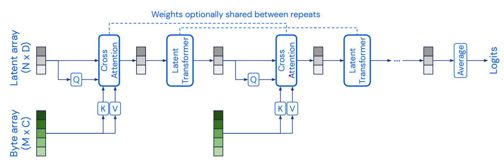
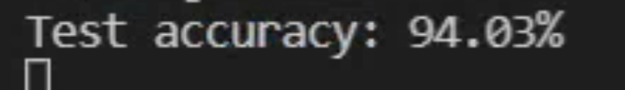
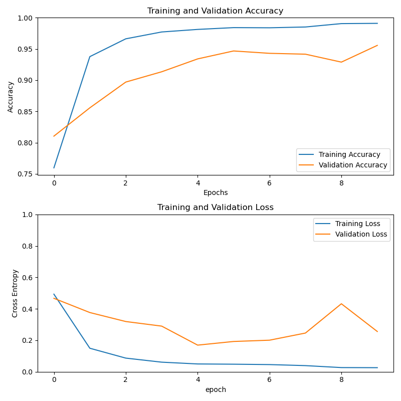
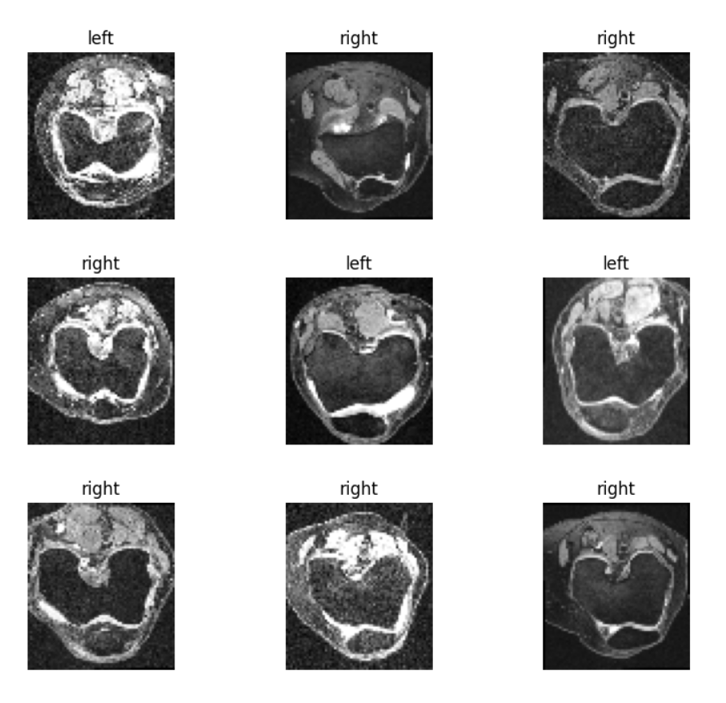
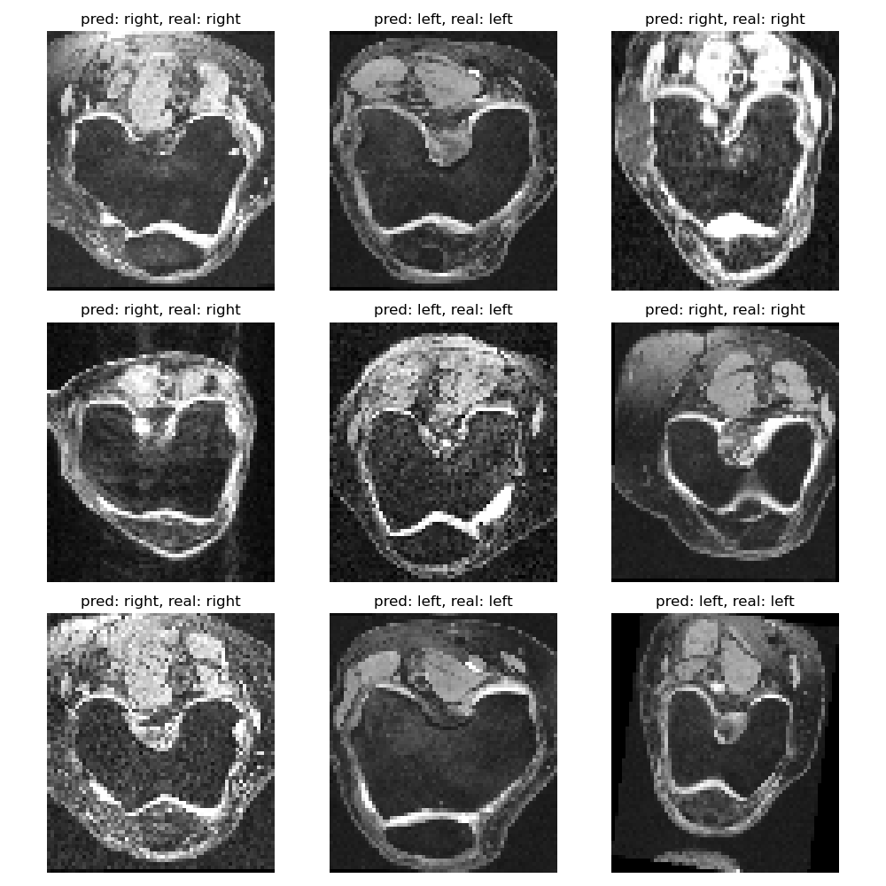

# COMP3710 Pattern Recognition Report
### Van Nhat Huy Nguyen (45717309)

## Purpose
The aim of this project is to create and assess the performance of a binary 
classifier of the OAI AKOA Knee dataset, using the Perceiver model as described
by Andrew Jaegle et al.

The Perceiver paper can be downloaded [here](https://arxiv.org/abs/2103.03206).

As proposed in the paper, "The Perceiver is an architecture based on attentional 
principles that scales to high-dimensional inputs such as images, videos, audio, 
point-clouds, and multimodal combinations without making domain-specific assumptions. 
The Perceiver uses a cross-attention module to project a high-dimensional input 
byte array to a fixed-dimensional latent bottleneck before processing it using 
a deep stack of Transformer-style self-attention blocks in the latent space. 
The Perceiver iteratively attends to the input byte array by alternating cross-attention
and latent self-attention blocks." The final results are passed through an 
average pooling layer and a dense layer for classification.

This is a visualization of the Perceiver model, from the paper:



This dataset contains 18680 preprocessed X-Ray images of left and right knees of
101 patients. The created model is supposed to distinguish between left and 
right laterality of the knee X-ray images. 7760 images are labelled as Left, 10920 as Right.

## Instructions
- Download the source code and grab the dataset from the cloudstore link
- Extract and place the dataset in the same directory as the source code
(by default, it is `D:/AKOA_Analysis`)
- Modify the hyperparameters (as in Appendix D) in `driver.py` if needed.
- Run `driver.py`. 
- Note: During the training process, train, validation and test 
dataset will be saved in `D:/np` as NumPy files. For future run, SAVE_DATA can be
edited to False if NumPy datasets are already available at said path.

## Dependencies
- Tensorflow (2.6 used in the report)
- Tensorflow Add-ons
- CUDA and CuDNN (download from NVIDIA, if trained with NVIDIA GPU)
- Keras (included in Tensorflow package)
- NumPy (for processing the dataset)

## Implementation
The implementation is divided into 5 main components:
- `cross_attention.py` Implement the cross attention block of the Perceiver model
- `transformer.py`: Implement the self-attention block of the Perceiver model.
- `fourier_encode.py`: Implement the Fourier encoding method that augment the 
image data with Fourier encoding of the image pixel position.
- `model.py`: Implement the Perceiver model. It consists of a Fourier encoding 
layer, cross attention module, a self-attention (transformer) module, and a 
binary classification head.
- `driver.py`: Implement data preprocessing, creating the model and carrying out
 the training, testing and plotting process.

## Data pre-processing
- Download the data from the supplied cloudstore link
- Image size of the dataset is 260 * 228 in RGB format, which is rather large for 
the laboratory GPU (RTX 2080 with 8GB VRAM). As the images are grayscale (the red,
 green and blue values are the same), they are loaded in grayscale mode (2D array)
and resolution reduced to 73 * 64 for memory saving. This does not affect the
training process. 
- The dataset contains the label (left/right) in each filename, so no manual
labelling is required.
- The dataset is extremely vulnerable to data leakage, since a patient 
(identified by the patient ID OAIxxxxxx) can have several images, each one being
only slightly different from each other. As there are 18680 images but only 101 
unique patients in the dataset, there is a high chance that the same patient
images will be present in both the training and testing set, if we only shuffle
the files. 
- To solve the problem, during the file loading process, patients and filenames 
are saved in a dictionary (mapping patient ID to the file names). Thus, when
loading the files into datasets, it is easy to keep track of the patient ID,
making sure that no overlapping patient ID is found in the testing set
- The dataset is split into 80% training, 16% validation and 4% testing.
- During the processing, the ratio between left and right labels are also
calculated. There are 7760 left images and 10920 right images, which is slightly 
skewed towards the right labels.

### Cross Attention module
This module is implemented according to the specification listed in the paper.
Steps include:
- Creating an input latent and input data layers, passing them through 
normalization layers.
- Getting the query, key and value (q, k, v) from the data and latent.
- Passing q, k, v through an Attention layer, then a Dense layer to project 
to projection size.
- Concatenate the original input to the output of the linear layer.
- Normalize the output of the concatenation above.
- Add a Dense layer with GELU activation to the output, then a Dense layer 
to project to projection size.
- Adding the output of the Dense layer to the input of the Dense layer (which is
the attention)

``` 
__________________________________________________________________________________________________
Layer (type)                    Output Shape         Param #     Connected to
==================================================================================================
input_1 (InputLayer)            [(None, 256, 27)]    0
__________________________________________________________________________________________________
input_2 (InputLayer)            [(None, 4672, 27)]   0
__________________________________________________________________________________________________
layer_normalization (LayerNorma (None, 256, 27)      54          input_1[0][0]
__________________________________________________________________________________________________
layer_normalization_1 (LayerNor (None, 4672, 27)     54          input_2[0][0]
__________________________________________________________________________________________________
dense (Dense)                   (None, 256, 27)      756         layer_normalization[0][0]
__________________________________________________________________________________________________
dense_1 (Dense)                 (None, 4672, 27)     756         layer_normalization_1[0][0]
__________________________________________________________________________________________________
dense_2 (Dense)                 (None, 4672, 27)     756         layer_normalization_1[0][0]
__________________________________________________________________________________________________
attention (Attention)           (None, 256, 27)      1           dense[0][0]
                                                                 dense_1[0][0]
                                                                 dense_2[0][0]
__________________________________________________________________________________________________
dense_3 (Dense)                 (None, 256, 27)      756         attention[0][0]
__________________________________________________________________________________________________
add (Add)                       (None, 256, 27)      0           dense_3[0][0]
                                                                 layer_normalization[0][0]
__________________________________________________________________________________________________
layer_normalization_2 (LayerNor (None, 256, 27)      54          add[0][0]
__________________________________________________________________________________________________
dense_4 (Dense)                 (None, 256, 27)      756         layer_normalization_2[0][0]
__________________________________________________________________________________________________
dense_5 (Dense)                 (None, 256, 27)      756         dense_4[0][0]
__________________________________________________________________________________________________
add_1 (Add)                     (None, 256, 27)      0           dense_5[0][0]
                                                                 layer_normalization_2[0][0]
==================================================================================================
Total params: 4,699
Trainable params: 4,699
Non-trainable params: 0
```

### Transformer module
This module is also implemented according to the specification listed in the paper,
Steps included:
- Put the input through a normalization layer.
- Calculate the attention from the MultiHeadAttention layer.
- Pass the attention to a linear layer to project it to the projection size.
- Concatenate the original input to the output of the linear layer.
- Pass the output to another normalization layer.
- Add a Dense layer with GELU activation to the output.
- Repeated the process again, according to the number of transformation blocks
(defined as a hyperparameter)

```
__________________________________________________________________________________________________
Layer (type)                    Output Shape         Param #     Connected to
==================================================================================================
input_3 (InputLayer)            [(None, 256, 27)]    0
__________________________________________________________________________________________________
layer_normalization_13 (LayerNo (None, 256, 27)      54          input_3[0][0]
__________________________________________________________________________________________________
multi_head_attention_5 (MultiHe (None, 256, 27)      24003       layer_normalization_13[0][0]
                                                                 layer_normalization_13[0][0]
__________________________________________________________________________________________________
dense_21 (Dense)                (None, 256, 27)      756         multi_head_attention_5[0][0]
__________________________________________________________________________________________________
add_12 (Add)                    (None, 256, 27)      0           dense_21[0][0]
                                                                 input_3[0][0]
__________________________________________________________________________________________________
layer_normalization_14 (LayerNo (None, 256, 27)      54          add_12[0][0]
__________________________________________________________________________________________________
dense_22 (Dense)                (None, 256, 27)      756         layer_normalization_14[0][0]
__________________________________________________________________________________________________
dense_23 (Dense)                (None, 256, 27)      756         dense_22[0][0]
__________________________________________________________________________________________________
add_13 (Add)                    (None, 256, 27)      0           dense_23[0][0]
                                                                 layer_normalization_14[0][0]
==================================================================================================
Total params: 26,379
Trainable params: 26,379
Non-trainable params: 0
__________________________________________________________________________________________________
``` 

### Fourier encoding module
This Fourier encoding module is implemented in the following steps:
- Mapping the positional cell number of the images to range [-1, 1]
- Calculate the Fourier encoding, using the log space between 0 and a max_frequency
(Nyquist frequency) as a hyperparameter, and calculating the sine and cosine 
of the results.
- Repeat the Fourier encoding results according to the batch size of the images
- Embed the encoding to the images.
- Detailed information can be found in the paper

### Classification head
- Before classification the output is passed through a global average pooling
layer.
- A binary classification dense layer is used, with sigmoid activation function.

### Results
- Training time: ~130s each epoch * 10 epochs ~ 22 minutes, in the laboratory
condition (RTX 2080 with 8GB VRAM)
- Using the Perceiver model, with the listed hyperparameters, achieved test accuracy is 
approximately 94%


- These are the plots illustrating the training process


From the plots, the model exhibited some overfitting behaviors, as in epoch 8, 
it experienced a considerable loss in validation accuracy and an increase in 
validation loss. Nevertheless, the final accuracy is still pretty high, considering
that the model was trained for only 10 epochs and data leakage prevention is 
guaranteed. This is perhaps due to the simplistic nature of the dataset, where
it is only a binary classification, and each label has a fairly distinctive feature
that makes the learning process easier. (The knee seems to lean towards the opposite
direction of the label, as can be seen in Appendix A).

### Appendix
#### Appendix A: Visualization of 9 samples in the dataset



#### Appendix B: Visualization of 9 predictions of test sets



#### Appendix C: Dataset specifications
- Number of images: 18680
- Number of right knee images: 10920
- Number of left knee images: 7760
- Number of unique patient IDs: 101
#### Appendix D: Hyperparameters
These are the tunable parameters used in the training process
```
BATCH_SIZE = 32 # Batch size in traning
IMG_SIZE = (73, 64) # image resize
ROWS, COLS = IMG_SIZE
TEST_PORTION = 5 # 1/n of test set to become real test set (the rest becomes validation)
LATENT_SIZE = 256  # Size of the latent array.
NUM_BANDS = 6 # Number of bands in Fourier encode. Used in the paper
NUM_CLASS = 1 # Number of classes to be predicted (1 for binary)
PROJ_SIZE = 2*(2*NUM_BANDS + 1) + 1  # Projection size of data after fourier encoding
NUM_HEADS = 8  # Number of Transformer heads.
NUM_TRANS_BLOCKS = 6 # Number of transformer blocks in the transformer layer. Used in the paper
NUM_ITER = 8  # Repetitions of the cross-attention and Transformer modules. Used in the paper
MAX_FREQ = 10 # Max frequency in Fourier encode
LR = 0.001 # Learning rate for optimizer
WEIGHT_DECAY = 0.0001 # Weight decay for optimizer
EPOCHS = 10 # Number of epochs in training
TRAIN_SPLIT = 0.8 # Portion for training set
```


