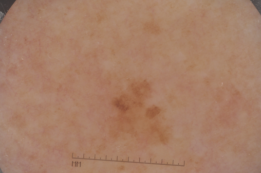
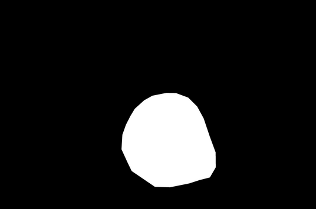
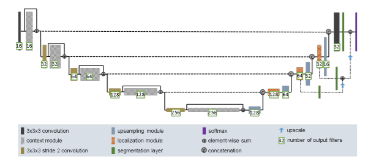
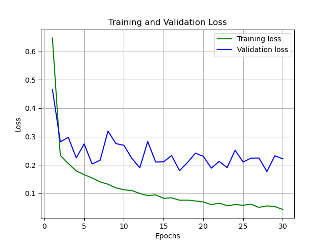
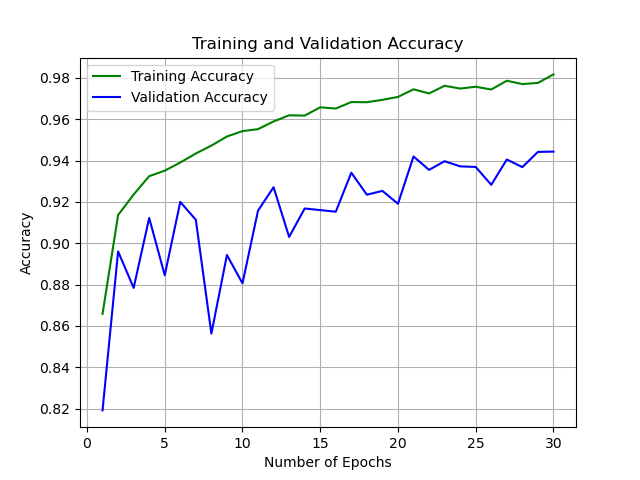
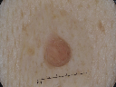

# Image Segmentation for ISIC 2018 Melanoma Dataset
The goal of this project is to perform Image Segmentation on the ISIC (International Skin Imaging Collaboration) 2018 Melanoma Dataset. Melanoma, a form of skin cancer is a public health problem with extremely high mortality. To reduce this, Melanoma needs to be detected early. In this project, this is done using an Improved UNET Model based on the paper [1]. The model will be trained on the dataset to produce a mask for each image containing a skin lesion. Performance wise, the model should achieve a Dice Coefficient for each class (Background and Lesion) greater than 0.8. 

## ISIC 2018 Melanoma Dataset
***
The ISIC 2018 Melanoma Dataset is a large dataset containing a total of 2,594 images of skin lesions and their respective labels. For this project, a preprocessed variant of the dataset was used. This was obtained from Course Help / Resources under COMP3710 Pattern Recognition, Semester 2, 2021.

The images containing the skin lesions are RGB Images, and the respective masks are binary images with the black color representing the background, and the white background representing the masked skin lesion. A random image was chosen from the dataset to be displayed below.

*Figure 1: Image of a Skin Lesion*

*Figure 2: Mask for the Skin Lesion*

## Data Preprocessing
***
For data preprocessing, the directories containing the images and the masks are converted into a 4D numpy array. The arrays will have 4 dimensions, with each dimension corresponding to \[Number of Images, Width, Height, Number of Channels]
The images have a shape of \[2594, 128, 96, 3] and the masks have a shape of \[2594, 128, 96, 1].

Each of these arrays are divided using train_test_split to create a training set of size 0.7, validation set of 0.15, and test set of 0.15.

The masks go through another step to convert all values for each pixel into either one of 2 values; 0 (Black) or 255 (White). The values are then encoded using a LabelEncoder to 0 or 1. Finally, the function to_categorical is used to change the number of channels of the masks from 1 to 2.

## Improved UNET Architecture
***
The Improved UNET Architecture used for this project is strongly based off the original UNET, with an additional segmentation layer and element wise sums performed after each contect module. The structure obtained from the paper [1] can be seen below.

*Figure 3: Improved UNET Architecture*

The entire Architecture is a connected series of convolution operations, concatentations and upscaling. Methods used to reduce overfitting have also been added to the model's implementations such as Batch Normalization and Dropout. 

A detailed explanation about the how the undefined modules have been implemented are included below. By default, all convolutional layers have identical padding to allow for the element wise sum and concatenation operations and use the same LeakyReLU Activation Function throughout. The number of output filters at for any module is shown in the image above contained within the green box.

- Context Module:
    > 1. Convolutional Layer with kernel size of 3
    > 2. Batch Normalization
    > 3. Dropout with value of 0.1
    > 4. Convolutional Layer with kernel size of 3
    > 5. Element-wise Sum with initial input and calculated output

- Upsampling Module:
    > 1. Convolutional Transpose Layer with kernel size of 3, stride of 2

- Localization Module:
    > 1. Convolutional Layer with kernel size of 3
    > 2. Convolutional Layer with kernel size of 1

- Segmentation Layer:
    > 1. Convolutional Layer with kernel size of 1
    > 2. Upsampling with factor of 2 except for final layer

## Results and Discussion
***
From the results attained and the graph seen below, the loss graph shows a decreasing trend with a possible plateau around 0.22. The predicted plateau pattern means that the model is not overfitting, but since the difference between the training and validation loss is still somewhat significant, this implies that the model could be further improved by tuning the Hyperparameters. The accuracy graph also shows an upward trend with the latest value at 30 epochs around 0.94.

*Figure 4: Loss Graph*

*Figure 5: Accuracy Graph*

As seen below, I included images for the real image containing a skin lesion, the real masks that have been used for testing, and my predicted results using the model. We can observe that the results are quite similar.

*Figure 6: Actual Image*

*Figure 7: Predicted Image*

*Figure 8: Predicted Masks*

For the results based off DSC (Dice Score), I obtained these values.
- Overall: 0.9051
- Label 0 (Background): 0.9605
- Label 1 (Lesion): 0.8497

## Hyperparameter Tuning
***
The initial hyperparameters chosen was 10 epochs with a batch size of 2, with the image widths and heights being 128 and 96 to preserve the aspect ratio. For the model downsampling step in the context module, this was done with 2 Convolutional Layers and a dropout in between with a value of 0.3. However, this resulted in many attempts with exploding gradients, which made the model unstable and the training step had to be restarted. To fix this issue, an additional batch normalization layer was added, and this improved the training significantly.

However, there was another issue where the model would overfit, as the validation loss graph would start an upward trend after 15 epochs. This was resolved by choosing a lower value for the dropout layer, which was 0.1. This produced a better model that could train for 30 epochs instead and return a better result overall for the dice coefficient.

## Dependencies
***
- Tensorflow
- Keras
- Operating System (os)
- Glob
- OpenCV (cv2)
- Numpy
- Matplotlib
- Sklearn
- ISIC 2018 Melanoma Dataset, Retrieved from https://challenge2018.isic-archive.com/

## References
***
[1] F. Isensee, P. Kickingereder, W. Wick, M. Bendszus, and K. H. Maier-Hein, “Brain Tumor Segmentation and Radiomics Survival Prediction: Contribution to the BRATS 2017 Challenge,” Feb. 2018. Retrieved from: https://arxiv.org/pdf/1802.10508v1.pdf