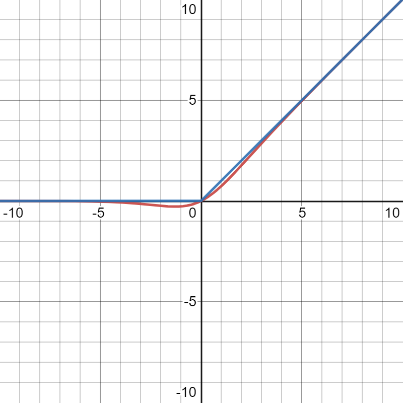
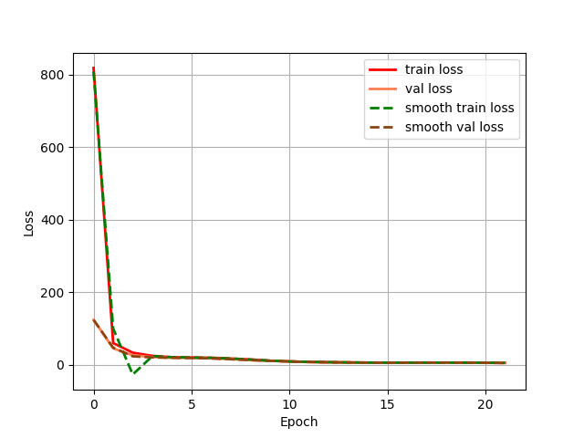
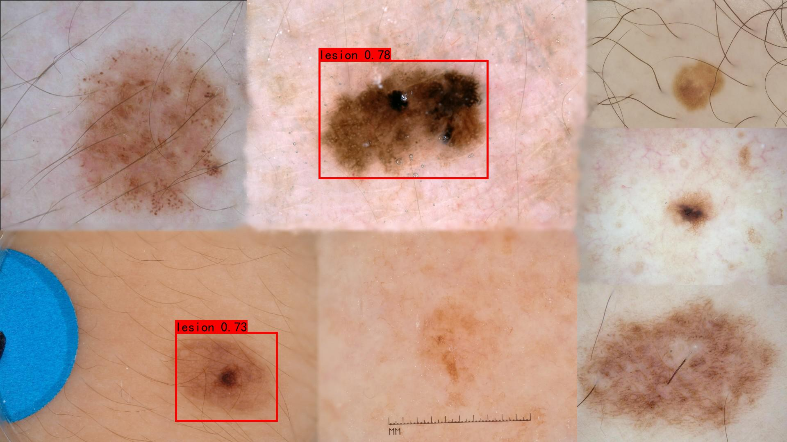

# Pattern Recognition Report - Task 3 with YOLOX

## Identity

> Student ID: 45742785

## Abstract

I trained a simplified [YOLOX][yolox2021] model on ISIC 2018 Task 1-2 Dataset, to clearly recognize the lesion area.
YOLOX is a latest algorithm which utilized many state-of-the-art techniques. By studying this algorithm, we can actually learn the latest progress in this field. Also since it's new, not many implementation out there.

## 1. Introduction

We will first extract a set of bounding boxes, then write a modified version of CSPNet as the backbone of PAFPN net. The PAFPN is the backbone of the entire YOLOX model, then we output 3 levels of abstraction, each have a 2x scaling factor on top of previous layer. For each layer we attach a YOLOX detection head, this head consist of 3 decouple component that coresponding to the object, the bounding box and classification respectively. each component have its very own loss logic: We use CIoU\[[7][zheng2019distanceiou]\] Loss for bounding box, and BCEWithLogitsLoss for classification of "if contains Obj" and "which class it belong". 

For implementation, I abandon tensorflow, because Life is Short, YOLO. The longer complaints is detailed in the Appendix.

Then the training process is done in a paid server, the challenges are also listed in the Appendix also.

After that we extract bounding boxes. Test results are kept in logs, then we run a set of evaluations, the results are shown in section 5, Results.

## 2. Data

### Dataset

We use the ISIC 2018 challenge task 1 dataset, there are 2594 preprocessed images with different sizes.
The image size range from (384x288) to (2044x1424).
We reserve 10% for testing(260). And reserve 10% for validation(234), 90% for training(2100) in the remaining 90%.

### preprocessing & augmentation

Firstly, We need to extract a set of bounding boxes out of the segment mask. We should not use OpenCV to do this task, so I craft a simple script using tensorflow 2.6. the bounding box for each segmentation is put in a xml under the same filename.

The original YOLOX use Mosaic / Mix Up / Copy-Paste to boost generalization performance. In our task, there is only one category to classify, and having too much augmentation may cause negative impact on performance\[[1][yolox2021]\]
So we plan to use only the basic random Scale Jitter & horizontal flip. Besides, those strong augmentations are too troublesome to use, we have to turn it off earlier before the training ends to have the best result.


## 3. Model - YOLOX

YOLOX is one of the latest work in YOLO Family, it is built on top of YOLO v3, utilize an anchor-free approach and combined with recent research progress on Deep Learning, like: decoupled head, SimOTA, Mosaic Data Augmentation, etc. Comparing to YOLO v5, it might be slower in some cases, but the AP is largely improved.

The original YOLOX model repo is published on [GitHub](https://github.com/Megvii-BaseDetection/YOLOX).

Some commenter say YOLOX, due to its Anchor free nature, it more similar to "[FCOS](tian2019fcos)".

### Backbone - Modified CSPNet\[[3][wang2019cspnet]\] + PA FPN

The CSPNet is firstly introduced into YOLO family by YOLO v4. YOLOX used the same modified CSPNet as YOLO v5. From the dense prediction of YOLO v1 to modified CSPNet in YOLO v5 and YOLOX, the capacity of feature extraction is drastically improved along the way.

Path Aggregation Feature Pyramid Networks (PAFPN) looks like an upside-down U-Net.

### Detection Head

As for detection head, there are 3 components, 1 regression for bounding box(4 numbers)
1 binary classification for detecting if the anchor-point detects an object.
1 multiple classification fo detecting object class. 

#### Loss function

For bounding boxes, we use the latest CIoU. IoU is ratio but as a loss function, scale matters, so we have Generalized IoU, the GIoU. CIoU is evolved from Distance-IoU. It take account for both centerpoint distance and the aspect ratio. it converge faster

For classification components, we use BCEWithLogitsLoss instead of traditional Cross-Entropy. It produce higher gradient, result in faster convergence.

I didn't fully understand the SimOAT part.

### Evaluation

Why choose AP over AOC(Area under ROC-curve)? Because in YOLO, we will generate many anchor boxes(anchor points in YOLOX) most of them are negative cases and should be cancelled anyway. In ROC curve true positive is equivalently important as true negative. So in this unbalanced scenario, a model which missed the only bounding box may still get a pretty decent AOC score, that's definitely not what we want.
mAP on the other hand, emphasize on the positive case.

### Activation

According to the paper[\[1\]][yolox2021], We used Sigmoid Linear Units, or SiLUs, it looks like a ReLU but smooth.
<figure>
   
   <figcaption>SiLU(red) vs ReLU(blue)</figcaption>
</figure>


## 4. Training

The CPU we used is Intel® Xeon® Silver 4210R Processor(10 core 20 threads), the GPU we used is RTX3090.
I only manage to use 30% of GPU after maximized the CPU worker, Seems there is a restriction on the server-side. 

For Optimizer, I us Adam, instead of SGD with momentum, because it's easier to tune. 
I also used CosineAnnealingLR scheduler, because It work well with Adam.

## 5. How to use & Results
### Requirement

- Require Torch & cudatoolkit=10.2 for training, detailed in [yaml](misc/tools.yaml) file
- May require OpenCV for data augmentation
- Require Numpy, PIL for Image visualization
### Usage
To Train

```shell
python3 ./train.py
```
To Test

```shell
python3 ./test.py
```

## Result

### Learning curve

<figure>
   
   <figcaption>Learning curve for the first 22 epochs</figcaption>
</figure>
Initially the loss is over hundreds, then it slowly but steadily go all the way down to 5~6 at 16 epoch.

### Demo detection
<figure>
   
   <figcaption>Predicted with IOU 0.2</figcaption>
</figure>
The result is not very satisfactory.

## References

<!-- https://www.bibtex.com/c/bibtex-to-ieee-converter/ -->
1. [Z. Ge, S. Liu, F. Wang, Z. Li, en J. Sun, “YOLOX: Exceeding YOLO Series in 2021”, arXiv [cs.CV]. 2021.][yolox2021]
2. [A. Bochkovskiy, C.-Y. Wang, en H.-Y. M. Liao, “YOLOv4: Optimal Speed and Accuracy of Object Detection”, arXiv [cs.CV]. 2020][bochkovskiy2020yolov4]
3. [C.-Y. Wang, H.-Y. M. Liao, I.-H. Yeh, Y.-H. Wu, P.-Y. Chen, en J.-W. Hsieh, “CSPNet: A New Backbone that can Enhance Learning Capability of CNN”, arXiv [cs.CV]. 2019.][wang2019cspnet]
4. [Z. Tian, C. Shen, H. Chen, en T. He, “FCOS: Fully Convolutional One-Stage Object Detection”, arXiv [cs.CV]. 2019.][tian2019fcos]
5. [S. Elfwing, E. Uchibe, en K. Doya, “Sigmoid-Weighted Linear Units for Neural Network Function Approximation in Reinforcement Learning”, arXiv [cs.LG]. 2017.][elfwing2017sigmoidweighted]
6. [Dan Hendrycks and Kevin Gimpel, Gaussian Error Linear Units (GELUs). arXiv preprint arXiv:][hendrycks2020gaussian]
7. [Z. Zheng, P. Wang, W. Liu, J. Li, R. Ye, en D. Ren, “Distance-IoU Loss: Faster and Better Learning for Bounding Box Regression”, arXiv [cs.CV]. 2019.][zheng2019distanceiou]

[yolox2021]: https://arxiv.org/abs/2107.08430 "YOLOX: Exceeding YOLO Series in 2021"
[bochkovskiy2020yolov4]: https://arxiv.org/abs/2004.10934 "YOLOv4: Optimal Speed and Accuracy of Object Detection"
[wang2019cspnet]: https://arxiv.org/abs/1911.11929 "CSPNet: A New Backbone that can Enhance Learning Capability of CNN"
[tian2019fcos]: https://arxiv.org/abs/1904.01355 "FCOS: Fully Convolutional One-Stage Object Detection"
[elfwing2017sigmoidweighted]: https://arxiv.org/abs/1702.03118v3 "Sigmoid-Weighted Linear Units for Neural Network Function Approximation in Reinforcement Learning"
[hendrycks2020gaussian]: https://arxiv.org/abs/1606.08415 "Gaussian Error Linear Units (GELUs)"
[zheng2019distanceiou]: https://arxiv.org/abs/1911.08287 "Z. Zheng, P. Wang, W. Liu, J. Li, R. Ye, en D. Ren, “Distance-IoU Loss: Faster and Better Learning for Bounding Box Regression”, arXiv [cs.CV]. 2019."

## Appendix: Challenges faced

- My queued task never run in Goliath servers. So I booked a paid GPU service.
- The dataset is relatively large. So it takes time to upload it to the server. Especially if you need to transfer the archive to another country like United States, may takes days to complete. *AVOID Paperspace*
- Originally I used Tensorflow, but I got many wired bugs. Besides, their documentation is terrible, API is chaotic, versioning is a nightmare, and community is fragmented. 

