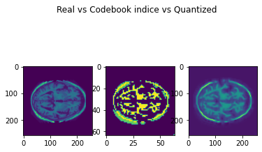

# Generative Model for the OASIS Brain Dataset Using VQVAE

## Description
This algorithm aims to implement a generative model for the OASIS brain dataset. To achieve this we can use a Vector-quantized Variational Auto-encoder to learn an embedding space. We can then feed encoded data into a DCGAN network to then generate realistic images from random noise. Descriptions of each model follow.
### VQVAE
The VQVAE model was presented in 2017 as a new generative model that can learn discrete representations. We know how VAE's work, using an encoder and decoder network to project images into a latent space, then learn to reconstruct them. However continuous vector spaces are used to represent the latent space, which is typically not how we find data in the real world. VQ-VAE's solve this problem. The encoder outputs are discrete and priors are learnt. To alleviate posterior collapse, they introduce a vector-quantizer into the model, hence the name. The vector quantizer transforms the discrete codebook into a probability density function which can then be decoded. The high level architecture is displayed below.

We use a VQVAE here to learn a discrete embedding space representation of the OASIS dataset. It should also be noted that the encoder and decoder networks make use of residual blocks as presented in resNET. 

### DCGAN
To then generate fake images, we need a generator network, thus a GAN became necessary. The DCGAN (deep-convolutional generative adversarial network) was introduced in 2015, producing strong results on various image datasets. GAN use a discriminator network to learn real/fake images, and the generate learns to generate fake images, competing each other in a zero-sum game. DCGAN's expand upon this idea by using convolutional layers, making them powerful for image learning. The high level architecture is displayed below:

## Training/Results
For training, the two main networks had to be trained seperately. The process is as follows.
### VQVAE
For the VQVAE we set up our encoder, decoder and vector quantizer models, and train them on the original images transformed to RGB. The model was trained over 5 epochs. Other hyperparamters are specified in code. Traning time was ~2 minutes on a Nvidia RTX 3070 GPU. Training loss is displayed below:

With the trained network, we can output an example of a real image and the reconstructed version:

We can also visualize an embedding slice from the network and the quantized output:

And a UMAP projection of what the overall embedding space looks like:

The above results already show the network is trained and we have a viable model.

### DCGAN
To then generate images, we train on input from the embedding space generated by the VQVAE. Thus the discriminator network trains with encoded data as the real data, and the generator attempts to generate fake codebook indices. The training process is the same as other GAN networks, where we first hold the generator constant and train the discriminator and find loss, and then we train the generator while holding the discriminator and loss. Refer to references for a more detailed explanation. 

Training occurred on batch sizes of 8, other 3 epochs. Other hyperparameters are specified in code. Training losses over the last epoch are displayed below:

We then visualize a generated codebook indice:

The structure of the brain can be seen, however to model was not converging and is likely not producing quality output. A revision of the training method and tuning of hyperparameters allowed a much better model to be achieved. Training took ~1 hour on Nvidia RTX 3070 GPU over 25 epochs on batch size of 256. Loss until model converges is displayed below:

As we can see the model converges! The generated codebook indice can be seen below:

We can then use our trained VQVAE model to quantize and decode the codebook indice to produce a fake:

Unfortunatly, the results aren't being decoded correctly. This is likely due to an error in the reconstruct method or get_quantized method. This was unfortunately unable to be solved. 

#### SSIM
Finally we can calculate the structured similarity between real images and the fake image using sklearn. SSIM is a relatively new metric that takes 3 factors into account (luminance (l), contrast (c) and structure (s)). A method has been implemented, but since the image is not being decoded correctly, results cannot be showed.

## Discussion
The VQVAE model worked very well and no adjustments should have to be made. The final DCGAN converged, and thus generated results should be viable. Further tuning of the model could be done but the models produced are viable. The reconstructions however are not. I believe the generative model has been implemented, but visualization was a challenge that can hopefully be overcame with fixes once bugs can be found.

## Instructions to replicate results
1. Change the train, test, val dir variables in datasets.py to where you have the image set stored on your computer. 
2. In trainVQVAE and trainDCGAN classes, change VQVAE_PATH and  to desired location. 
3. In train.py set VQVAE_PATH and run train.py
4. In predict.py, set train_dir, VQVAE_PATH and GENERATOR_PATH to locations trained models.
5. Run predict.py

Please note this is subject to model tuning, but using the default hyperparamters should reproduce viable models. The VQVAE hyperparameters are stored, and was trained over 5 epochs. THE DCGAN model, I recommend observing the loss outputted and tuning the model as required. Results here were achieved with hyperparameters stored and running over 25 epochs.

## Depedencies
cuda - 11.7.0

opencv - 4.0.1

pytorch - 1.12.1 (py3.8_cuda11.5_cudnn8_0)

torchvision - 0.12.0

matplotlib - 3.3.2

scipy - 1.5.2

numpy - 1.19.2

scikit-learn - 0.23.2 

## References
https://developers.google.com/machine-learning/gan

https://www.researchgate.net/figure/The-architecture-of-the-generator-and-the-discriminator-in-a-DCGAN-model-FSC-is-the_fig4_343597759

https://arxiv.org/abs/1511.06434 (DCGAN paper)

https://arxiv.org/abs/1711.00937 (VQVAE paper)

https://colab.research.google.com/github/zalandoresearch/pytorch-vq-vae/blob/master/vq-vae.ipynb

https://ml.berkeley.edu/blog/posts/vq-vae/

https://github.com/aladdinpersson/Machine-Learning-Collection/tree/master/ML/Pytorch/GANs/2.%20DCGAN

https://code.adonline.id.au/structural-similarity-index-ssim-in-python/

https://scikit-image.org/docs/stable/auto_examples/transform/plot_ssim.html

