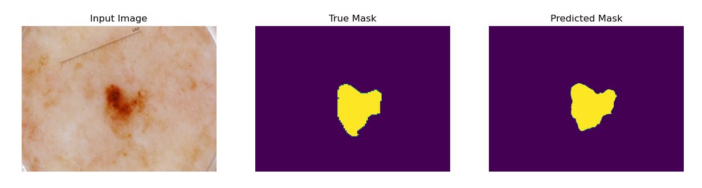
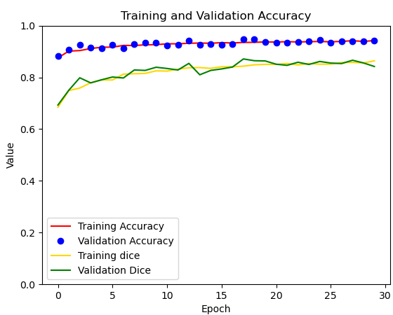

# Segmentation of the ISICs 2017 Dataset Using the Improved U-Net

This project implements an Improved version of the U-Net architecture which was designed by Isensee and colleagues, found in the report: https://arxiv.org/pdf/1802.10508v1.pdf.
This model follows the structure of a U-Net implementation but with key areas of improvement which enhance the performance of the model. [1]

## ISICs Data Set
This Improved U-Net model was used to segment the 2017 ISIC Dataset which is a collection of skin lesions.
The training, test, and validation datasets provided were used for their respective training sets and
due to the low number of total samples, augmentation was implemented on the training set;  vertical and horizontal
flips of the data were employed.

### Data Preprocessing
In the preprocessing phase, the training data and masks were normalized and resized to (256, 256), the training 
data has 3 channels of colour whilst the masks were reduced to grayscale. A threshold was applied to the masks where values > 0.5 were rounded to 1
and the other masks are set to 0 in order to boost performance of the model. 

## Description of Algorithm

_Figure 1: Improved UNet Architecture[1]_

The Improved U-Net model consists of three types of modules as seen in figure 1:
### Context Pathway
  This pathway is designed to encode the input images into more compact representations
  as the network runs. This is achieved through the use of 3x3 Convolutions and context modules.
  The context module is described by 2 convolution layers with a dropout layer in between. 
  These are residual blocks, a form of skip connection that learns the residual function 
  with reference to an input [2].

### Localisation Pathway
  This pathway is designed to increase the dimensionality of the encoded image representation 
  to produce high resolution segmentation through UpSampling modules and localisation modules.
#### Upsampling Modules
  Upsampling modules are placed after every localisation module in the pathway. They are used to 
  upscale the resolution to encode it up to higher resolutions. It consists of an upsample layer 
  followed by a 3x3 convolution layer.
### Skip Connections
  These connections are represented by the horizontal lines in figure 1, skip connections 
  are element-wise summations of 3x3 Convolutions and Context module outputs from the context Pathway.
Skip Connections are concatenated into the corresponding network level in the Localisation pathway.
Localisation modules are designed to re-introduce these skips back into the network after the
concatenation is complete.
### Segmentation 
Segmentation is performed on multiple levels of the localisation pathway and allows for segmented information
from lower levels of the network to propagate into the higher levels through summation. Lower level layers
are upsampled via a convolutional layer to allow for summation of different depths of layers.

## Results
The algorithm was run for 30 epochs with an initial filter size of 64 and a batch size of 1. 

_Figure 2: Predicted model for data sample from ISICs dataset_

_Figure 3: Training and Validation Accuracy and Dice Coefficient during training_

At the end of training, the model achieved a loss of 0.162, accuracy of 0.928, and a dice coefficient of 0.838.
### Tuning of Hyper parameters
During training, various values of hyper parameters were tested in order to balance performance and the running time of 
the algorithm with the best results coming from a batch size of 1 and learning rate of 0.001. 
Using a spatialDropout2d instead of a usual dropout layer was found to produce much greater results as well as the introduction
of Instance Normalisation modules.

## Dependencies
- Tensorflow 2.9.2
- Matplotlib 3.2.2
- Python 3.7.15
- Tensorflow addons 0.18.0

## Usage
In order to run this algorithm, the above dependencies are required. In addition to this, the ISICs 2017 training, 
validation, and test datasets must be unzipped and available locally. Altering the paths to the datasets and labels in 
dataset.py will be required. Then run `python train.py` in a command line. After the model is saved, running `python predict.py` will use the 
built model to predict masks of the training set and display 3 random samples. Depending on the desired running time of the 
algorithm, the values of EPOCHS, LEARNING_RATE, BATCH_SIZE in train.py may be altered.

## References 
[1] F. Isensee, P. Kickingereder, W. Wick, M. Bendszus and K. H. Maier-Hein, "Brain Tumor Segmentation and Radiomics Survival Prediction: Contribution to the BRATS 2017 Challenge," 28 February 2018. [Online]. Available: https://arxiv.org/pdf/1802.10508v1.pdf.

[2] K. He, X. Zhang, S. Ren and J. Sun, "Deep Residual Learning for Image Recognition," 10 December 2015. [Online]. Available: https://arxiv.org/pdf/1512.03385v1.pdf.

