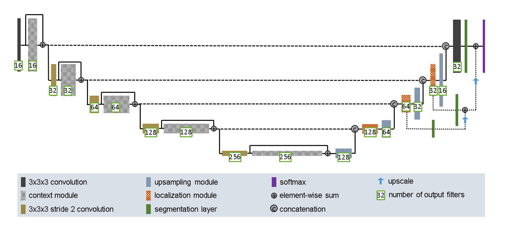

# Segmentation of the ISICs 2017 Dataset Using the Improved U-Net

This project implements an Improved version of the U-Net architecture which was designed by Isensee and colleagues, found in the report: https://arxiv.org/pdf/1802.10508v1.pdf.
This model follows the structure of a U-Net implementation but with key areas of improvement which enhance the performance of the model. [1]

## Description of Algorithm

_Figure 1: Improved UNet Architecture[1]_

The Improved U-Net model consists of three types of modules as seen in figure 1:
### Context Pathway
  This pathway is designed to encode the input images into increasingly compact representations
  as the network progresses. This is achieved through the use of 3x3 Convolutions and context modules
  The context module is described by 2 convolution layers with a dropout layer in between. 
  These are residual blocks, a type of skip connection that learns the residual function 
  with reference to an input [2].

### Localization Pathway
  This pathway is designed to increase the dimensionality of the encoded image representation 
  to produce high resolution segmentation through UpSampling modules and localization modules.
#### Upsampling Modules
  Upsampling modules are placed after every localization module in the pathway. They are used to 
  upscale the resolution to encode it up to higher resolutions. It consists of an upsample layer 
  followed by a 3x3 convolution layer.
### Skip Connections
  These connections are represented by the horizontal dashed lines in figure 1, skip connections 
  are element-wise summations of 3x3 Convolutions and Context module outputs in the context Pathway.
Skip Connections are concatenated into the corresponding network level in the Localization pathway.

Localization modules are designed to re-introduce these skip connections into the network after the
concatenation.
### Segmentation 
Segmentation is performed on multiple levels of the localization pathway and allows for segmented information
from lower levels of the network to propagate into the higher levels through summation. Lower level layers
are upsampled via a convolutional layer to allow for summation of different depths of layers.

## References 
[1] F. Isensee, P. Kickingereder, W. Wick, M. Bendszus and K. H. Maier-Hein, "Brain Tumor Segmentation and Radiomics Survival Prediction: Contribution to the BRATS 2017 Challenge," 28 February 2018. [Online]. Available: https://arxiv.org/pdf/1802.10508v1.pdf.

[2] K. He, X. Zhang, S. Ren and J. Sun, "Deep Residual Learning for Image Recognition," 10 December 2015. [Online]. Available: https://arxiv.org/pdf/1512.03385v1.pdf.

