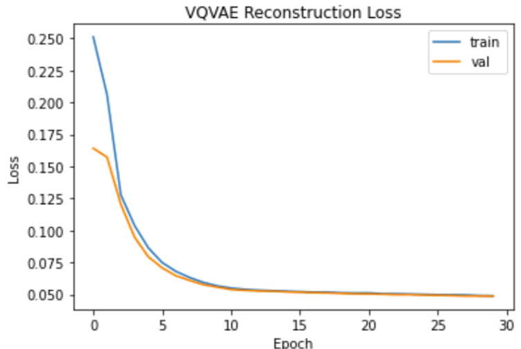
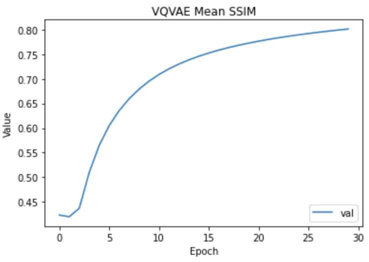
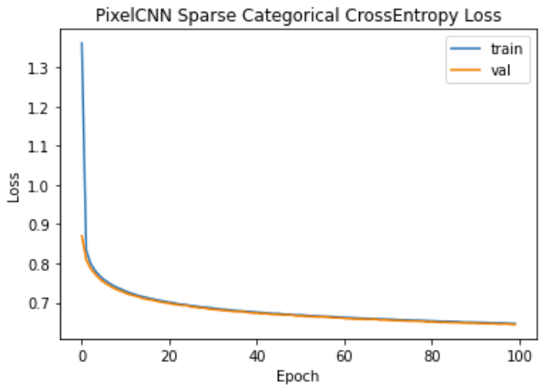
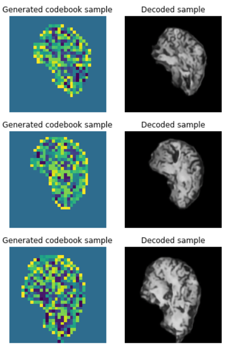
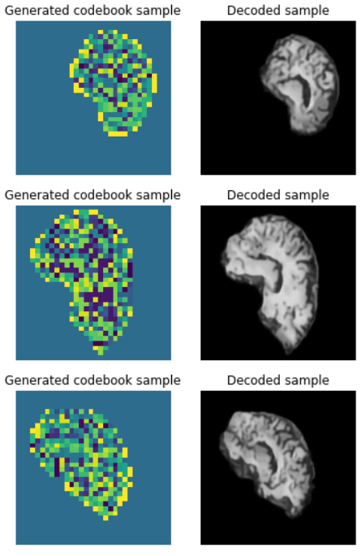

# Generative VQ-VAE using PixelCNN on the ADNI Dataset

## Overview

The project implements a generative model on the ADNI dataset to generate new brain images. 
This is done by training a VQ-VAE (Vector Quantized Variational AutoEncoder) on the training images, 
and then using it to train a PixelCNN prior on encoded codebook samples. The trained PixelCNN 
then generates new codebook samples which are decoded by the VQ-VAE to generate new images.

## Models

### VQ-VAE Overview

### Implemented VQ-VAE Model

### PixelCNN

### Implemented PixelCNN Model

## Data Pre-Processing

The ADNI dataset for Alzheimer's disease used was a preprocessed version 
containing brain images from 2 classes (Alzheimer's and Non-Alzheimers). The dataset was obtained 
at https://cloudstor.aarnet.edu.au/plus/s/L6bbssKhUoUdTSI 
The dataset has the following directory structure:
```
+-- ADNI_AC_NC_2D
|   +-- AD_NC
|       +-- test
|           +-- test_images.png
|           +-- ...
|       +-- train
|           +-- train_images.png
|           +-- ...
```
For the Generative model, both classes were combined in each folder, resulting in 21520 training images and 
9000 test images. 

***Images had the shape (256,256,3) with pixel values between [0,255], and were normalized then scaled 
to be between [0,1], which gave good performance.***

## Hyper-Parameter Selection

### Data Hyper-Parameters
- For VQ-VAE, a ***train-validation split of 0.8*** was selected to ensure most of the images were retained
for training, but we still want to test the reconstructions on enough images to ensure the model's gradients are learnt correctly.
- The data was already processed into training and testing, so the test-split was decided to be all images in the test folder to
test reconstructions on images which the model was not trained on
- Images were kept at the original size of (256,256,3) with 3 RGB channels as this gave better performance
- ***Batch size of 32 used for VQ-VAE and batch size of 64 used for PixelCNN*** to balance improved performance and computation
time

### Model Hyper-Parameters
- ***The number of embeddings in the latent space was chosen to be 32, the dimension of the latent space as 128 and shape of the latent space as 32x32 pixels .***
- Many tests were conducted with combinations of embedding numbers (eg. 64, 128, 256, 512), latent dimensions (16, 32, 64, 128, 256, 512) and codebook sizes (16,32,64,128).
It was found that keeping the number of embeddings low, codebook small but the dimensions high slightly decreases reconstruction performance, but
significantly improved PixelCNN performance. 
- This is because the codebook is simpler to learn as
there are less choices for selecting the codebook embedding for the PixelCNN, but enough dimensions to give the model capacity to learn the features of input images.
- ***Adam optimiser with learning rate 0.001 for VQ-VAE and 0.0003 for PixelCNN*** were chosen as through many tests in the range [0.0001, 0.001] 
- ***The commitment loss scaling of 0.25 was selected for VQ-VAE***, as this was selected in the original paper and was found to
give the best performance. Although, the performance seems robust with the choice of this parameter.
## Training the Models

### VQ-VAE Training 

The VQ-VAE model was trained for 30 epochs, and a steady decline in training and validation reconstruction loss was observed.
The final obtained ***reconstruction loss for training and validation was 0.048 and 0.050 respectively.***

<p align = "center"></p>

In each validation step, the mean SSIM between the input image and decoded output image was calculated. The mean SSIM quickly
steadily increases as the epochs increase, ***achieving a final mean SSIM of 0.835 on the validation set.***

<p align = "center"></p>


### PixelCNN Training

The PixelCNN was trained for 100 epochs, and a steady decrease in the loss was observed. After about 40 epochs, the loss
seemed to have converged and the rate of decline slowed. 
 
<p align = "center"></p>

***The final training loss was 0.6441 and the final validation loss was 0.6481.*** Interestingly, it was found that more complex 
models with smaller loss did not always result in better generated images, but instead simpler models with smaller codebook 
sizes and number of embeddings performed better.

## Results

### VQ-VAE Reconstructions
Below are some example input images from the ADNI dataset, codebooks and decoded codebook images from the VQ-VAE model, 
as well as the SSIM value between input and output images. 

<p align = "center"> </p>

We find that after 30 epochs that the decoded images have an ***average SSIM of 0.823*** across the 9000 ADNI 
test images (above is 0.6 SSIM threshold). Decoded images visually resemble the input images, indicating that the 
trained encoder and decoder are performing well.


### Pixel CNN Generated Samples

Below are some of the better samples of the generated codebooks from the PixelCNN, and decoded outputs using the trained VQ-VAE
decoder. We can see that the generated images are ***reasonably clear, resembling the input brain images in shape, size and location, indicating good performance.***
However, the structure of the brain's internals for the given sample is not perfect, and is missing key detailed features of
a typical brain.

<p align = "center"></p>

Below are more generated samples which exhibit better details and clarity of the brain's internal features. However, for this sample the
shape and size of the generated brains are too large and not perfect.

<p align = "center"></p>

Despite this, the images indicate that the VQ-VAE and PixelCNN are learning the input images and codebooks appropriately.

It should be noted that some images constructed end up being much larger in size, but maintains the same shape
and internal structure.

## Improvements

Currently, the PixelCNN's generated samples resemble brain images from the ADNI dataset, but the detail of the 
structures within the brain could be improved. Another indicator of suboptimal performance from PixelCNN is the large
Sparse Categorical Cross Entropy Loss.
Thus, improvements could potentially be achieved by ***performing more hyper-parameter
tuning. In particular, tuning the number of residual blocks, codebook size, the number of embeddings, the dimension of the 
codebook.***

However, PixelCNN suffers from blind spots, where the construction of the masks in the implementation skips pixels
when performing a prediction for the current pixel. Therefore, ***generated images could be improved by implementing 
another model to train the prior***. Some candidate models include an improved autoregressive 
generative model such as Gated PixelCNN or PixelSNAIL, or a Generative Adversarial Network (GAN).

## Example Usage

**Loading in the data**

Store the path for your train,test and validation data in the variables train_path, test_path, validation_path respectively.
```
train_ds = load_train_data(train_path, img_height, img_width, batch_size, val_split)
val_ds = load_validation_data(train_path, img_height, img_width, batch_size, val_split)
test_ds = load_test_data(test_path, img_height, img_width, batch_size)
 ```
Where img_height, img_width are the height and width of the images, batch_size is the number of images loaded in per batch, and val_split is the validation split.

**Training the VQ-VAE Model**

Initailises and trains the custom VQ-VAE Model
```
data_var = find_data_var(train_ds) #Find the variance of the data
vqvae_model = VQVAEModel(img_shape = (img_height, img_width, 3), embedding_num=num_embeddings, embedding_dim=latent_dim, beta=0.25, data_variance=data_var)
vqvae_model.compile(optimizer=keras.optimizers.Adam())
device = "/GPU:0" if len(tf.config.list_physical_devices('GPU')) else '/CPU:0'

# Training the model
with tf.device("/GPU:0"):
    history = vqvae_model.fit(train_ds, epochs=30, validation_data=val_ds, batch_size=batch_size)

 ```
Where num_embeddings is the number of embeddings in the codebook, beta is the scaling for commitment loss, latent_dim is the 
number of dimensions 

**Saving the VQ-VAE Model**

Input the directory path where the weights would be stored.
```
vqvae_model.save_weights("path to store weights")
 ```
**Loading the VQ-VAE Model**

Reinitialise the custom VQ-VAE model and load in the trained weights. Provide the 
path of the saved weights from the above call.

***It is important that the image size, latent dimensions and number of embeddings is the same as the values
which the model was trained on.***

```
vqvae_model = VQVAEModel(img_shape=(img_height, img_width, 3), embedding_num=num_embeddings,
                         embedding_dim=latent_dim, beta=0.25,
                         data_variance=data_var)
vqvae_model.load_weights("Placeholder path to VQ-VAE trained weights")
```

**Training the PixelCNN Model**

The data for training the PixelCNN are codebook images, so this needs to be loaded into the correct format by
applying a map to the data loader.
```
# Loading in the codebook images data
pixel_train_ds = load_train_data(train_path, img_height, img_width, batch_size, 0.8)
pixel_val_ds = load_validation_data(train_path, img_height, img_width, batch_size, 0.05)
codebook_mapper = codebook_wrapper_fn(
        vqvae_model.get_encoder(),
        vqvae_model.get_vq())
codebook_dataset = pixel_train_ds.map(codebook_mapper)
codebook_val_dataset = pixel_val_ds.map(codebook_mapper)
pixelcnn_input_shape = vqvae_model.get_encoder().output.shape[1:3]

# Make and compile the model
pixelcnn_model = PixelCNNModel(pixelcnn_input_shape, vqvae_model._embedding_num, 128, 2,2)
pixelcnn_model.compile(optimizer=keras.optimizers.Adam(0.0003),
                       loss=keras.losses.SparseCategoricalCrossentropy(from_logits=True),
                       metrics=["accuracy"]
)

# Training the model
with tf.device("/GPU:0"):
    history2 = pixelcnn_model.fit(codebook_dataset, batch_size=64, epochs=100, validation_data=codebook_val_dataset)

```

**Saving the PixelCNN Model**
Input the directory path where the weights would be stored.
```
pixelcnn_model.save_weights("path to store weights")
```

**Loading the PixelCNN Model**

Assumes that the trained VQ-VAE is loaded in the variable vqvae_model

```
pixelcnn_input_shape = vqvae_model.get_encoder().output.shape[1:3]
pixelcnn_model = PixelCNNModel(pixelcnn_input_shape, vqvae_model._embedding_num, 128, 2, 2)
pixelcnn_model.load_weights("Placeholder path to pixelCNN trained weights")
```

**Generating VQ-VAE Reconstructions**

Assumes that the trained VQ-VAE is loaded in the variable vqvae_model

```
# Plot some reconstructed images from the vqvae model
number_images = 3 #Change to the number of images you want.
reconstructed_image(test_ds, vqvae_model, number_images, img_height, img_width)
```

**Generating New Images**

Assumes that the trained PixelCNN and VQ-VAE are loaded into the variables pixelcnn_model and 
vqvae_model respectively.

```
# Plots of generated images from PixelCNN
pixelCNN_generate_images(pixelcnn_model, vqvae_model, number_images)
```


## Dependencies
- tensorflow >= 2.9.2
- numpy >= 1.21.6
- matplotlib >= 3.2.2
- tensorflow_probability >= 0.16.0

## References

References for understanding and creating the VQ-VAE Model
- https://keras.io/examples/generative/vq_vae/
- https://www.kaggle.com/code/ameroyer/keras-vq-vae-for-image-generation/notebook
- https://www.youtube.com/watch?v=VZFVUrYcig0

Tutorial referenced for creating the PixelCNN model
- https://keras.io/examples/generative/pixelcnn/
- https://towardsdatascience.com/auto-regressive-generative-models-pixelrnn-pixelcnn-32d192911173

Customising a tf.keras model
- https://www.tensorflow.org/guide/keras/customizing_what_happens_in_fit
- https://www.tensorflow.org/guide/keras/custom_layers_and_models

Academic Paper references for VQ-VAE and PixelCNN
- https://arxiv.org/pdf/1711.00937.pdf
- https://arxiv.org/pdf/1606.05328.pdf
- https://arxiv.org/pdf/1601.06759v3.pdf


