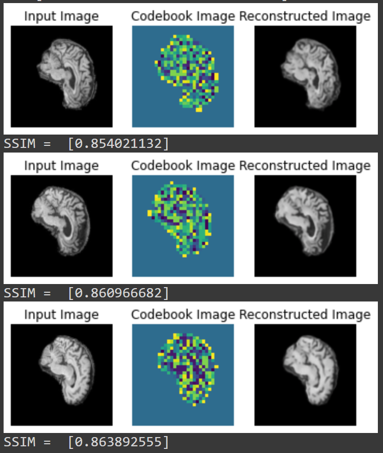
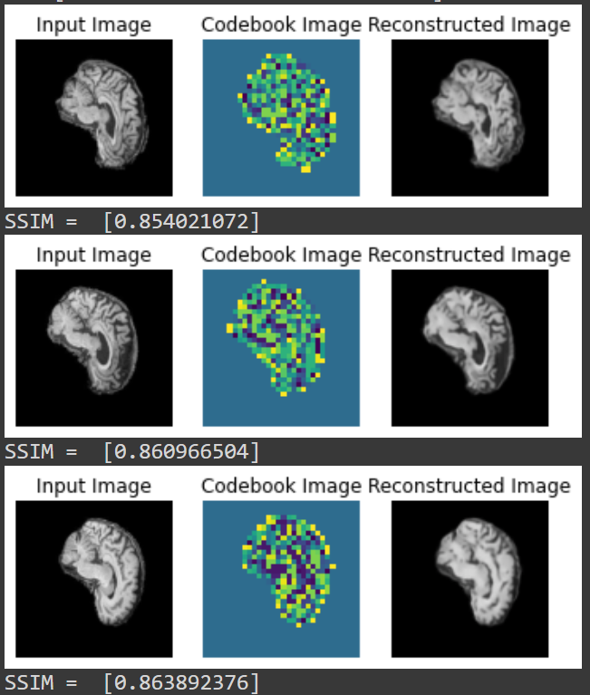

# Generative VQ-VAE using PixelCNN on the ADNI Dataset

## Overview

The project implements a generative model on the ADNI dataset to generate new brain images. 
This is done by training a VQ-VAE (Vector Quantized Variational AutoEncoder) on the training images, 
and then using it to train a PixelCNN prior on encoded codebook samples. The trained PixelCNN 
then generates new codebook samples which are decoded by the VQ-VAE to generate new images.

## Models

### VQ-VAE Overview

### Implemented VQ-VAE Model

### PixelCNN

### Implemented PixelCNN Model

## Data Pre-Processing

The ADNI dataset for Alzheimer's disease used was a preprocessed version 
containing brain images from 2 classes (Alzheimer's and Non-Alzheimers). The dataset has the following directory structure:
```
+-- ADNI_AC_NC_2D
|   +-- AD_NC
|       +-- test
|           +-- test_images.png
|           +-- ...
|       +-- train
|           +-- train_images.png
|           +-- ...
```
For the Generative model, both classes were combined in each folder, resulting in 21520 training images and 
9000 test images. 

***Images had the shape (256,256,3) with pixel values between [0,255], and were normalized then scaled 
to be between [0,1], which gave good performance.***

## Hyper-Parameter Selection

- Train Test split, batch size
- Latent Dimensions and number of embeddings
- Image sizes and codebook size

## Training the Models

### VQ-VAE Training 

- Mention the loss functions

The VQ-VAE model was trained for 30 epochs, and a steady decline in training and validation reconstruction loss was observed.
The final obtained ***reconstruction loss for training and validation was 0.048 and 0.050 respectively.***

In each validation step, the mean SSIM between the input image and decoded output image was calculated. The mean SSIM quickly
steadily increases as the epochs increase, ***achieving a final mean SSIM of 0.835 on the validation set.***

- Include Image

### PixelCNN Training

- Mention the loss functions

The PixelCNN was trained for 100 epochs, and a steady decrease in the loss was observed. After about 40 epochs, the loss
seemed to have converged and the rate of decline slowed. 
 
- Include Image

***The final training loss was 0.6441 and the final validation loss was 0.6481.*** Interestingly, it was found that more complex 
models with smaller loss did not always result in better generated images, but instead simpler models with smaller codebook 
sizes and number of embeddings performed better.

## Results

### VQ-VAE Reconstructions
Below are some example input images from the ADNI dataset, codebooks and decoded codebook images from the VQ-VAE model, 
as well as the SSIM value between input and output images. 



<p align = "center"></p>



We find that after 30 epochs that the decoded images have an ***average SSIM of 0.823*** across the 9000 ADNI 
test images (above is 0.6 SSIM threshold). Decoded images visually resemble the input images, indicating that the 
trained encoder and decoder are performing well.


### Pixel CNN Generated Samples

***Discussion***

- Include Image

***Discussion***

- Include Image

## Improvements

Currently, the PixelCNN's generated samples resemble brain images from the ADNI dataset, but the detail of the 
structures within the brain could be improved. Another indicator of suboptimal performance from PixelCNN is the large
Sparse Categorical Cross Entropy Loss.
Thus, improvements could potentially be achieved by ***performing more hyper-parameter
tuning. In particular, tuning the number of residual blocks, codebook size, the number of embeddings, the dimension of the 
codebook.***

However, PixelCNN suffers from blind spots, where the construction of the masks in the implementation skips pixels
when performing a prediction for the current pixel. Therefore, ***generated images could be improved by implementing 
another model to train the prior***. Some candidate models include an improved autoregressive 
generative model such as Gated PixelCNN or PixelSNAIL, or aGenerative Adversarial Network (GAN).

## Example Usage

## Reproduce Results

## Dependencies
- tensorflow >= 2.9.2
- numpy >= 1.21.6
- matplotlib >= 3.2.2
- tensorflow_probability >= 0.16.0

## References

References for understanding and creating the VQ-VAE Model
- https://keras.io/examples/generative/vq_vae/
- https://www.kaggle.com/code/ameroyer/keras-vq-vae-for-image-generation/notebook
- https://www.youtube.com/watch?v=VZFVUrYcig0

Tutorial referenced for creating the PixelCNN model
- https://keras.io/examples/generative/pixelcnn/
- https://towardsdatascience.com/auto-regressive-generative-models-pixelrnn-pixelcnn-32d192911173

Customising a tf.keras model
- https://www.tensorflow.org/guide/keras/customizing_what_happens_in_fit
- https://www.tensorflow.org/guide/keras/custom_layers_and_models

Academic Paper references for VQ-VAE and PixelCNN
- https://arxiv.org/pdf/1711.00937.pdf
- https://arxiv.org/pdf/1606.05328.pdf
- https://arxiv.org/pdf/1601.06759v3.pdf


