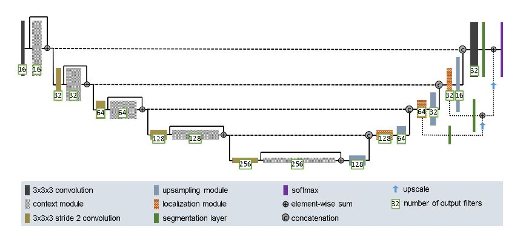

# Improved UNet Model for Segmenting the ISICs Dataset
This task uses an improved UNet model which maintains the same convolutional neural network structure of a regular UNet, combined with dice loss functions to more suitably segment brain tumours. 

## The Improved UNet
The paper supplied with this task focuses on 3D input blocks, below is an image of their architecture, which will be used to loosely base this task's architecture off. 

*Figure 1: Network Architecture for Improved UNet*

For this task, 2D images will be used as the input, and as such, a simpler approach can be taken. The aim of this project is to be able to segment the ISIC dataset provided with all labels having a minimum Dice Similarity coefficient of 0.8 using an improved UNet model.

## ISIC 2018 Task 1 Dataset
The dataset given for this task was a preprocessed ISIC 2018 Melanoma Dermoscopy dataset, based off the ISIC 2018 segmentation task challenge. The dataset was downsampled by 2, and contained around 3000 images of dermoscopies and masks. Below are examples are the training data and segmentation data. 

*Figure 2: Raw training image - Example from Dataset*

*Figure 3: Segmented mask of Figure 2 - Example from Dataset*

## UNet Model Architecture
### Down Sampling Module
This module was implemented to assist the encoding section of the model. Following what is stated in the paper, multiple convolutional layers with 3x3 filters are used, with a dropout layer of 0.3 placed in between.  

### Upsampling Module
This module was implemented to assist with the decoding section of the model. As per the paper, an upsampling layer (in this case a 2D upsampling layer) is given with size 2, followed by a 3x3 convolutional layer. 

### Localisation Module
A simple module designed to work alongside the upsampling module to assist with decoding. It employs a 3x3 convolutional layer followed by a 1x1 convolutional layer. 

### UNet Model
Initially, 5 blocks of downsampling are run, all with a 3x3 convolutional before them. From the second to the fifth downsampling block, the preceeding 3x3 convolution is given strides of 2. A single upsampling module is called alone, followed by 3 blocks of localisation followed by upsampling. The second and third of these blocks are followed by a segmentation layer and an upscale. The final block is followed by a 3x3 convolution and a segmentation. Finally, the output is run through a softmax. 

## Dependencies 
- Python 3.9.7
- Tensorflow 2.6.0
- Numpy 1.19.5
- Matplotlib 3.4.3
- ISIC 2018 Task 1 Dataset

## Usage
In its current state, there are no steps needed to be taken.

## References
F. Isensee, P. Kickingereder, W. Wick, M. Bendszus, and K. H. Maier-Hein, “Brain Tumor Segmentation
and Radiomics Survival Prediction: Contribution to the BRATS 2017 Challenge,” Feb. 2018. [Online].
Available: https://arxiv.org/abs/1802.10508v1
