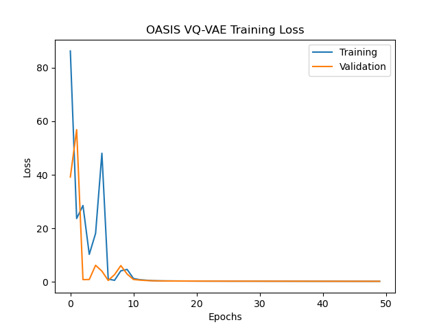
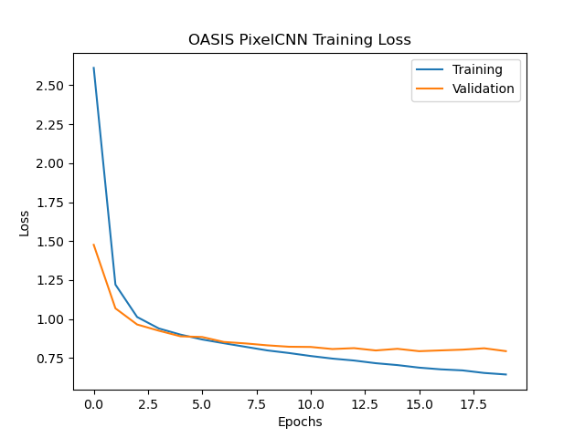
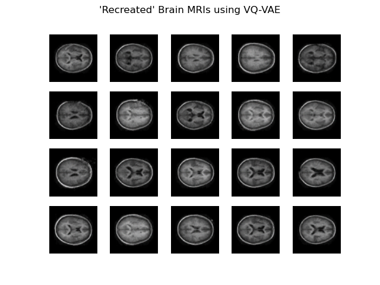
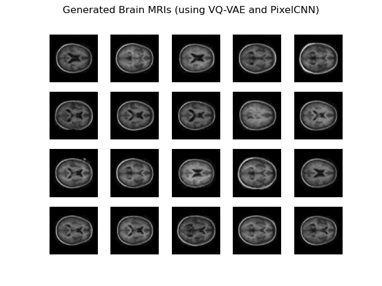

# Generating Brain Images using OASIS Dataset with VQ-VAE and PixelCNN

## Introduction

This repo implements the VQ-VAE (Vector Quantizer - Variable Auto Encoder) model
and trains it on the OASIS Brain dataset [1]. A VQ-VAE model is combined
with a PixelCNN, both of which are trained on the OASIS dataset, to generate
fake images of brain MRIs.

### OASIS Dataset

The OASIS Dataset is a dataset containing 9000+ images of brain MRIs that have
been preprocessed and cleaned. This dataset is split into training, validation 
and testing sets - for the purposes of this task only the training and testing 
set have been used as the training set contained enough images to simply use
a validation split.

## Dependencies and Usage

In order to run this repository, Python 3.9+ is required (due to the use of type hints)
and the dependencies listed in the `requirements.txt` file should be installed. These 
include Tensorflow/Keras 2.4+, Tensorflow Probability and Scikit-Image.

The file that should be run is `driver.py`. This trains the model and generates
20 images of Brains with further configuration options available at the top 
`driver.py`. `model.py` contains the implementation of the model in Tensorflow/Keras.

## Method

The VQ-VAE model was used to train a Decoder and Vector Quantiser that could be used with PixelCNN. 

VQ-VAE has 3 main parts (these can be seen below)[2]:
1. the encoder model
2. the vector quantiser layer
3. the decoder model

Although clearly similar to a VAE in structure, a VQ-VAE uses a discrete representation
of the latent space rather than a continuous representation. This discretisation is done
by the Vector Quantizer layer [2].

During training batches of data are passed along this pipeline with the encoder
"encoding" the input data to a representation of the input in discrete latent space,
the vector quantiser essentially building a dictionary of latent space encodings and
the decoder "decoding" this latent space representation into the original dimensions [2].
Standard back-propagation and a loss function are used to propagate weights back through the
decoder and into the encoder with a "straight-through" estimation used to pass weights
through the non-differentiable vector quantizer layer.

More specifically, in this implementation the VQ-VAE had 4 Convolution layers as part of the Encoder, 4 Transpose Convolution layers as part of the Decoder and a simple Vector Quantiser layer in the middle [5]. The performance of the VQ-VAE was measured
by taking the SSIM and testing recreating images by passing them through the full pipeline - this is discussed in more detail below.

The dictionary built by the vector quantiser can then be used to generate images
by training a PixelCNN [4] on this dictionary and sampling this PixelCNN
to create priors of the latent space [3]. Using these, latent codes
can be generated from the PixelCNN and passed to the decoder trained as part of
the VQ-VAE allowing for images to be generated [2].

The standard PixelCNN architecture is included in the below table from the paper.

The general architecture for the PixelCNN can be seen above - essentially the model iterates through inputs in a pixel-by-pixel manner (starting at the center) and treats images as sequences [4], which improves learning in generation applications. More specifically the PixelCNN used here has a single masked convolution layer followed by two residual masked convolution blocks and another two masked convolution layers. Each masked convolution layer applies a mask to the input in-order to essentially treat the input as a sequential input and only look at pixels to the left and above of the current pixel being predicted or generated. The residual masked block is similar, however applies a residual to the output by adding the input and applying 2 more convolutions as seen above.

Each residual block (essentially a residual masked convolution layer) has the following architecture.

Together the VQ-VAE and PixelCNN were combined as described above to generate images.

### Notes

Using a Gated PixelCNN was considered due to the "blind spot" issue that
PixelCNN's have, however because of problems with getting it to work this was dropped
in favour of a standard PixelCNN [3][4]. The PixelCNN also seemed to have sufficient
performance for generating images.

## Results

For the purposes of training, the training set provided as part of the OASIS
dataset was used for training both the PixelCNN and VQVAE. A validation split
was used rather than using a dedicated validation dataset as there are over
9000 images in the training set and so there would not be a large impact on
results from doing this. Lastly, the test set provided as part of OASIS was
used to test the VQVAE recreation quality, however the PixelCNN did not
require the use of such a test set as explained further below.

### Loss

Through trial and error good results were achieved when trained with 50 epochs
for the VQVAE model and 20 epochs for the PixelCNN model. The loss achieved
while training these models can be seen below.

### VQ-VAE Results

Furthermore, the best combination of training speed and quality was provided
by using 16 latent dimensions and 128 embeddings for the Vector Quantizer layer 
in the VQVAE. It was also observed that trying to make the latent space as
small as possible by adding extra Convolution layers to the encoder and decoder
resulted in clearer generated samples.

In order to quantify the results of the VQVAE model, the SSIM of the OASIS
test set can be calculated by comparing each test image to the "recreated" image
i.e. the test image after it has been passed through the VQVAE. This gives an
average SSIM that lies between 0.78 and 0.82 on most runs. Furthermore a summary of some recreated images has
been provided below which shows that the recreated image retain much of the
quality of the originals.

### PixelCNN and Brain MRI Generation Results

Quantifying the results of the PixelCNN is much more difficult and it is
probably better to just visually confirm whether the sampled output generated
by the PixelCNN + VQVAE Decoder looks correct. A summary of 20 sampled images
has been provided below.

## References
[1] D. S. Marcus, T. H. Wang, J. Parker, J. G. Csernansky, J. C. Morris, and R. L. Buckner, “Open Access Series of Imaging Studies (OASIS): Cross-sectional MRI Data in Young, Middle Aged, Nondemented, and Demented Older Adults,” Journal of Cognitive Neuroscience, vol. 19, no. 9, pp. 1498–1507, Sep. 2007, doi: 10.1162/jocn.2007.19.9.1498. 

[2] A. van den Oord, O. Vinyals, and K. Kavukcuoglu, “Neural Discrete Representation Learning,” arXiv:1711.00937 [cs], May 2018, [Online]. Available: http://arxiv.org/abs/1711.00937

[3] A. van den Oord, N. Kalchbrenner, O. Vinyals, L. Espeholt, A. Graves, and K. Kavukcuoglu, “Conditional Image Generation with PixelCNN Decoders,” arXiv:1606.05328 [cs], Jun. 2016, [Online]. Available: http://arxiv.org/abs/1606.05328

[4] A. van den Oord, N. Kalchbrenner, and K. Kavukcuoglu, “Pixel Recurrent Neural Networks,” arXiv:1601.06759 [cs], Aug. 2016, [Online]. Available: http://arxiv.org/abs/1601.06759

[5] “Vector Quantization Data Compression,” in Optical Satellite Data Compression and Implementation, Society of Photo-Optical Instrumentation Engineers, 2013. doi: 10.1117/3.1002297.ch4.

