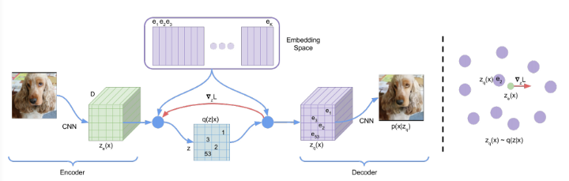
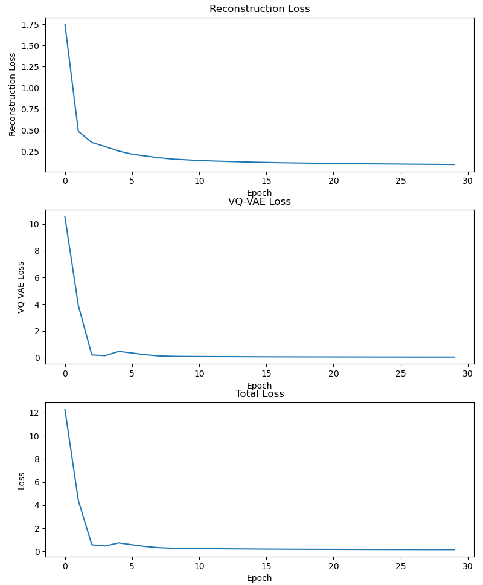
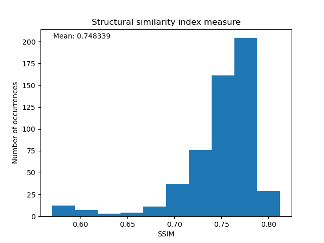
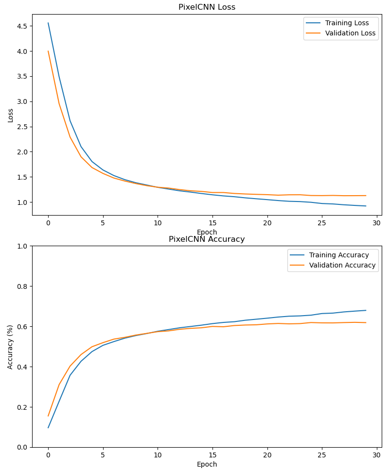
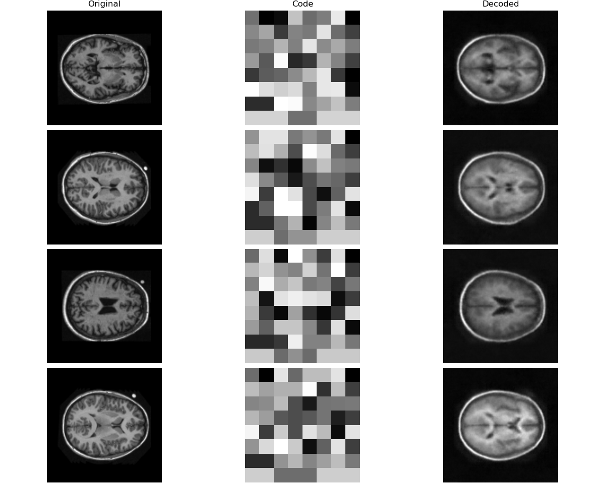
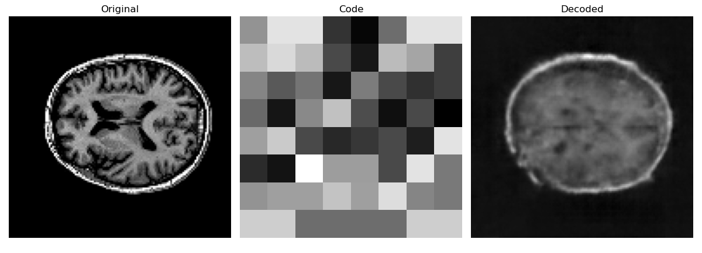
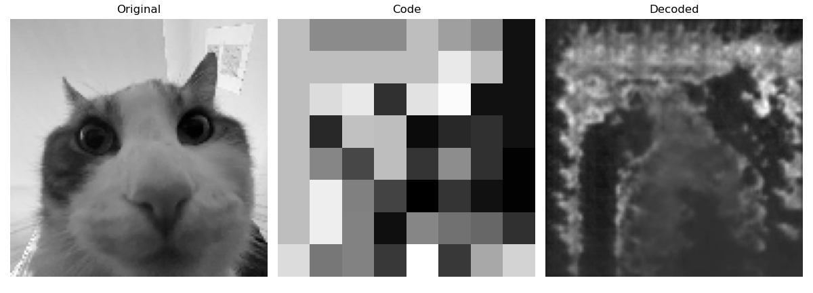
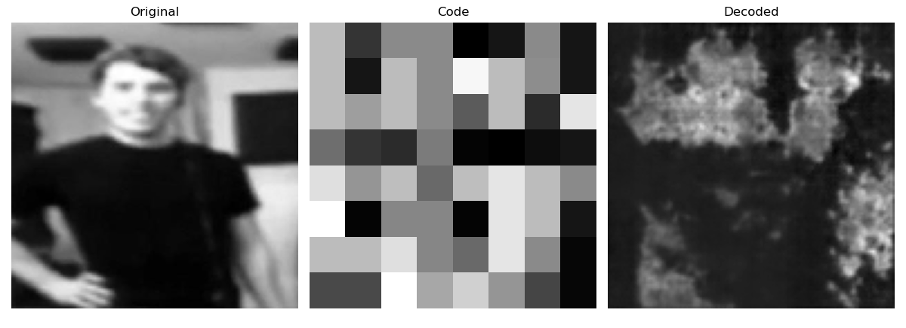
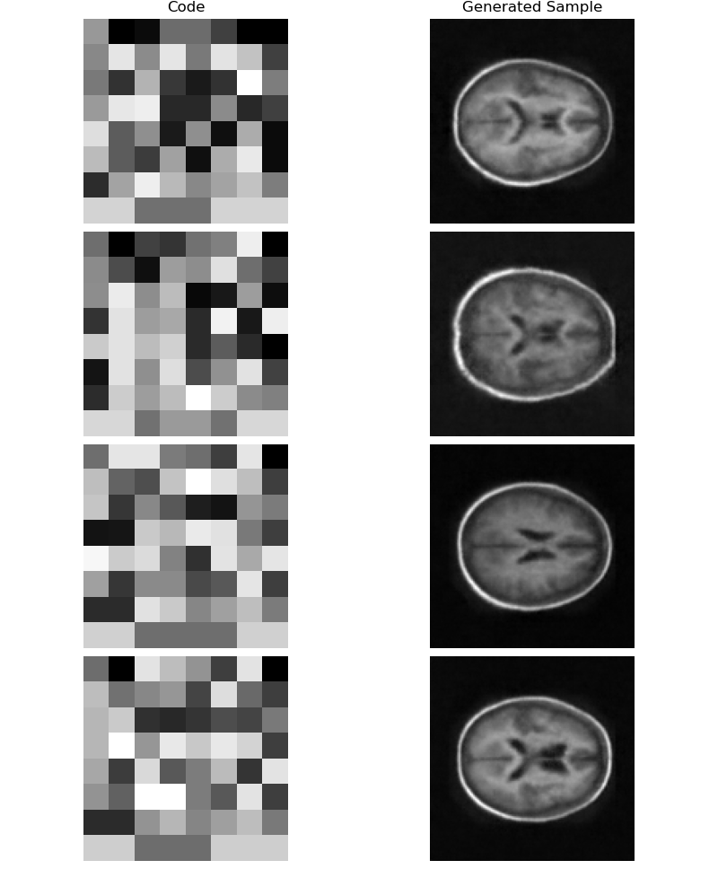

# Generative VQ-VAE model for the OASIS MRI dataset

## Project Overview

The purpose of this project is to implement a generative model to create novel images of brains based on the OASIS MRI dataset. To achieve this, I trained a VQ-VAE model to encode and decode the images of the brains, then trained a PixelCNN model to generate new examples of encoded images, which can then be fed into the decoder to create new brains.

## Dependencies

- python >= 3.7.13
- requests >= 2.28.1
- numpy >= 1.21.5
- matplotlib >= 3.5.2
- tensorflow >= 2.10.1
- tensorflow-probability >= 0.14.0

## Usage

### train.py

The train.py script can be run from a commandline. It will automatically download and unzip the dataset using the functions in dataset.py, and then train the VQ-VAE and PixelCNN models, storing the trained weights in the trained_models/ directory. It will then display plots of the training loss of the VQ-VAE and the training/validation loss/accuracy of the PixelCNN.

### ssim.py

The ssim.py script can be run from a commandline. It will calculate the [structural similarity index measure (SSIM)](https://en.wikipedia.org/wiki/Structural_similarity) of the trained VQ-VAE against the testing dataset. This script requires train.py to have been run beforehand, so that the training weights are saved.

### predict.py

The predict.py script can be run from a commandline. It has two different modes that can be run depending on the given commandline arguments:

- reconstruct:
	- Run the command `predict.py reconstruct [filepath]` to load the image at the given filepath `filepath`, encode it, and decode it. Displays a figure of the original, encoded, and decoded images.
	- Run the command `predict.py reconstruct --random [num]` to load a random sample of the given size `num` from the testing dataset, and encode then decode the images. It displays a figure of the original, encoded, and decoded images.

- generate
	- Run the command `predict.py generate [num]` to create the given number `num` new brains. Displays a figure of the generated code and the decoded brain.

## Models

### VQ-VAE

<p align="center">
	
</p>

Image taken from [the paper](https://arxiv.org/abs/1711.00937v2) that originally proposed the VQ-VAE model.

The VQ-VAE essentially trains an encoder CNN model to encode images, a vector quantizer layer to generate a discrete codebook from the encoded images, and a decoder CNN model to decode the images to look as close as possible to the original input image. The code for constructing and training the VQ-VAE model was adapted from [this article](https://keras.io/examples/generative/vq_vae/) in the Keras documentation.

The summaries of the encoder and decoder for the VQ-VAE are shown below. The vector quantizer layer is not modified from the original article.

```
Model: "encoder"
_________________________________________________________________
 Layer (type)                Output Shape              Param #
=================================================================
 input_1 (InputLayer)        [(None, 128, 128, 1)]     0

 conv2d (Conv2D)             (None, 64, 64, 32)        320

 conv2d_1 (Conv2D)           (None, 32, 32, 32)        9248

 conv2d_2 (Conv2D)           (None, 16, 16, 64)        18496

 conv2d_3 (Conv2D)           (None, 8, 8, 64)          36928

 conv2d_4 (Conv2D)           (None, 8, 8, 128)         73856

 conv2d_5 (Conv2D)           (None, 8, 8, 16)          2064

=================================================================
Total params: 140,912
Trainable params: 140,912
Non-trainable params: 0
_________________________________________________________________
```

```
Model: "decoder"
_________________________________________________________________
 Layer (type)                Output Shape              Param #
=================================================================
 input_3 (InputLayer)        [(None, 8, 8, 16)]        0

 conv2d_transpose (Conv2DTra  (None, 8, 8, 128)        18560
 nspose)

 conv2d_transpose_1 (Conv2DT  (None, 16, 16, 64)       73792
 ranspose)

 conv2d_transpose_2 (Conv2DT  (None, 32, 32, 64)       36928
 ranspose)

 conv2d_transpose_3 (Conv2DT  (None, 64, 64, 32)       18464
 ranspose)

 conv2d_transpose_4 (Conv2DT  (None, 128, 128, 32)     9248
 ranspose)

 conv2d_transpose_5 (Conv2DT  (None, 128, 128, 1)      289
 ranspose)

=================================================================
Total params: 157,281
Trainable params: 157,281
Non-trainable params: 0
_________________________________________________________________
```

### PixelCNN

A PixelCNN is a type of generative model that is being used to generate images that imitate the encoded output of the encoder from the VQ-VAE, trained on the training dataset. The code for constructing, training, and using the PixelCNN model was taken from [same article](https://keras.io/examples/generative/vq_vae/) in the Keras documentation as the VQ-VAE, which in turn got it from the Keras article on [PixelCNNs](https://keras.io/examples/generative/pixelcnn/). The PixelCNN model in this project was not modified from that in the article, as I found it gave suitable results without any changes. After training, the codes generated by the PixelCNN can then be fed as input to the decoder from the VQ-VAE in order to generate novel images.

## Preprocessing

The images loaded from the dataset are scaled down to a resolution of 128x128 in order to speed up training and avoid memory issues. Since the images are already greyscale, they are reduced from 3 colour channels to only 1. The colour values are also normalized from a range of [0, 255] to a range of [-0.5, 0.5]. Additionally, the images are also loaded as a Numpy array, as that is the type of the dataset that the original Keras article used, which greatly simplified adapting the code to the OASIS MRI dataset. It may be more efficient and less resource-heavy to have the data in a Tensorflow dataset, but I managed to work around it to get it working fine as a simple array.

## Training

Many of the hyperparameters, such as batch sizes, number of epochs, and size of the latent dimension, were left unchanged from the original [Keras article](https://keras.io/examples/generative/vq_vae/). This is, again, because I found the outputs satisfactory, and if it's not broken, why fix it? 😜

| **Hyperparameter** | **Value** |
|---|---|
| VQ-VAE latent dimension size | 16 |
| VQ-VAE number of embeddings | 128 |
| VQ-VAE number of epochs | 30 |
| VQ-VAE batch size | 128 |
| PixelCNN number of residual blocks | 2 |
| PixelCNN number of PixelCNN layers | 2 |
| PixelCNN number of epochs | 30 |
| PixelCNN batch size | 128 |
| PixelCNN validation split size | 10% |

After training the VQ-VAE with these parameters, I got the following loss plots.

<p align="center">
	
</p>

I also ran ssim.py to get this histogram of the SSIM values for the model ran against the testing set.

<p align="center">
	
</p>

After training the PixelCNN, i got the following plots of loss and accuracy.

<p align="center">
	
</p>

## Results

The following figure shows the results of encoding and reconstructing four images from the testing set:

<p align="center">
	
</p>

A noticeable amount of detail is lost, in the process, though you can still clearly see that the decoded output has the same general structure as the original input; many of the smaller lines become blurred together, while the larger shapes are maintained. I did find that I could get better results in the reconstructions with certain tunings of the hyperparameters, particularly having larger encoded outputs. However, doing so would cause the codes generated by the PixelCNN to be incredibly inaccurate, creating novel images that are vaguely brain-patterned, but not at all brain-shaped. Thus, I settled for a middle ground of blurry reconstructions that the PixelCNN would easily be able to replicate.

Out of curiosity, I did also attempt to reconstruct an MRI scan of a brain from outside of the database, giving the following result.

<p align="center">
	
</p>

As you can see, the result of the reconstruction is far less accurate than for the brains in the testing set.

This same curiosity also led me to input images completely unrelated to MRI scans, such as the following pictures of a cat and a human.

<p align="center">
	
</p>

<p align="center">
	
</p>

You can see the reconstructions have similar structures to the original images, though they are completely incomprehensible. My curiosity was sated by these results.

I also generated some new brains using the PixelCNN, as can be seen below.

<p align="center">
	
</p>

These brains have similar structures and levels of detail to the reconstructed brains. More hyperparameter tuning could surely allow the PixelCNN and decoder to generate novel brains with more detail, but I found these results to be reasonable for the project.

## References

- https://en.wikipedia.org/wiki/Structural_similarity
- https://arxiv.org/abs/1711.00937v2
- https://keras.io/examples/generative/vq_vae/
- https://keras.io/examples/generative/pixelcnn/
