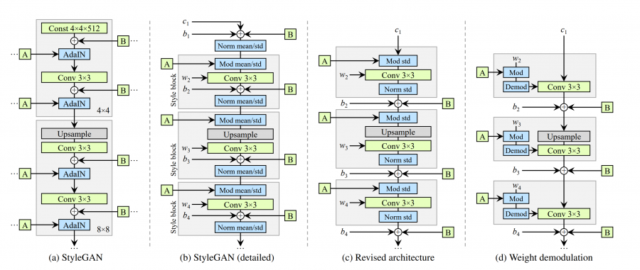

# Generative model of the OASIS brain data set using StyleGAN2.
## The Model
Generative adversarial networks are capable of synthesising complex and realistic images through the training of two competing models that are trained simultaneously. The first component of the network is the discriminator which is rewarded based upon how well it can classify real and fake images. The other component the generator attempts to generate images which can fool this discriminator and is rewarded for its success. Due to this dependance if either model becomes too dominant the whole network can collapse and thus they are quite difficult to train. The StyleGAN developed by nvidia labs aims to improve the control a user has over the latent input onto the mapping of the synthesised image. It does this through the utilisation of a third model which takes the style vector and disentangles it into what is called the w space which is then fed into each layer of the network. 
### StyleGAN architecture vs traditional GAN

### Applying style to layers
In the original StyleGAN this was done through the use of adaptive instance normalisation. Howthey noticed that this produced what is termed droplet artifacts in the generated images. To resolve this issue in the revised StyleGAN2 they used weight modulation and demodulation of the convolution weights. This means that a modified convolutional layer must be used during synthesis.
### Applying consistent features 
In the original StyleGAN to improve training stability and to preserver broader features like between layers they used what is called a Progressive GAN architecture. This is where the network first produces smaller resolution images and then scale them up eventually to the desired size. In the revised StyleGAN2 it was shown that a similar effect could be achieved through using residual connections with down sampling in the discriminator and skip connections in the generator with up sampling. This was shown to preserver more consistent feature impact on the ffinal high resolution images rather than just having a sharper low resolution image.
### Stochastic Variation
Noise is inserted to every block in order to generate more realistic images which helps with tcomplex textures like hair. 
### Path Length Regularization
Path length regularization encourages a mapping between a fixed size step in the w space and a fixed magnitude change in the resulting image.
### StyleGAN architecture vs revised StyleGAN2

## Dependencies

Python version: 3.9.7

| Library    | Version |
| ---------- | ------- |
| tensorflow-gpu | 2.4.1   |
| matplotlib | 3.4.3   |
## Methodology
### Data processing
To try and minimise dependancies and ease of use the preprocessing was done through `tensorflow.data.Dataset.from_tensor_slices` provided with image paths from standard library `glob.glob`. Due to the nature of GAN`s there is no need for any train/test/validation split and can simple all be fed into the dataset. Then a custom preprocessing function is mapped to each input which rescales the image to the desired size, converts to grayscale and normalises the image. It is then cached and seperated into batches for easier training and testing.
### Building the model
The model is separated into different files with `generator.py` and `discriminator.py` housing the respective networks with their own global parameters for easy tuning. There is then a `gan.py` file which builds the two models and implements the simultaneous training as well as every other utility function that would be useful for monitoring performance and saving progress.
The generator uses a modified convolution layer which is stored in `layers.py`.
### Training the model
To train the model the dataset must be in the same directory as the `driver.py` file or manually change the `IMAGE_PATHS` in the file. All other folders should be created automatically. The `cache` will store the cached dataset for easy retraining. The `samples` will hold the sample images and the graph of generator vs discriminator loss. Finally `checkpoints` will have the saved weights of the model after every epoch for easy loading and saving of the network. Running the model with no loading or clearing of these folders run.
\
`python driver.py`
\
To clear samples or the cache or both run.
\
`python driver.py --clear samples | cache | both`
\
To load weights.
\
`python driver.py --load weights`
\
To tune any hyperparmaters they are clearly labelled at the top of their respective files.
## Results
Unfortunately no decent images where produced within the time frame. However I will detail everything I tried for future reference. Disregarding endless tuning of hyperparmaters there are a few main aspects that I tried to change in order to see any progress. (NOTE: I also basically was unable to use the cluster computers which impacted this ALOT review pull request)
### Loss Functions
Even in the official StyleGAN2 implementations several loss functions are utilised I will outline those attempted to be used and all of which can be used by calling the different loss function stored in each class.
#### `loss` Generic Loss 
This loss function is the generic binary cross entropy loss used in traditional GAN's. It can make the model very unpredictable sometimes collapsing which happened multiple times. This produced the most varied results. Below is a plot of losses over 50 epochs with 256x256 no convergence visible.

#### `w_loss` Wasserstein Loss 
In the official implementation their is a WGAN_GP loss, this was compeletely implemented and clearly was more stable than the generic loss. In a WGAN it is recommended to train the discriminator multiple times more than the generator per each batch. A `train_step_seperated` was created for this purpose and thus it is slightly harder to implement. However no percievable results were found in testing. Multiple discriminator to generator ratios were tested.
#### `h_loss` Hinge Loss
This loss was used in the below referenced implementation and had the best results, but still took far too long to converge to anything as I only got success using a smaller image size and smaller dataset, this does not often translate to the larger dataset. The below
loss plot was trained for around 80 epochs at size 64x64.

#### `l_loss` Logistic Loss
This was the least tested loss and was taken from the official implementation. No converging results.
### Hyper Parameters
#### Latent Size
Modifying the latent size is a tradeoff between fitting your model in memory/training time to extracting more details in the images. It is recommended to keep this in factors of 64 so that it is optimised on the GPU. Tested with `512` `256` `128` `100`.
#### Learning Rate
The learning rate can swing the balance between how powerful each side of the network is. I did not have much success deviating away from `0.0001` however multiple inbalanced and scaled learning rates were tried.
## References
Images and architecture sourced from original StyleGAN paper: 
\
https://arxiv.org/abs/1812.04948\
And revised StyleGAN2 paper: 
\
https://arxiv.org/abs/1912.04958
\
Logic and modulated convolutional layer based from : 
\
https://github.com/manicman1999/StyleGAN2-Tensorflow-2.0
\
Official Tensorflow Implementation:
\
https://github.com/NVlabs/stylegan2
