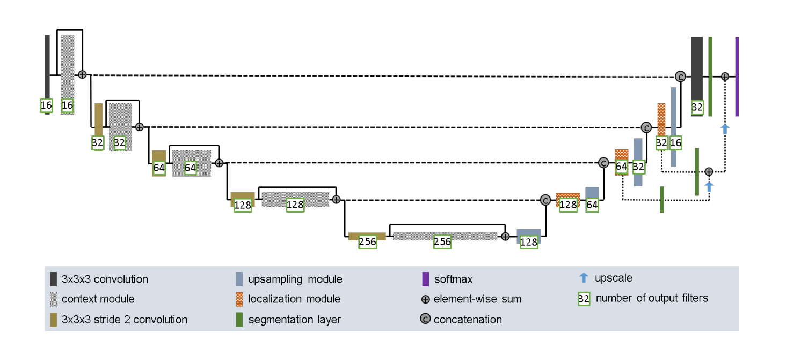
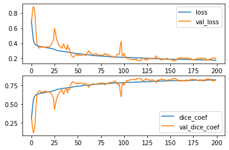
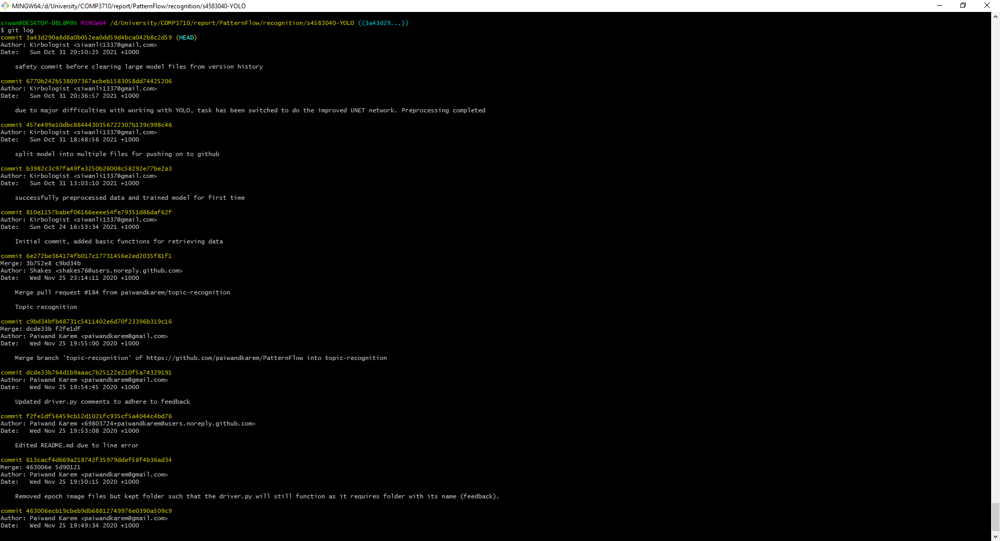

# Detecting Lesions Using Improved UNet
#### by Siwan Li (s4583040)

## Introduction

This neural network uses the Improved UNet architecture to detect skin lesions in an image by segmenting out the skin lesion pixels.
In particular, the network is trained on the ISICs dataset and for the ISICs dataset, getting a DICE similarity coefficient of ~0.8.
The network is based on the model given in the original paper for improved UNet [1]. In the model, images get downsampled
for feature extraction before being upsampled. During upsampling, the layers are concatenated with the results from the upsampling part.
The a visualisation of the model is given in the schematic below.

<p float="left">

<center>

</center>
</p>

## Method

The raw image data and their masks are preprocessed using `preprocessing.py`. In it, the images are converted into tensorflow tensors
and resized to `256x256` to make them compatible with the model. They are then normalised and zipped into (image, mask) pairs.
The model is defined in `UNet_model.py`, based on the model given in [1]. The function for the DICE coefficient (used to test
similarity between two images) is similar to that given in the original paper, but with an added smooth factor based on
the code in [2]. In `main.py`, the model is built and trained on the preprocessed data and the DICE coefficient.

## Results

The resulting loss and dice coefficients from training are shown in the figure below. The model was trained for 200 epochs using the
exponential decay optimiser and the DICE loss function. The final DICE coefficient on the validation set is 0.8231, with the DICE
coefficient on the test set eclipsing 0.8.

<p float="left">
<center>
</center>
</p>

## Usage

The test driver can be executed and the network can be trained using `main.py`. Please change the `mask_path` and `img_path` variables to
the directories containing the mask image files and the raw skin lesion image files respectively. After that, simply run main.py to
train and test the model.

## Dependencies

The following libraries and dependencies are required to run the script:

```
Python 3.8
Tensorflow 2.6
Matplotlib
```

## Technical Issues

Originally, I was going to write an algorithm to detect skin lesions based on the YOLOv4 architecture,
but I then switched to the Improved UNet architecture after experiencing many difficulties getting an adequate amount of training.
Unfortunately, the original local branch where I did much of this work is broken. During an attempt to remove some large files that
have been committed to this local branch, git filter-branch was used to clear them from the history, but then unexpectedly, attempting
to push results in the entire repo being pushed to the remote branch. Thus, much of the version history had to be re-committed and pushed
from a new clone. More details can be found on this thread: https://edstem.org/au/courses/6584/discussion/665177

Below is a screenshot featuring the commit logs from the broken branch.

<p float="left">

<center>

</center>
</p>

## References

1. F. Isensee, P. Kickingereder, W. Wick, M. Bendszus, and K. H. Maier-Hein, “Brain Tumor Segmentation and Radiomics Survival Prediction:
Contribution to the BRATS 2017 Challenge,” Feb. 2018. [Online]. Available: https://arxiv.org/abs/1802.10508v1

2. Ekin Tiu (2019), Metrics to Evaluate your Semantic Segmentation Model [Online]. Available at:
https://towardsdatascience.com/metrics-to-evaluate-your-semantic-segmentation-model-6bcb99639aa2 (Accessed: 31 October 2019)
