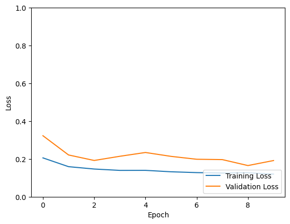
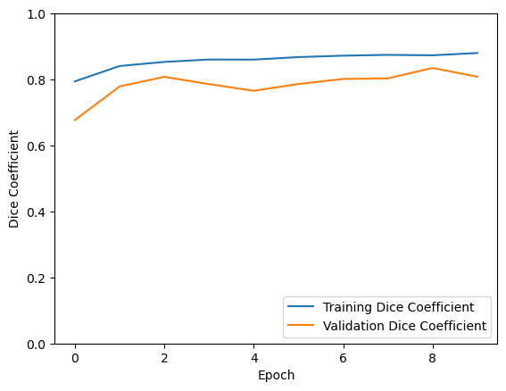
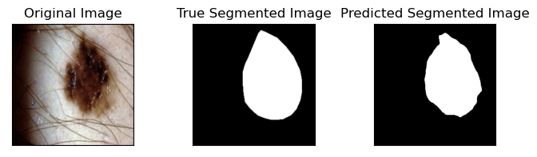
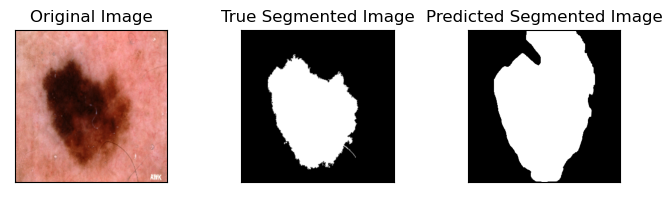

#### Name
Byron Downey 
Github: [@ByronDowney](https://github.com/ByronDowney/)

#### Student Number
45872815

## Using the File
This repository contains two python files. Driver.py is an example of how to run Model.py, whereas Model.py contains the model itself and accepts the following parameters:
#parameters here

## Problem and Solution
The problem that my model attempts to solve is the segmentation of the Preprocessed ISIC 2018 Melanoma Dermoscopy Dataset available on the COMP3710 blackboard. The dataset contains images of each melanoma as well as their segmented counterparts. Each image is segmented into areas of melanoma and areas of normal skin. 

The proposed solution involves using an improved Unet model, as described in [1] to accurately segment the ISICs images.

## The Improved Unet Model

The picture above, taken from [1], describes the general structure of the improved Unet model. Like most Unets, the structure is composed of a "contracting path" that downscales the images and an "expanding path" that then upscales them. The intermediate results of the contracting path are appended to the expanding path so it is able to reconstruct the original image. The difference with this "improved" Unet is that the intermediate results of the expanding path are added together with the final result of the Unet to accomplish "deep supervision" to help with accuracy and training rate.

##  Results
A fairly standard training, validation and test split of (0.8, 0.1, 0.1) was used in order to leave as much data possible for the training set while still having a reasonable amount for validation and testing.
Below are results for a model created with the Driver.py file. Looking at the graphs, you can see that it easily achieves > 0.8 dice coefficient on the validation set, but unfortunately it only achieves 0.7 on the test set. The lack of generalisation may be due to the test set containing some images from different sources, because the training, validation and test data was split according to file name. Taking a different approach to pre-processing by randomising the contents of the splits may have yielded better results.

Loss Over Epochs (Loss is 1 - dice coefficient):

Dice Coefficient Over Epochs:

#example outputs here

## Dependencies
Python v3.8.5
Tensorflow v2.6.0

## References
[1]F. Isensee, P. Kickingereder, W. Wick, M. Bendszus and K. Maier-Hein, "Brain Tumor Segmentation and Radiomics Survival Prediction: Contribution to the BRATS 2017 Challenge", arXiv.org, 2018. [Online]. Available: https://arxiv.org/abs/1802.10508. [Accessed: 26- Oct- 2021].
