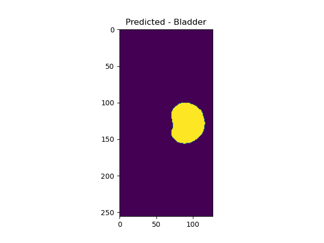

# Segmentation of Prostate 3D data set with a UNet3D.

The 3D U-Net is based on that described in the paper [1] "3D U-Net: Learning 
Dense Volumetric Segmentation from Sparse Annotation" by Cicek et al.  The 
following flow diagram is the u-net illustrated in the paper.

## Semantic image segmentation of 3D images: The problem and the solution.
Semantic image segmentation is the labelling of each pixel (or voxel) of an 
image with a corresponding class (background, bone, bladder, prostate...). 
Semantic segmentation is a tedious and time-consuming task to undertake 
manually. Furthermore, manually segmenting 3D images requires slice by slice
annotation. The goal of this u-net is to automatically annotate 3D images after
the model is trained.

Slices of one of the images used in this project at the middle of each axis.

| Side | Front   |  Above |
| :---: | :---: | :---: |
|  |  |  |

### Data download and preparation
The data is 3D MRI scans of the prostate within the lower body. The source of
the data is well described in ref [2] and had been acquired as part of a 
retrospective MRI-alone radiation therapy study from the Calvary Mater Newcastle 
Hospital [3]. Patients had up to 8 MRI scans. The first, week0, was taken prior 
to treatment. The remaining were taken at week1 to week7 during a course of 
prostate cancer radiation therapy.

The labels are annotated with 6 classes.

            0=Background
            1=Body
            2=Bones
            3=Bladder
            4=Rectum
            5=Prostate

The data was downloaded as a doubly zipped file from the CSIRO Data access 
portal [4].  It was extracted onto a local drive with data and labels residing
in respective directories. 

        * semantic_MRs_anon 
        * semantic_labels_anon 
    
There were 211 data images with matching labels. These related to 38
patients with each having from 1 to 8 scans. As multiple scans of a given 
patient were not expected to show large variations it was appropriate that 
separation into train, validation and test groupings took patients into 
consideration. That is a given patients scans could only reside in train or 
validation or test, and not span more than one group.

Segregation into train, validation and test groups was done manually, by firstly
ordering by number of scans a patient had, and then by patient ID. Clients
were then allocated into train, validation and test subdirectories on an 
approximate 70:20:10 ratio, with labels being allocated in an identical manner.

A review of the data structure of all images found one scan that had a different 
dimension to all others. That client had seven other scans that were expected to
be similar and so the removal of this image wasn't expected to influence 
training. 

The data was provided in NIfTI format (nii.gz) with orientation:('L', 'P', 'S').

### Data preparation:
As per ref [2], the data was normalised (mean = 0, stdev=1) on a per-image 
basis. 

N4ITK intensity normalisation, which corrects for gain field, an intra-volume 
inhomogeneity caused by the image acquisition process and variations of tissue
penetration, was planned to be undertaken, but it couldn't be successfully 
implemented in time [2,5,6]. It is expected that the prediction would be 
improved by its inclusion.

### Data Augmentation
While there are 157 training images these scans are only of 27 individuals. Data
augmentation, using methods such as those coded by Siyu Liu [7] may improve
prediction outcomes. Data augmentation has not yet been applied.

### Description of the algorithm
The data set is sufficiently large to require the images be provided to the 
model in batches to avoid out-of-resources errors. Keras.utils.Sequence
class has been used to create generators to provide images to the model 
in batch sizes of 1.

If the model is training or validating the generator returns both 
an image and a label to the model. If the model is predicting, the
generator only returns the image. The prediction output is then
compared to its matching label using the DSC. 

### Description of the model

The model is designed on that described in [1], with several modifications. 
Relu activation was included in the Conv3D layer followed by 
BatchNormalization. The paper describes these as occurring in the
reverse order. BatchNormalization was only included after the
first Conv3D in each set. OOM errors were experienced and reducing the 
number of BatchNormalizations seemed to help, although more testing
is required to support this.

In addition, the number of filters were reduced by a factor of 4 to 
limit OOM errors. That is the first layer begins with 8 filters rather than
32 and scales from there. 

Kernel_initializer was he_normal. MaxPooling was used after each set of 2 conv3D 
layers on the compression side with Conv3DTranspose (strides=(2,2,2)) on the
expansion side. There were 3 data pass-throughs using Concatenate between
equivalent levels. 

The final activation was softmax. 

### Training parameters
Adam was used as the optimiser with no modification to the default training 
rate. Loss was categorical_crossentropy as there were 6 classes, and labels
were provided after one_hot encoding. Metrics was set to accuracy. Plots of 
training loss and accuracy are below.

| Accuracy | Loss  |
| :---: | :---: |
|  |  |

### Dice coefficient - DSC
The target was to have a Dice score exceeding 0.7 for each class. 

The DSC was poor at low epochs, particularly for the prostate and rectum (~e-7), 
and improved at higher epochs. The target DSC is well exceeded by 50 epochs 
with run time on the cluster at around 11 hrs. Loss and accuracy metrics
stabilize around 20-30 epochs.

 
## Predicted vs test labels
The following image slices compare the true values versus those predicted by 
the model after 50 epochs.

### Segmented images 

| True | Predicted   |
| :---: | :---: |
|  |  |

### Class images

| True | Predicted   |
| :---: | :---: |
|  |  |
|  |  |
|  |  |
|  |  |
|  |  |
|  |  |
 

## Future work
Work I would like follow up on to extend this project, to improve results and 
reduce the training time include:
* Data augmentation to increase the training sample size. Siyu Lui provides some
methods for augmenting 3D data [7].
* Add N4ITK normalisation to lessen field bias.
* Add DSC loss function to model.compile() for one or a number of the classes 
    with poorer performing DSC scores (ie prostate or rectum), to 
    investigate if this would improve overall performance
* Save weights to reduce training time.
* Adjust for class bias, as the size of background and body greatly exceed 
that of the prostate and rectum. 

## Dependencies, resources and running code
* Python
* Tensorflow 
* Matplotlib
* Numpy 
* Nibabel

The model starting with 8 filters only ran on Goliath's c4130-2s sometimes, 
but not consistently. It would report OOM errors on number of calls on the 
c4130-2, and always on the c4130 and c4130-s. It ran on Rangpur on vgpu20 but
not vgpu10. 

driver.py contains a main function and will run the code. Uncomment the 
directory paths for the system you are running on, after manually setting up
the data directory structure, as described above.

# References
<a id="1">[1]</a>
"3D U-Net: Learning Dense Volumetric Segmentation from Sparse Annotation" by 
Cicek, Adbulkadir, Lienkamp, Brox and Ronneberger. 
https://arxiv.org/abs/1606.06650.

<a id="1">[2]</a>
" CAN3D: Fast 3D medical Image Segmentation via Compact Context Aggregation" by
Wei Dai, Boyeong Woo, Siyu Liu, Matthew Marques, Craig B. Engstrom, Peter B. 
Greer, Stuart Crozier, Jason A. Dowling and Shekhar S. Chandra.
https://arxiv.org/pdf/2109.05443.pdf

<a id="1">[3]</a>
Dowling, et al. (2015), Automatic Substitute Computed Tomography
Generation and Contouring for Magnetic Resonance Imaging (MRI)-Alone External
Beam Radiation Therapy From Standard MRI Sequences, International Journal of
Radiation Oncology*Biology*Physics, 93(5), pp. 1144-1153,
https://doi.org/10.1016/j.ijrobp.2015.08.045 .

<a id="1">[4]</a>
Data sourced from CSIRO
https://data.csiro.au/collection/csiro:51392v2.

<a id="1">[6]</a>
"N4ITK: Improved N3 Bias Correction" by Nicholas J. Tustison, Brian B. Avants, 
Philip A. Cook, Yuanjie Zheng, Alexander Egan, Paul A. Yushkevich, and James C. 
Gee. https://ieeexplore.ieee.org/stamp/stamp.jsp?tp=&arnumber=5445030

<a id="1">[6]</a>
"A generalized Network for MRI Intensity Normalization". by Attila Simk ́o,
Tommy L ̈ofstedt, Anders Garpebring, Tufve Nyholm, Joakim Jonsson at Department
of Radiation Sciences, Ume ̊a University, Ume ̊a, Sweden.
https://arxiv.org/pdf/1909.05484.pdf

<a id="1">[7]</a>
Public repo for data augmentation by Siyu Lui.
https://github.com/SiyuLiu0329/pyimgaug3d

