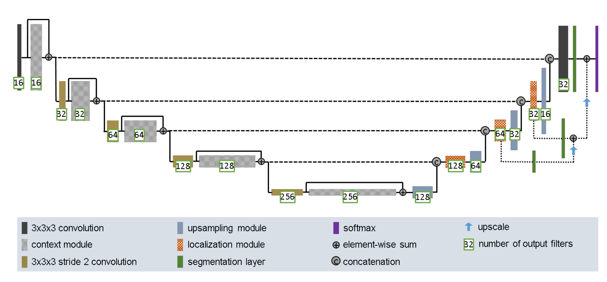
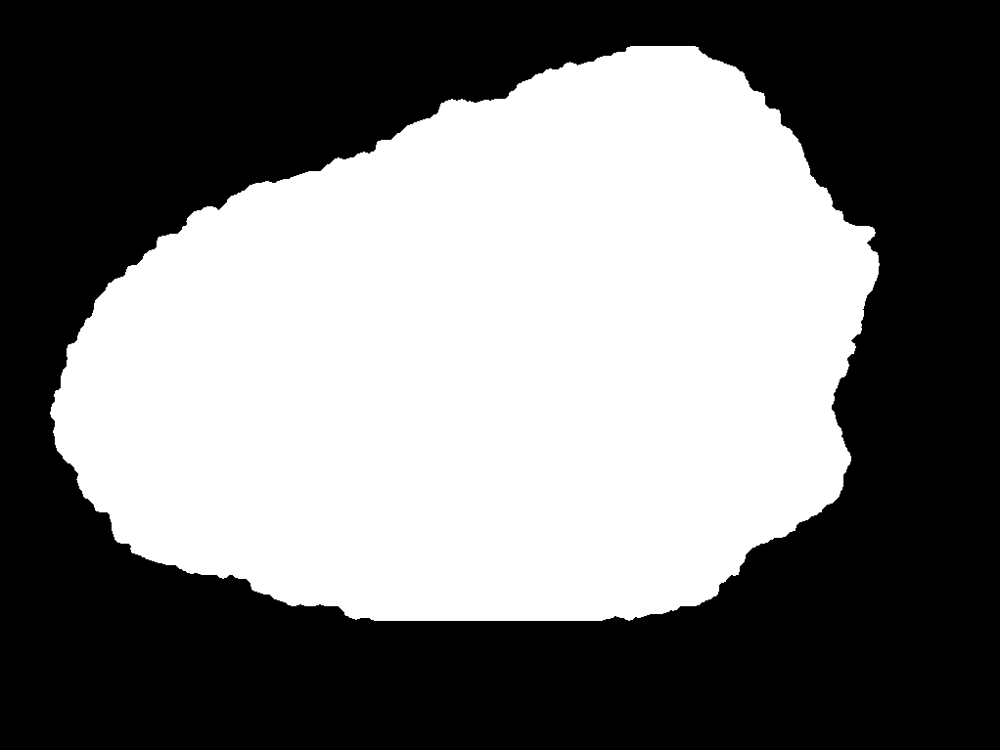

# U-Net Segmentation of ISIC 2017
This repository contains functionality to segment the [ISIC 2017 Lesion Dataset](https://challenge.isic-archive.com/data/#2017) using the [Improved UNet Model](https://arxiv.org/abs/1802.10508v1).

Completed by Luke Harrison, Student Number 45875209

## Dependencies
This model was created/tested using the following software versions:
Python 3.10.6
Pytorch 1.12.1
CUDA 11.3
Pillow 9.2.0
matplotlib 3.5.2

## Functionality
### Modules
[modules.py](modules.py) implements the Improved UNet architecture as faithfully to the [original paper](https://arxiv.org/abs/1802.10508v1) as possible. Issues present have resulted in the model not learning correctly when using train.py. I have tried:
 - Removing .detach() statments (causes memory overflow)
 - Adding activation functions with normalisation (no change demonstrated)
 - Removing softmax layers (Performance change but still no demonstrated learning.

It also includes a simple calculators for the DICE loss and DICE Similarity coefficient for use in training and testing

### Dataset
[dataset.py](dataset.py) Contains functionality for important png and jpg images from a folder directory into Tensors for operation.
Images should be lesions and segmentations should be one-hot masks, specifically the [ISIC 2017 Lesion Dataset](https://challenge.isic-archive.com/data/#2017).

### Training
[train.py](train.py) Trains the model over the dataset specified in-file, and then saves the weights to the specified location. Currently does not work correctly and model does not improve performance.

### Prediction
[predict.py](predict.py) Loads the model from weights at specified location to make a segmentation of a given image, returns DICE Similarity coefficient and subplot of original image with segmentation prediction.

## Results
Data was split into sections Training, Testing and Validation as provided by the [ISIC 2017 Lesion Dataset](https://challenge.isic-archive.com/data/#2017).

I was unable to complete the functionality as a result of the lack of training. [modules.py](modules.py) is a complete representation of UNet and [dataset.py](dataset.py) can load images for training, however [train.py](train.py) has no validation or testing.

Training whole-batch on small datasets demonstrates no improvement. See [train.py](train.py) output below.

[predict.py](predict.py) shows that the UNet model has reasonable segmentation regardless of training.

## Other
Original commit log:
