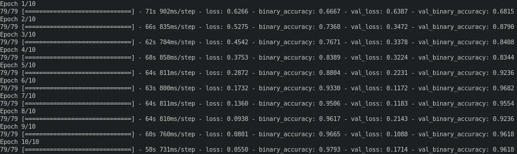

# COMP3710 Preort - OAI AKOA Perceiver
#### Ahmed Hafeez-Baig (s4589325)

## General References:
- https://keras.io/examples/vision/perceiver_image_classification/ (good resource to see general structure)
- https://github.com/Rishit-dagli/Perceiver (decent for seeing how some functions are implemented)
- https://keras.io/api/layers/base_layer/ (how to use classes with tf)
- https://arxiv.org/abs/2103.03206 (perceiver paper)

## Description
The goal of this project is to develope a perceiver that can be used to classify the OAI AKOA Knee dataset (binary classification). A full description of the Perceiver can be found in [this paper](https://arxiv.org/abs/2103.03206). The basic premise of a perceiver is to have "an architecture based on attentional princicples" capable of making classifications without dommain specific assumptions (i.e. a perceiver should be capable of working on images, videos, audio, point clouds, etc). Initially a byte array of all input data set is parsed through a latent vector (using a cross-attention module) to compress down the relative data size. An arbitrary number of transformer modules using self-attention blocks. This whole process is applied iteratively. The result is then parsed to a global pooling layer and a dense classification layer. The figure below shows the general structure of a perceiver.


## Perceiver Dependencies
- Tensorflow (v2.6)
- Keras (part of Tensorflow)
- Tensorflow Addons (v0.13.0)
- CUDA is desirable (although not needed)

## Driver Script Dependencies
- Pillow
- NumPy

## Instructions
1. Clone the repository (e.g. `git clone -b topic-recognition git@github.com:Ahmed-HB/PatternFlow`
2. Download the AKOA Knee Dataset and edit the Driver Script (`Driver_Script.py`) directory variable (`dataDirectory`) (default directory: `../../../AKOA_Analysis/`)
3. Modify the hyperparameters in `Parameters.py`
4. Run `slurp.py` (running with CUDA) or `Driver_Script.py` (running without CUDA) (data files are stored in `../../../`)

## Implementation
### File Implementation:
- `Driver_Script.py`: script to split data into training and testing sets and make plots
- `OAI_AKOA_Perceiver.py`: contains the class definition of the perceiver as well as function definitions for the cross attention module, fourier encoding and the transformer module
- `Parameters.py`: easy access to all the hyperparameters used to tune the model

### Data Split Overview
As images from multiple patients exist in the dataset, the patients must be sorted so that the training dataset and testing dataset have none of the same patients (i.e. there must be no leakage). Patient IDs are present in each image name and the driver script initially sorts the data and seperates it into training and testing datasets. Other operation such as image downsizing and shuffling are also performed. The training set is then split by `tf.fit()` into a validation set and the final accuracy is found using `tf.evaluate()` on the testing set.

### Cross-Attention Module Overview
The cross-attention module followed the general structure outlined by the perceiver paper. Input layers were created for the latent vector and the byte array containing all the data from the images. From here the query was retreived from the latent vector and the key and value were retreived from the byte layer. The query key and value were then combined in a attention layer and then passed through a dense layer followed by a normalization layer. A connection was also passed through a dense layer connected to a dropout layer and this was recombined with the normalization layer.

### Transformer Module Overview
Initially the input was defined for the transfomer module followed by a `for` loop defining how many transformer modules that were to be used. Each loop created a multihead attention layer followed by a dense layer and a combination layer (between the previous dense layer and the initial input). A normalization layer was then added followed several dense layers connected through a combination layer.

### Fouier Encoding Overview
The basic process for fourier encoding was to make a map with the same dimensions of the image with values \[-1, 1\] followed by creating a log-space (from 0 to the Nyquist frequency) and finding the cosine and sine of this. This was repeated for all the images passed to the function and the result was then concatenated with the initial image set.

### Classification Overview
The classification portion of the implementation involves a global pooling layer followed by a dense layer for classification.

### Hyperparameters
```
BATCH			= 8
IMG_WIDTH		= int(260 / 2)
IMG_HEIGHT		= int(228 / 2)
INPUT_SHAPE		= (IMG_WIDTH, IMG_HEIGHT)
SEED			= 3141
BANDS			= 6
MAX_FREQUENCY		= 10
VALIDATION_SPLIT	= 0.2
EPOCHS			= 10
LATENT_ARRAY_SIZE	= 64 # Paper uses 512
BYTE_ARRAY_SIZE		= IMG_HEIGHT * IMG_WIDTH
CHANNEL			= (2 * BANDS + 1)
PROJECTION		= 2 * (2 * BANDS + 1) + 1
QKV_DIM			= PROJECTION
LEARNING_RATE		= 0.0015
WEIGHT_DECAY_RATE	= 0.0001
DROPOUT_RATE		= 0.1
TRANSFOMER_NUM		= 4
HEAD_NUM		= 6
MODULES_NUM		= 4
ITERATIONS		= 2
OUT_SIZE		= 1 # binary as only left or right knee
```

## Examples and Results

### Dataset Used
- Images: 18680
- Unique patients: 101
- Right knees: 10920
- Left knees: 7760

### Results Overview
The plots below show the accuracy and loss of the model throughout the training process. Final results are also shown and the model achieved an overall accuracy of approximately 93% (although there was some variation in the accuracy achieved on each run).

### Accuracy Plot


### Loss Plot


### Training


### Test Set Accuracy


