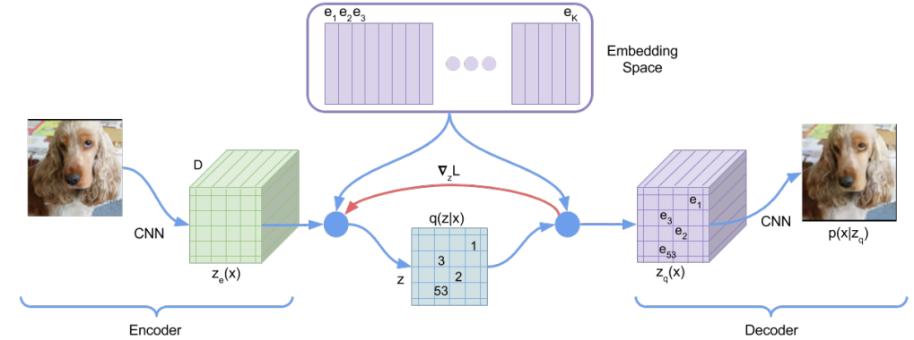
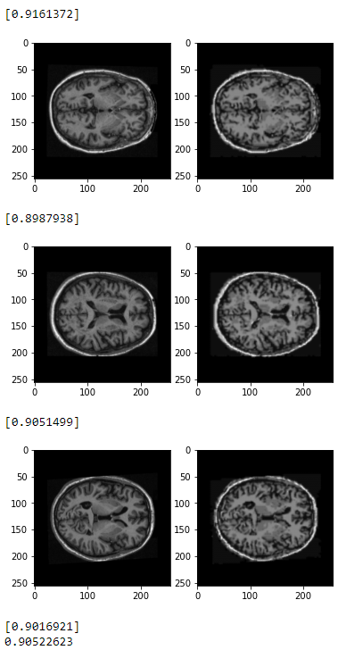

# Vector-Quantized Variational Autoencoder for OASIS Brain Dataset

The Vector-Quantized Variational Autoencoder (VQ-VAE) is a form of generative neural network model proposed by van den Oord et al. (2018). Compared to a traditional Variational Autoencoder (VAE) which uses continuous latent space codes sampled from a standard Gaussian distribution and has a static standard Gaussian prior; the VQ-VAE algorithm is significantly improved in two main ways - the latent space is structured into discrete vector-quantized codes, and the prior is no longer static, rather an autoregressive model that is trained to learn the prior. Here, a VQ-VAE is used to solve the recognition problem of generating reasonably clear Magnetic Resonance (MR) images of the human brain, with a Structured Similarity (SSIM) of over 0.6 when compared to the original brain images.
	
## OASIS Brain Dataset

The pre-processed Open Access Series of Imaging Studies (OASIS) Brain Dataset has been made freely accessible to the public, and contains over 10,000 cross-sectional MRI brain images of 416 subjects (male and female, aged 18-96). An example of how this data looks can be seen in Figure 1.

*Figure 1: Example MR Brain Image in the OASIS dataset*

The dataset provides a prior-completed training, validation and test split of the images, with a training collection of 9,664 images, testing collection of 544 images, and validation collection of 1120 images. Thus, this data split was used as is, with no amendments. The corresponding segmentation masks for each image are also provided, however, because an autoencoder doesn't utilise the label assigned to an image, these masks were disregarded.

In terms of pre-processing, the images have already been centred, so the further pre-processing implemented in the algorithm was to normalise the grayscale values (0-255) to a value between 0 and 1, and to ensure all images were resized to 256 x 256 pixels if not already.
         
## VQ-VAE Architecture
The architecture used was a two-stage neural network, consisting first of the VQ-VAE itself - a convolutional neural network (CNN) based on the higher-level structure of traditional autoencoders. As such, it consisted of:
- an encoder network which compressed the images into a latent space (z) via strided convolutional layers, thereby learning the features that best and most efficiently describe the image
- a decoder that mirrored the encoder structure by upsampling via transpose convolutional layers until almost the same image as the input is reconstructed
- a Vector Quantizer layer between the encoder and decoder, which discretizes the latent space by "snapping" each code to the closest vector (as defined by L2 norm) in the codebook of trainable vectors

A schematic visualizing the architecture of the VQ-VAE is shown in Figure 2.

*Figure 2: VQ-VAE Architecture as provided in van den Oord et al. (2018).*

Once the model was fully trained, the encoder and decoder were frozen and an off-the-shelf pixelCNN (van den Oord et al., 2018) used to do autoregressive modelling to train the prior. This is a sequentially-dependent model which learns to predict which codebook index comes next based on all the previous indices, via masked convolutions. As such, once trained, the pixelCNN can be prompted to generate a latent space representation of an image, which can then be fed through the frozen decoder to produce an entirely novel image.

## Results
The output of the VQ-VAE trained end-to-end for 50 epochs are displayed in Figure 3.

*Figure 3: Comparison of the original vs. reconstructed images of the VQ-VAE model, with associated SSIM score for the example comparisons shown underneath, and final average SSIM for the testing images displayed on the last line.*

As can be seen, the images produced at the decoder output are reasonably clear, and share a high degree of similarity with the original input image (SSIM ~ 0.9). It is evident that there is still some blurring of the output image compared to the input, however, some degree of resolution loss is inevitable in an autoencoder due to compression of an input into the latent space. The average SSIM score across all test images is printed in the last line of Figure 3, with a score of 0.905 which is > 0.6 as required for this recognition problem.

While the reconstruction loss (orange curve in Figure 4) consistently decreased throughout training, the committment loss (green curve) first peaked, before gradually improving over the course of the epochs. The total loss was determined by the sum of the committment and reconstruction losses, and is shown in blue in Figure 4. 

*Figure 4: Training loss curves - total loss shown in blue, committment loss shown in green and reconstruction loss shown in orange.*

***pixelCNN output

## Dependencies
- OASIS Brain Dataset (available for download from the following [link](https://cloudstor.aarnet.edu.au/plus/s/tByzSZzvvVh0hZA/download)).
- Python 3.7
- TensorFlow 2.6.0
- TensorFlow Probability
- matplotlib
- Numpy

## References

van den Oord, A., Vinyals, O., & Kavukcuoglu, K. (2018). Neural Discrete Representation Learning. *Arxiv*. arXiv: 1711.00937. Retrieved from: https://arxiv.org/abs/1711.00937.

Paul, S. (2021). Keras documentation: Vector-Quantized Variational Autoencoders. Retrieved 10 October 2021, from https://keras.io/examples/generative/vq_vae/

