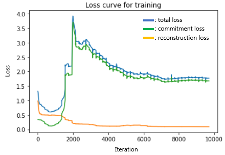
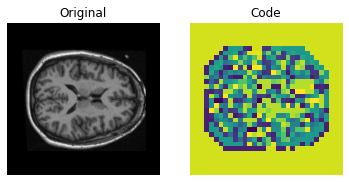

# Vector-Quantized Variational Autoencoder for OASIS Brain Dataset

The Vector-Quantized Variational Autoencoder (VQ-VAE) is a form of generative neural network model proposed by van den Oord et al. (2018). Compared to a traditional Variational Autoencoder (VAE) which uses continuous latent space codes sampled from a standard Gaussian distribution and has a static standard Gaussian prior; the VQ-VAE algorithm is significantly improved in two main ways - the latent space is structured into discrete vector-quantized codes, and the prior is no longer static, rather an autoregressive model that is trained to learn the prior. Here, a VQ-VAE is used to solve the recognition problem of generating reasonably clear Magnetic Resonance (MR) images of the human brain, with a Structured Similarity (SSIM) of over 0.6 when compared to the original brain images.
	
## OASIS Brain Dataset

The pre-processed Open Access Series of Imaging Studies (OASIS) Brain Dataset has been made freely accessible to the public, and contains over 10,000 cross-sectional MRI brain images of 416 subjects (male and female, aged 18-96). An example of how this data looks can be seen in Figure 1.


*Figure 1: Example MR Brain Image in the OASIS dataset*

The dataset provides a prior-completed training, validation and test split of the images, with a training collection of 9,664 images, testing collection of 544 images, and validation collection of 1120 images. A reasonable data split should set aside a significant portion (approximately 80%) of the images for training, thus allowing for robust training whilst leaving enough images for testing and validation to check the algorithm works on unseen data. The provided train-test-validation split assigned 85% of data for training, which was deemed reasonable, and so used as is. The corresponding segmentation masks for each image are also provided, however, because an autoencoder doesn't utilise the label assigned to an image, these masks were disregarded.

In terms of pre-processing, the images have already been centred, so the further pre-processing implemented in the algorithm was to normalise the grayscale values (0-255) to a value between 0 and 1, and to ensure all images were resized to 256 x 256 pixels if not already.
         
## VQ-VAE Architecture
The architecture used was a two-stage neural network, consisting first of the VQ-VAE itself - a convolutional neural network (CNN) based on the higher-level structure of traditional autoencoders. As such, the VQ-VAE model consisted of:
- an encoder network which compressed the images into a latent space (z) via strided convolutional layers, thereby learning the features that best and most efficiently describe the image
- a decoder that mirrored the encoder structure by upsampling via transpose convolutional layers until an image closely resembling the original input is reconstructed
- a Vector Quantizer layer between the encoder and decoder, which discretizes the latent space by "snapping" each code to the closest vector (as defined by L2 norm) in the codebook of trainable vectors and storing the index to this codebook vector. 

A schematic visualizing the architecture of the VQ-VAE is shown in Figure 2. It is important to note that because the process of "snapping" onto the nearest codebook vector is not differentiable, the VQ-VAE model implements straight-through estimation (indicated by the red line in Figure 2) where because z<sub>e</sub>(x) has the same shape as z<sub>q</sub>(x), the gradients of z<sub>q</sub>(x) can be "copy-pasted" into the encoder and back-propagation completed as normal.


*Figure 2: VQ-VAE Architecture as provided in van den Oord et al. (2018).*

Once the model was fully trained, the encoder and decoder were frozen and an off-the-shelf pixelCNN (proposed by van den Oord et al., 2016) was used to do autoregressive modelling to train the prior - code retrieved from this [link] (https://keras.io/examples/generative/pixelcnn/). The pixelCNN is a sequentially-dependent model which learns to predict which codebook index comes next, based only on all the previous indices. It does this by performing masked convolutions, which ensures the joint image distribution is broken down into a product of conditionals (visualized in Figure 3). As such, once trained, the pixelCNN can be prompted  with an empty array, into which it will pixel-by-pixel generate a latent space representation, which can then be fed through the frozen VQ-VAE decoder to produce an entirely novel brain image.


*Figure 3: The underlying concept of the Pixel CNN.*

## Example Usage
To run the algorithm on the OASIS MRI Brain Dataset, run test_vqvae_oasis.py as shown below:
```bash
$ python test_vqvae_oasis.py
```
This test script will call the functions in the driver.py file to load the oasis data into tensorflow Dataset objects, and then utilize the functions in model.py to build, train and visualise the results of the VQ-VAE and pixelCNN networks. All hyper-parameters for the models, as well as dataset batch size and training epoch number can be modified in the test_vqvae_oasis.py file. The model parameters used to produce the subsequent results, which will be used by default in test_vqvae_oasis.py, were based on recommendations in van den Oord (2018) i.e. K = 512 and beta = 0.25.

## Results
After training the VQ-VAE end-to-end for 30 epochs, the images reproduced by the decoder output are reasonably clear, and share a high degree of similarity with the original input image. Example reconstructions of the decoder on images from the test dataset are shown in Figure 4, along with the original image and the corresponding SSIM scores.


SSIM = 0.8853166


SSIM = 0.86084414


SSIM = 0.8727031

*Figure 4: Comparisons of the original vs. reconstructed images of the VQ-VAE model, with associated SSIM score shown underneath*

There is still some blurring of the output image evident compared to the input, however, the reconstruction is still reasonably clear, and some degree of resolution loss is inevitable in an autoencoder due to compression of an input into the latent space. The reconstruction quality could be improved in future by increasing the number of epochs for which the model trains. The average SSIM score across all test images is printed as part of the output from the algorithm (Figure 5), and was found to produce a score of 0.8544786 which is greater than 0.6 as required for this recognition problem.


*Figure 5: Mean Structual Similarity Score across all images in the test images dataset*

While the reconstruction loss (orange curve in Figure 4) consistently decreased throughout training, the committment loss (green curve) first peaked, before gradually improving over the course of the epochs. The total loss was determined by the sum of the committment and reconstruction losses, and is shown in blue in Figure 4. 



*Figure 6: Training loss curves - total loss shown in blue, committment loss shown in green and reconstruction loss shown in orange.*

The latent codes produced by the VQ-VAE were also visualized (Figure 7), and used as a second comparison point of comparison to the final generated images when evaluating the output of the pixelCNN.




*Figure 7: VQ-VAE latent code representations of the original images.*

Examples of the pixelCNN generated latent codes and brain images can be seen for comparison in Figure 8. The latent codes are similar to those the VQ-VAE produced for original images, and the generated images also show semblance to the original brain images. With longer training and further fine-tuning of hyperparameters, the quality of the pixelCNN generated images could potentially be further improved.


*Figure 7: Latent code representations and corresponding novel images generated by the pixelCNN.*

## Dependencies
- OASIS Brain Dataset (available for download from the following [link](https://cloudstor.aarnet.edu.au/plus/s/tByzSZzvvVh0hZA/download)).
- Python 3.7
- TensorFlow 2.6.0
- TensorFlow Probability
- matplotlib
- Numpy

## References

Moreau, A. (2020). Keras documentation: PixelCNN. Retrieved 28 October 2021, from https://keras.io/examples/generative/pixelcnn/

Paul, S. (2021). Keras documentation: Vector-Quantized Variational Autoencoders. Retrieved 10 October 2021, from https://keras.io/examples/generative/vq_vae/

van den Oord, A., Vinyals, O., & Kavukcuoglu, K. (2018). Neural Discrete Representation Learning. *Arxiv*. arXiv: 1711.00937. Retrieved from: https://arxiv.org/abs/1711.00937.

