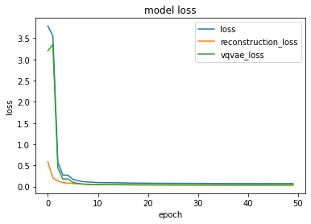
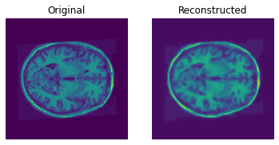
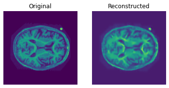
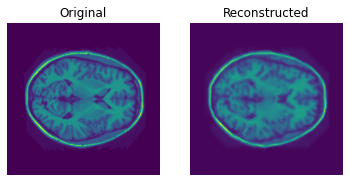

# Vector-Quantized Variational Autoencoders

## Overview
This repository is used to implement the vq-vae project of COMP3710, where a variational autoencoder was built with vector quantized layer, and it takes OASIS brain images as input and reproduces reasonable images. The model is implemented based on the [paper](https://arxiv.org/abs/1711.00937) and referenced to the [code](https://github.com/keras-team/keras-io/blob/master/examples/generative/vq_vae.py).


## Requirement
- Python 3.6+
- Tensorflow 2.10.0+
- CUDA toolkit
- tensorflow-probability 0.16.0
- matplotlib 3.2.2
- numpy 1.21.6
- PIL 7.1.2
- High End NVDIA GPU

## Dataset
This project makes use of the [OASIS Brains](https://www.oasis-brains.org/) dataset and it is split into the training, validation and testing datasets stored in seperated folders under the blackboard. There are around 20,000 preprocessed gray scaled images and they will be used to train and test the vq-vae model.

## Model
### Vector Quantized Latent Space
Different from traditional variational autoencoders, VQ-VAE has the modified latent space with an additional vector quantized layer which makes use of a codebook. The output of the encoder is compared to the codebook columns(embeddings) and the we use the closest embedding whose L2 norm distance is the minimum will be chosen and we use one-hot encoding to do the quantization so as to achieve the minimum information losses. Then the quantized vector will be passed to the decoder as input and the decoder will reproduce the images. The codebook is learnt during the training process via gradient descent.

### Encoder
The encoder is a convolutional neural network model built upon convolutional layers transforming images from size (256, 256, 1) to (32, 32, 30).

### Decoder
The decoder is a CNN model that is implemented with transpose conv layers to recreate (256, 256, 1) images.

```
Model: "encoder"
_________________________________________________________________
 Layer (type)                Output Shape              Param #   
=================================================================
 input_4 (InputLayer)        [(None, 256, 256, 1)]     0         
                                                                 
 conv2d_4 (Conv2D)           (None, 128, 128, 32)      320       
                                                                 
 conv2d_5 (Conv2D)           (None, 64, 64, 64)        18496     
                                                                 
 conv2d_6 (Conv2D)           (None, 32, 32, 128)       73856     
                                                                 
 conv2d_7 (Conv2D)           (None, 32, 32, 30)        3870      
                                                                 
=================================================================
Total params: 96,542
Trainable params: 96,542
Non-trainable params: 0
_________________________________________________________________
None
Model: "decoder"
_________________________________________________________________
 Layer (type)                Output Shape              Param #   
=================================================================
 input_5 (InputLayer)        [(None, 32, 32, 30)]      0         
                                                                 
 conv2d_transpose_4 (Conv2DT  (None, 64, 64, 128)      34688     
 ranspose)                                                       
                                                                 
 conv2d_transpose_5 (Conv2DT  (None, 128, 128, 64)     73792     
 ranspose)                                                       
                                                                 
 conv2d_transpose_6 (Conv2DT  (None, 256, 256, 32)     18464     
 ranspose)                                                       
                                                                 
 conv2d_transpose_7 (Conv2DT  (None, 256, 256, 1)      289       
 ranspose)             
```

## Preprocessing the dataset
The training and testing dataset are loaded from the directories using pillow(PIL), and the variance of the training set is caculated. Both training and testing sets are normalized by dividing 255.0 and scaled within range [-0.5, 0.5] by substracting 0.5.

## Training and testing result
The model is trained on OASIS training dataset on 50 epochs, and the total losses, reconstruction losses and vqvae losses is displayed below. We can see that the losses are decreasing rapidly to converge after around 10 epoches. And the weights of the trained model are saved in /saved_model folder.


OASIS brain test images are used as test dataset to predict the structured similarity(SSIM) and result is very promising where the average SSIM of all predicted images is 0.8575265.
```
tf.Tensor([[0.8575265]], shape=(1, 1), dtype=float32)
```


## Visualization
I plot reconstructed images using test images from test dataset and the images are clear which is almost identical to the original ones.






## Usage
To train the vqvae model and plot the losses, run the train.py
```
python3 train.py
```
, and you can modify the train dataset paths and test dataset paths in main() function to get your own correct directories.

To test the accuracy of the model, run the predict.py and you should modify the train and test dataset paths in main() function.
```
python3 predict.py
```

## Files
- dataset.py: containing data loader loading and preprocessing the train and test dataset
- module.py: containing all the modules of vqvae including encoder, decoder and vector quantized model.
- train.py: code to train and test and save the vq-vae model.
- predict.py: provide the usage and accuracy of the test dataset and show the examples and visualization of result.
- /save_image: folder containing some predicted images.
- /saved_model: the trained model is saved in the directory.
- VQ_VAE.ipynb: the jupyter/colab notebook showing all the code and outputs of building, trainging and testing the vqvae model.


## Notes
I build the model and trained it on google colab's notebook and rewrite the code into python files. For the convenience, I also upload the VQ_VAE.ipynb that has all the source code and output results.