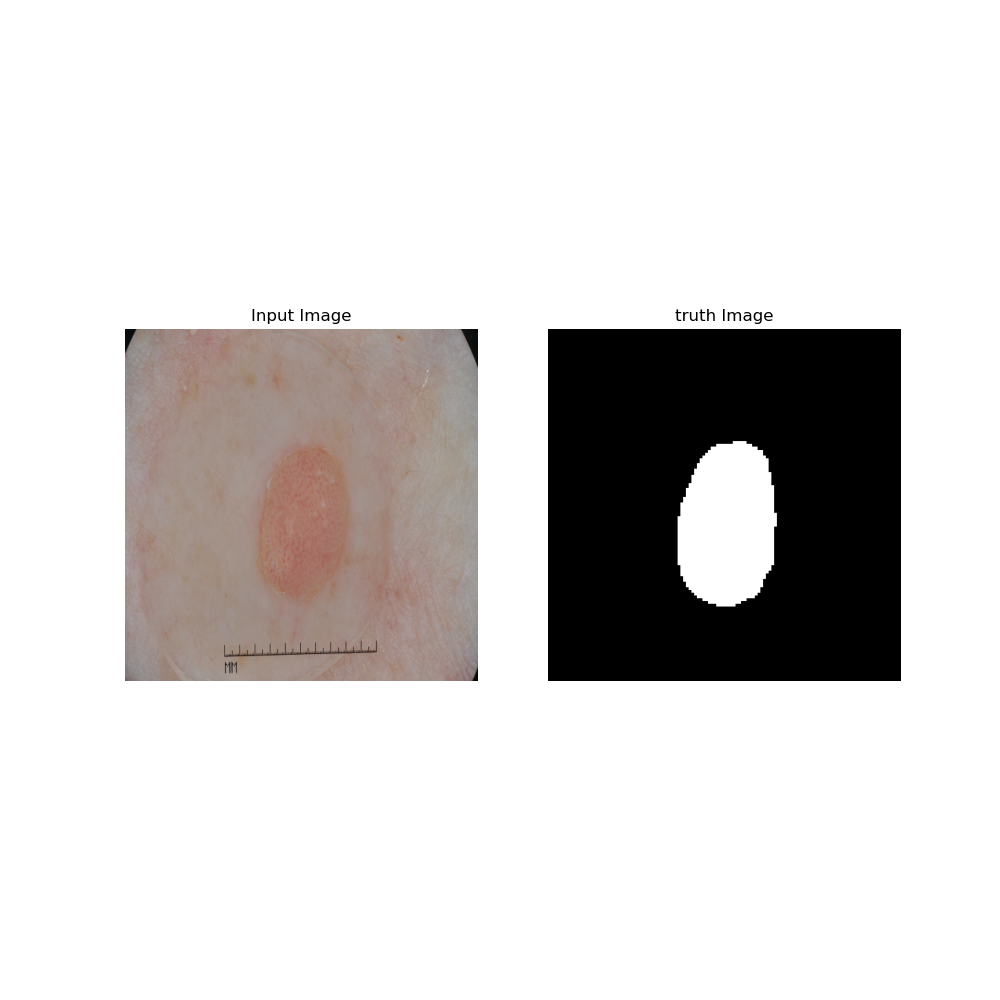
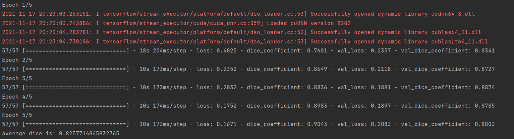
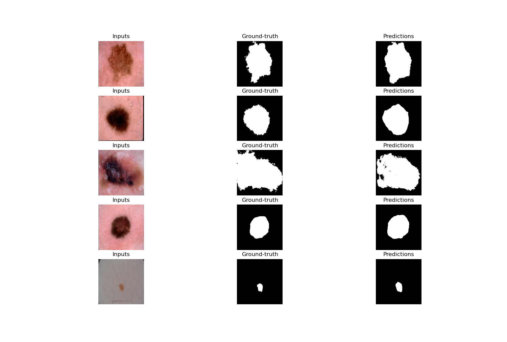

# Segment the ISICs data set with the Improved UNet
### Student Name: Yushan Zeng
### Student Number: 46156530

## Objective

Segment the ISICs data set with the Improved UNet [1] with all labels having a minimum Dice similarity
coefficient of 0.8 on the test set. 

## Introduction

The improved Unet is inspired by Unet architecture. The architecture is shown below:
The improved U-Net architecture is proposed by Isensee et al. in paper[1], and was inspired by the 
original U-Net architecture . As shown in figure, the network includes a context pathway (left) and a localization 
pathway (right).

         
## Dependencies
1. Pyrhon 3.9
2. Tensorflow 2.5.0
3. Tensorflow-gpu 2.3.0
4. Cuda 11.4.0
5. Cdnn cudnn-11.4-windows-x64-v8.2.2.26
         
## How It Works

### Architecture

The improved UNet model architecture is based on original UNet model. Improved Unet has additional segmentation layers.
And the architecture is connected with convolution, concatatentations and up scaling. It also used batch normalization 
and dropout to improve UNet model.

**Normalization:**

In this model, we use Instance Normalization.

**Context:**

This section was implemented with fuction 'context_module()' in 'Unet_model.py'

First, for inputs, process Instance Normalization. Then get 2D convolution layer with activation is leaky ReLU.Next, we
do dropout operation with last output, and then we do Instance Normalization and got 2D convolution layer again.

**Localization:**

This section was implemented with fuction 'localization_module()' in 'Unet_model.py'

This operation can recombine the features following concatenation and reduce the number of feature maps for memory.

First this operation will get the 2D convolution layer with activation is leaky ReLU and get the normalization for input.
And processing Instance Normalization with the output. Repeat above operation, it will return 2 normalization.

**segmentation:**

The last operation is segmentation. First, get convolutional layer with kernel size of 1
Then, Upsampling with factor of 2 except for final layer.

### Preprocessing data

1. load data from ISIC2018 dataset.

2. The data were divided into training set, validation set and test set according to the ratio of 0.7, 0.1 and 0.2.

3. In order to reduce the amount of calculation, the image is resized to 256x256 
   grayscale images and normalized.

4. Transform data into tensor type.

5. shuffle and map data.

In order to test if data is loaded correctly, I write a main function to display images. Sample is shown below.

### Training and test

1. Build the improved Unet model. The model architecture can be got through running model.summary().

2. Implement functions to compute dice coefficient[2], average dice coefficient and dice loss.

3. Use adam as optimizer, binary_crossentropy as loss function and dice coefficient as metrics to compile model.
   
4. Use batch size = 32 and epoch = 5 to train model and got the average dice coefficient.

5. Predict and plot by test data. We can get average dice coefficient on test set is 0.8259171690348954.

## Result and epoch history screenshot

## Reference

[1] F. Isensee, P. Kickingereder, W. Wick, M. Bendszus, and K. H. Maier-Hein, “Brain Tumor Segmentation
and Radiomics Survival Prediction: Contribution to the BRATS 2017 Challenge,” Feb. 2018. [Online].
Available: https://arxiv.org/abs/1802.10508v1

[2]Jakhar, Karan. "Dice Coefficient, IOU". Medium, 2021, https://medium.com/@karan_jakhar/100-days-of-code-day-7-84e4918cb72c.

