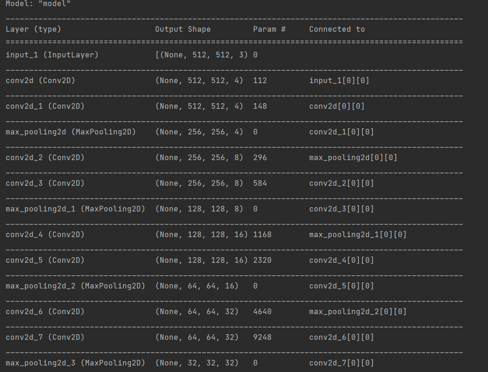
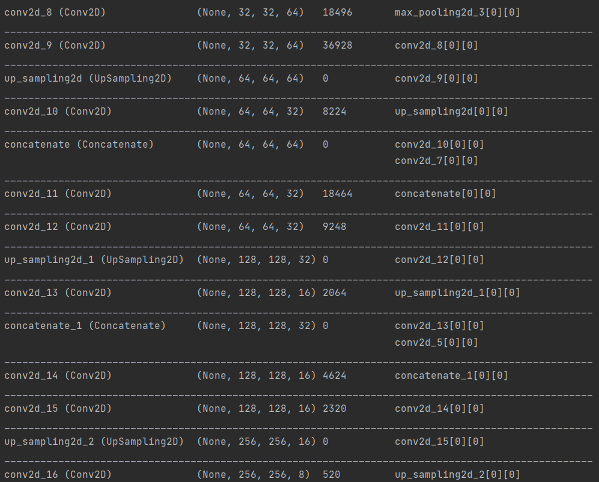
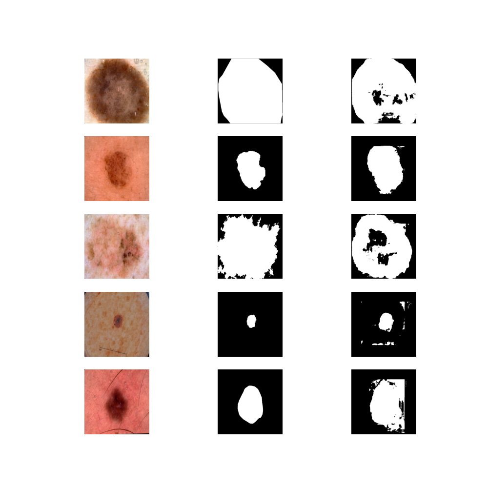
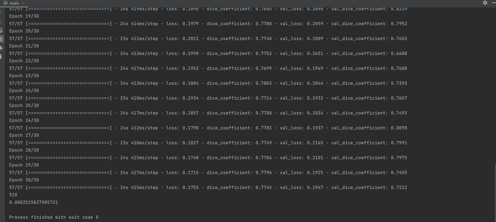
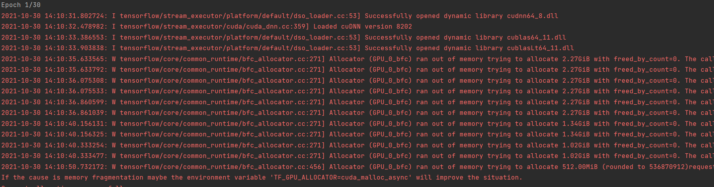

# Segment the ISICs data set with the Improved UNet
### Student Name: Yushan Zeng
### Student Number: 46156530

## Objective

Segment the ISICs data set with the Improved UNet [1] with all labels having a minimum Dice similarity
coefficient of 0.8 on the test set. 

## Introduction

The improved Unet is inspired by Unet architecture. This architecture comprises a context aggregation pathway that 
encodes increasingly abstract representations of the input as we progress deeper into the network, followed by a 
localization pathway that recombines these representations with shallower features to precisely localize the structures
of interest (Figure1).

Unet is a kind of autoencoder which is expected to learn features through downing sampling path and then recreate
ground-truth through upsampling path.

### Figure 1 Unet architecture [1]

         
## Dependencies
1. Pyrhon 3.9
2. Tensorflow 2.5.0
3. Tensorflow-gpu 2.3.0
4. Cuda 11.4.0
5. Cdnn cudnn-11.4-windows-x64-v8.2.2.26
         
## How It Works

I use a four layer padded Unet model to learn fetures and recreate ground-groundtruth.

The total process can be devided into two sections: preproceing data, trainging and test.

### Preprocessing data

1. load data from ISIC2018 dataset.

2. The data were divided into training set, validation set and test set according to the ratio of 0.7, 0.1 and 0.2.

3. Transform data into tensor typy.

4. shuffle and map data.

In order to test if data is loaded correctly, I write a main function to display images. Sample is shown below.

### Training and test

1. Build a Unet model, model summary show below.

2. Implement functions to compute dice coefficient[2], average dice coefficient and dice loss.

3. Use adam as optimizer, categorical_crossentropy as loss function and dice coefficient as metrics to compile model.
   (It should use dice loss here, reason will be given in limitation)
   
4. Use batch size = 32 and epoch = 30 to train model and got the average dice coefficient.

5. Predict and plot by test data. We can get average dice coefficient on test set is 0.8003515837985721.

## epoch history:
2021-10-29 19:10:20.078536: I tensorflow/compiler/mlir/mlir_graph_optimization_pass.cc:176] None of the MLIR Optimization Passes are enabled (registered 2)
Epoch 1/30
2021-10-29 19:10:21.093127: I tensorflow/stream_executor/platform/default/dso_loader.cc:53] Successfully opened dynamic library cudnn64_8.dll
2021-10-29 19:10:21.627384: I tensorflow/stream_executor/cuda/cuda_dnn.cc:359] Loaded cuDNN version 8202
2021-10-29 19:10:22.298540: I tensorflow/stream_executor/platform/default/dso_loader.cc:53] Successfully opened dynamic library cublas64_11.dll
2021-10-29 19:10:22.761447: I tensorflow/stream_executor/platform/default/dso_loader.cc:53] Successfully opened dynamic library cublasLt64_11.dll
57/57 [==============================] - 34s 480ms/step - loss: 0.4630 - dice_coefficient: 0.6152 - val_loss: 0.3033 - val_dice_coefficient: 0.6941
Epoch 2/30
57/57 [==============================] - 23s 410ms/step - loss: 0.3719 - dice_coefficient: 0.6748 - val_loss: 0.2892 - val_dice_coefficient: 0.7358
Epoch 3/30
57/57 [==============================] - 23s 411ms/step - loss: 0.3574 - dice_coefficient: 0.6839 - val_loss: 0.3234 - val_dice_coefficient: 0.6516
Epoch 4/30
57/57 [==============================] - 24s 412ms/step - loss: 0.3405 - dice_coefficient: 0.6947 - val_loss: 0.3259 - val_dice_coefficient: 0.6376
Epoch 5/30
57/57 [==============================] - 24s 413ms/step - loss: 0.3336 - dice_coefficient: 0.6957 - val_loss: 0.3048 - val_dice_coefficient: 0.6656
Epoch 6/30
57/57 [==============================] - 23s 410ms/step - loss: 0.3276 - dice_coefficient: 0.6964 - val_loss: 0.2728 - val_dice_coefficient: 0.7347
Epoch 7/30
57/57 [==============================] - 24s 412ms/step - loss: 0.3158 - dice_coefficient: 0.7047 - val_loss: 0.2721 - val_dice_coefficient: 0.6954
Epoch 8/30
57/57 [==============================] - 24s 414ms/step - loss: 0.2925 - dice_coefficient: 0.7210 - val_loss: 0.3178 - val_dice_coefficient: 0.6990
Epoch 9/30
57/57 [==============================] - 24s 413ms/step - loss: 0.2860 - dice_coefficient: 0.7248 - val_loss: 0.2313 - val_dice_coefficient: 0.7693
Epoch 10/30
57/57 [==============================] - 24s 416ms/step - loss: 0.2590 - dice_coefficient: 0.7429 - val_loss: 0.2269 - val_dice_coefficient: 0.7496
Epoch 11/30
57/57 [==============================] - 24s 412ms/step - loss: 0.2456 - dice_coefficient: 0.7537 - val_loss: 0.2194 - val_dice_coefficient: 0.7772
Epoch 12/30
57/57 [==============================] - 24s 414ms/step - loss: 0.2368 - dice_coefficient: 0.7550 - val_loss: 0.2154 - val_dice_coefficient: 0.7635
Epoch 13/30
57/57 [==============================] - 24s 415ms/step - loss: 0.2315 - dice_coefficient: 0.7641 - val_loss: 0.2312 - val_dice_coefficient: 0.7333
Epoch 14/30
57/57 [==============================] - 24s 413ms/step - loss: 0.2286 - dice_coefficient: 0.7557 - val_loss: 0.2012 - val_dice_coefficient: 0.7825
Epoch 15/30
57/57 [==============================] - 24s 412ms/step - loss: 0.2217 - dice_coefficient: 0.7652 - val_loss: 0.2189 - val_dice_coefficient: 0.7483
Epoch 16/30
57/57 [==============================] - 24s 414ms/step - loss: 0.2106 - dice_coefficient: 0.7719 - val_loss: 0.2044 - val_dice_coefficient: 0.7789
Epoch 17/30
57/57 [==============================] - 23s 409ms/step - loss: 0.2130 - dice_coefficient: 0.7675 - val_loss: 0.2428 - val_dice_coefficient: 0.7875
Epoch 18/30
57/57 [==============================] - 24s 419ms/step - loss: 0.2090 - dice_coefficient: 0.7685 - val_loss: 0.2096 - val_dice_coefficient: 0.8219
Epoch 19/30
57/57 [==============================] - 24s 414ms/step - loss: 0.1979 - dice_coefficient: 0.7780 - val_loss: 0.2059 - val_dice_coefficient: 0.7952
Epoch 20/30
57/57 [==============================] - 23s 411ms/step - loss: 0.2011 - dice_coefficient: 0.7740 - val_loss: 0.2009 - val_dice_coefficient: 0.7603
Epoch 21/30
57/57 [==============================] - 24s 413ms/step - loss: 0.1990 - dice_coefficient: 0.7752 - val_loss: 0.2651 - val_dice_coefficient: 0.6688
Epoch 22/30
57/57 [==============================] - 24s 417ms/step - loss: 0.1953 - dice_coefficient: 0.7699 - val_loss: 0.1969 - val_dice_coefficient: 0.7688
Epoch 23/30
57/57 [==============================] - 24s 413ms/step - loss: 0.1884 - dice_coefficient: 0.7803 - val_loss: 0.2044 - val_dice_coefficient: 0.7393
Epoch 24/30
57/57 [==============================] - 23s 410ms/step - loss: 0.1934 - dice_coefficient: 0.7714 - val_loss: 0.1933 - val_dice_coefficient: 0.7657
Epoch 25/30
57/57 [==============================] - 24s 417ms/step - loss: 0.1857 - dice_coefficient: 0.7788 - val_loss: 0.2034 - val_dice_coefficient: 0.7493
Epoch 26/30
57/57 [==============================] - 24s 412ms/step - loss: 0.1790 - dice_coefficient: 0.7783 - val_loss: 0.1937 - val_dice_coefficient: 0.8098
Epoch 27/30
57/57 [==============================] - 23s 410ms/step - loss: 0.1827 - dice_coefficient: 0.7749 - val_loss: 0.2165 - val_dice_coefficient: 0.7991
Epoch 28/30
57/57 [==============================] - 24s 415ms/step - loss: 0.1748 - dice_coefficient: 0.7786 - val_loss: 0.2101 - val_dice_coefficient: 0.7975
Epoch 29/30
57/57 [==============================] - 24s 417ms/step - loss: 0.1715 - dice_coefficient: 0.7796 - val_loss: 0.1925 - val_dice_coefficient: 0.7455
Epoch 30/30
57/57 [==============================] - 24s 415ms/step - loss: 0.1753 - dice_coefficient: 0.7745 - val_loss: 0.1967 - val_dice_coefficient: 0.7212
518
0.8003515837985721

Process finished with exit code 0
## Result and epoch history screenshot

## Limitation

1. The choice of Unet filter
   At first, I use 32 as the first layer filter, but when I run the main.py, it raise a error: out of memory.
   So I have to choose smaller filter.
   
   
2. I have written the dice loss function, but when I use it. it reminds data type imcompatable, when I changed the data 
   type of ground-truth, the prediction did not show anything.

## Reference

[1] Ronneberger, Olaf, Philipp Fischer, and Thomas Brox. "U-net: Convolutional networks for biomedical image segmentation." International Conference on Medical image computing and computer-assisted intervention. Springer, Cham, 2015.

[2]Jakhar, Karan. "Dice Coefficient, IOU". Medium, 2021, https://medium.com/@karan_jakhar/100-days-of-code-day-7-84e4918cb72c.

